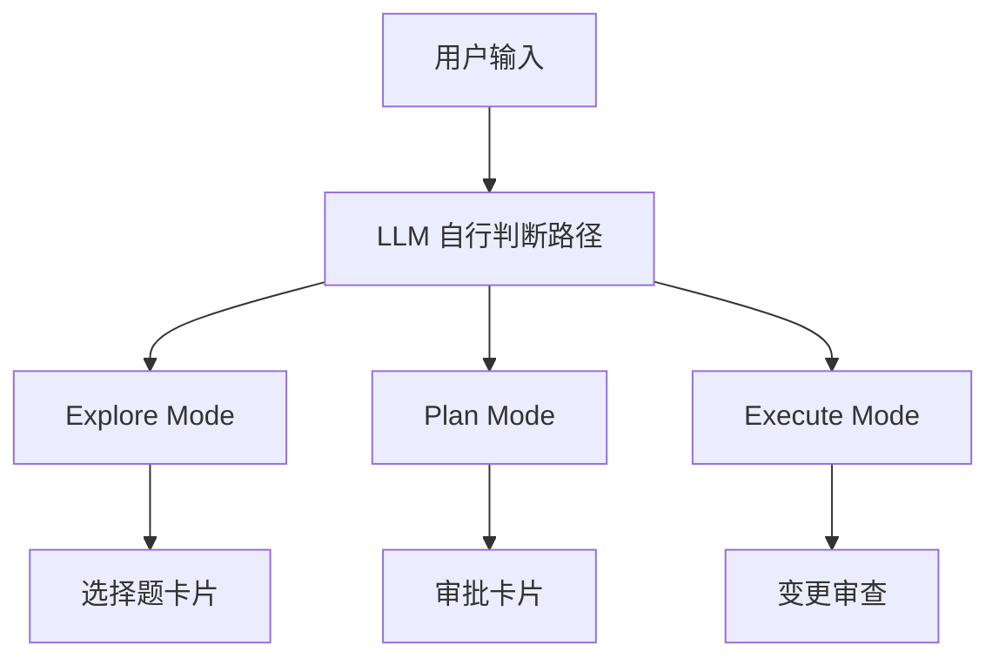

# FlyPig Agent 架构重构文档

> 版本: v7.7 · 最后更新: 2026-05-31
>
> 本文档是全栈重构蓝图，涵盖架构设计、模块职责、数据流、DevOps、代码规范。
> **目标：** 把当前"一锅粥"的代码库重构为**分层清晰、模块独立、AI可检索、可扩展**的工程化架构。

---

## 目录

1. [为什么需要重构](#一为什么需要重构)
2. [目标架构总览](#二目标架构总览)
3. [模块职责详解](#三模块职责详解)
4. [前端架构（Vite + Vue 3 SFC + Vercel AI SDK）](#四前端架构vite--vue-3-sfc--vercel-ai-sdk)
5. [后端分层（Clean Architecture）](#五后端分层clean-architecture)
6. [DevOps 架构（Docker Compose）](#六devops-架构docker-compose)
7. [文件夹树（当前 vs 目标）](#七文件夹树当前-vs-目标)
8. [数据流设计](#八数据流设计)
9. [AI 友好编码规范](#九ai-友好编码规范)
10. [分步迁移路线](#十分步迁移路线)

---

## 一、为什么需要重构

### 当前痛点

| 问题　　　　　　　　　　　　　　　　　　　　　　　　　　　 | 严重程度 | 影响　　　　　　　　　　　　　　　　　　 |
| ------------------------------------------------------------| ----------| ------------------------------------------|
| `tools.py` **~820 行** 一个大文件　　　　　　　　　　　　　| 🔴　　　 | 一个函数修改，要读完整文件才知道影响范围 |
| `sandbox.py` **~1000 行** 一个大文件　　　　　　　　　　　 | 🔴　　　 | 沙箱配置、路径验证、Docker 管理混一起　　|
| `server.py` **~780 行** 一个大文件　　　　　　　　　　　　 | 🔴　　　 | 路由、配置、SSE、WebSocket、文件监控全在 |
| `index.html` **~2500 行** 单页　　　　　　　　　　　　　　 | 🔴　　　 | Vue 组件、CSS、终端逻辑、SSE 消费全在　　|
| 全局变量散落 (`_agent`, `_config`, `_terminal_injections`) | 🔴　　　 | 多请求时状态混乱，测试无法隔离　　　　　 |
| Agent 装配代码重复 3 处（server.py, __main__.py, cli.py）　| 🟡　　　　| 改一个依赖要改三个地方　　　　　　　　　 |
| PTY 注入链路 7 步，从未稳定工作　　　　　　　　　　　　　　| 🔴　　　 | `AI→SSE→前端→API→终端→WS→PTY` 过于复杂　 |
| 流式输出是模拟的（setInterval 轮询）　　　　　　　　　　　 | 🟡　　　　| 体验差，阻塞输入框　　　　　　　　　　　 |
| 没有依赖注入，紧耦合　　　　　　　　　　　　　　　　　　　 | 🟡　　　　| 换模型、换沙箱需要改核心代码　　　　　　 |

### 重构收益

| 指标 | 当前 | 重构后 |
|------|------|--------|
| 单个文件最大行数 | ~2500 行 | ≤200 行 |
| Agent 装配代码重复 | 3 处 | 1 处（DI Container） |
| 模块间耦合 | 紧耦合 | 接口依赖 |
| 测试能力 | 几乎不可测试 | 接口可 Mock |
| 加新模型 | 改 agent.py、server.py | 加一个 ModelAdapter 实现 |
| 加新前端功能 | 改 2500 行 index.html | 加一个 .vue 组件 |
| AI 检索代码 | 一个文件里猜位置 | 按目录名直接定位 |

---

## 二、目标架构总览

```
┌─────────────────────────────────────────────────────────────────────────┐
│                       PRESENTATION LAYER (Web Dashboard)                  │
│                                                                          │
│  ┌──────────────────────────────────────────────────────────────────┐   │
│  │     Vue 3 + Vercel AI SDK (useChat) + Monaco Editor + xterm.js    │   │
│  │                                                                   │   │
│  │  ┌──────────────────────┐  ┌──────────────────┐  ┌──────────────┐ │   │
│  │  │  对话面板              │  │  交互卡片区域     │  │  终端面板     │ │   │
│  │  │  MessageList          │  │  ChoiceCard      │  │  XtermViewer  │ │   │
│  │  │  MessageItem          │  │  ChangeReview    │  │  OutputViewer │ │   │
│  │  │  ThinkingIndicator   │  │  SuggestionCard  │  │  TerminalTab  │ │   │
│  │  │  InputBox            │  │  ToolCallCard    │  │               │ │   │
│  │  │  Markdown/Mermaid    │  │  (工具调用/审批)   │  │               │ │   │
│  │  │  LivePreview         │  │                  │  │               │ │   │
│  │  └──────────────────────┘  └──────────────────┘  └──────────────┘ │   │
│  │  ┌──────────────────────────────────────────────────────────┐    │   │
│  │  │  侧边栏: 文件树(FileTree)  |  未来Dashboard(监控/成本)   │    │   │
│  │  └──────────────────────────────────────────────────────────┘    │   │
│  └──────────────────────────────────────────────────────────────────┘   │
│                                    │ SSE (chat) + WebSocket (pty)       │
├────────────────────────────────────┼─────────────────────────────────────┤
│                   INTERFACE LAYER (Quart — 唯一入口)                      │
│                                                                          │
│  ┌──────────┐ ┌───────────┐ ┌───────────┐ ┌─────────┐ ┌──────────────┐ │
│  │ /api/chat │ │/api/config│ │ /api/files │ │ /ws/pty │ │/api/sessions │ │
│  │ (SSE流式) │ │           │ │+ /api/tree │ │(手动终端)│ │(历史会话)    │ │
│  └────┬─────┘ └───────────┘ └───────────┘ └─────────┘ └──────────────┘ │
│  ┌──────────┐ ┌───────────┐ ┌───────────┐ ┌────────────┐ ┌──────────┐  │
│  │/api/roll │ │/api/health│ │/api/upload│ │/api/history│ │/api/agent│  │
│  │  back    │ │(健康检查)  │ │(文件上传) │ │  /search   │ │ /status  │  │
│  │(Git回滚) │ │           │ │(+解压)    │ │(历史搜索)  │ │+ /stop   │  │
│  └──────────┘ └───────────┘ └───────────┘ └────────────┘ └──────────┘  │
│       │                                                                 │
├───────┼─────────────────────────────────────────────────────────────────┤
│       ▼                                                                 │
│              APPLICATION LAYER (业务编排)                                  │
│                                                                          │
│  ┌──────────────────────────────────────────────────────────────────┐   │
│  │  GraphFactory                                                    │   │
│  │  ├─ build_graph() → 导入 domain/agent/ 下 nodes + router        │   │
│  │  │  + context → 编译 StateGraph（路由注册在应用层完成）           │   │
│  │  └─ 工具变化时重建图（DynamicGraphFactory）                       │   │
│  └──────────────────────────────────────────────────────────────────┘   │
│                                                                          │
│  ┌──────────────────────────────┐ ┌──────────────────┐ ┌─────────────┐  │
│  │  SuggestionEngine            │ │  HookService     │ │ ConfigSvc   │  │
│  │  generate_suggestion(score)  │ │  register/emit   │ │ SessionSvc  │  │
│  │  → SuggestionCard            │ │  (通用事件钩子)   │ │ PolicySvc   │  │
│  └──────────────────────────────┘ └──────────────────┘ └─────────────┘  │
│  ┌─────────────────┐ ┌──────────────────┐ ┌─────────────────────────┐  │
│  │ GitCheckpoint   │ │ CheckpointStore  │ │ SummaryGenerator        │  │
│  │ Manager         │ │ SQLite 映射表    │ │ 自动生成 ≤50 字摘要    │  │
│  │ (Agent Git)     │ │ turn_id→hash    │ │                         │  │
│  └─────────────────┘ └──────────────────┘ └─────────────────────────┘  │
│                                                                          │
├─────────────────────────────────────────────────────────────────────────┤
│                     DOMAIN LAYER (领域层)                                  │
│                                                                          │
│  ┌──────────────────────────────────────────────────────────────────┐   │
│  │  LangGraph: StateSchema + ToolNode + conditional_edges           │   │
│  │  + Checkpointer(SqliteSaver) + Human-in-the-loop + Streaming    │   │
│  │  AgentState: messages, turn_id, persona, phase,                  │   │
│  │    pending_approval, change_review, rejected_changes,            │   │
│  │    change_score, adversarial_suggestion, test_results            │   │
│  └──────────────────────────────────────────────────────────────────┘   │
│  ┌───────────────────┐ ┌────────────────────┐ ┌────────────────────────┐│
│  │  Interfaces       │ │  Models            │ │  PromptManager         ││
│  │  IModel(context驱动)  │ │  Message, ToolCall │ │  多角色按需懒加载      ││
│  │  IToolExecutor    │ │  Session, ModeConfig│ │  developer(核心)       ││
│  │  ICostTracker     │ │  ChoiceCard        │ │  reviewer(对抗)        ││
│  │  IConversationStore│ │  ChangeScore       │ │  tester                ││
│  │  IContextPipeline  │ │  PermissionRule    │ │  architect             ││
│  │  IKnowledgeStore   │ │  ConversationState │ │  documenter            ││
│  │  IAgent / IHook   │ │  SessionSummary    │ │                        ││
│  └───────────────────┘ └────────────────────┘ └────────────────────────┘│
│  ┌──────────────────────────────────────────────────────────────────┐   │
│  │  Policies & Casbin: model.conf + policy.csv                      │   │
│  │  审批分类: file(带diff)/terminal/git/test/change(审查)           │   │
│  └──────────────────────────────────────────────────────────────────┘   │
│                                                                          │
├─────────────────────────────────────────────────────────────────────────┤
│                  INFRASTRUCTURE LAYER (基础设施层)                          │
│                                                                          │
│  ┌────────┐ ┌──────────────────────────┐ ┌─────────┐ ┌──────────────┐  │
│  │ Model  │ │  Tools(全部工具)          │ │ Sandbox │ │ Repository   │  │
│  │ Adapter│ │  bash/file/search/task   │ │ (Docker)│ │ SQLAlchemy   │  │
│  │(多种)  │ │  ask_choice/change_review│ │         │ │ + IHistory   │  │
│  │        │ │  lint/change_score       │ │         │ │   Store(预留)│  │
│  │        │ │  extract_archive/mcp(含  │ │         │ │              │  │
│  │        │ │  auto-install)          │ │         │ │              │  │
│  └────────┘ └──────────────────────────┘ └─────────┘ └──────────────┘  │
│  ┌────────┐ ┌─────────────────────┐ ┌──────────┐ ┌──────────────────┐  │
│  │ Cost   │ │ PermissionChecker   │ │ Terminal │ │ Background +    │  │
│  │ Tracker│ │ file/term/git/test  │ │ (用户PTY)│ │ Casbin Setup    │  │
│  │        │ │ allow/ask/deny      │ │          │ │                 │  │
│  └────────┘ └─────────────────────┘ └──────────┘ └──────────────────┘  │
│                                                                          │
├─────────────────────────────────────────────────────────────────────────┤
│                     DI CONTAINER (依赖注入容器)                            │
│  Container.configure() → 装配:                                          │
│    IModel / IToolExecutor / ICostTracker / IConversationStore         │
│    IContextPipeline / PolicyService / PromptManager                    │
│    IKnowledgeStore(NoOp) / GraphFactory / SuggestionEngine / HookService │
│  create_agent() → 返回 IAgent (一张图统一 Graph，context 约束内 LLM 自行决定路径)
└─────────────────────────────────────────────────────────────────────────┘
```

### 核心原则

1. **单向依赖**：Interface → Application → Domain → Infrastructure，**依赖只能从上往下**
2. **接口隔离**：领域层定义接口（`IModel`、`IToolExecutor`），基础设施层实现
3. **DI 单点装配**：所有依赖在 `Container` 类里装配，其他地方只消费接口
4. **每个文件一个职责**：一个文件不超过 200 行，一个类不超过 100 行
5. **工具调用是 AI 的反射外延**：工具执行结果（含报错）原样返回 AI，不做任何预处理/计数/分类。AI 自行决定下一步

---

## 三、模块职责详解

### 3.1 Interface Layer — 用户界面适配

> 📎 详细路由拆分见: `docs/docs_refactor/api-reference.md`

```python
# 每个接口一个独立入口文件，代码量极小

flypig/interface/
└── web/                     # 唯一入口（统一为 Web）
    ├── __init__.py
    ├── server.py            # app 声明 + 路由注册 + 启动（~50 行）
    ├── routes/
    │   ├── chat.py          # /api/chat SSE 端点
    │   ├── config.py        # /api/config/*
    │   ├── files.py         # /api/files, /api/file, /api/tree
    │   ├── sessions.py      # 历史会话路由
    │   ├── health.py        # 健康检查
    │   ├── upload.py        # 文件上传 + 压缩解压
    │   ├── rollback.py      # Git 回滚
    │   ├── agent.py         # /api/agent/status + /api/agent/stop
    │   ├── history.py       # /api/history/search
    │   └── feedback.py      # /api/feedback/suggestion（建议反馈）
    └── services/
        ├── sse_queue.py     # SSE 队列抽象
        └── file_watcher.py  # 文件变更监控
```

| 文件 | 职责 | 限制行数 |
|------|------|---------|
| `routes/chat.py` | SSE 事件流处理，调用 ChatService | ≤120 |
| `routes/config.py` | 配置查询/修改/Agent 初始化 | ≤80 |
| `routes/files.py` | 文件浏览/读取/文件树 | ≤80 |
| `sse_queue.py` | Queue<->SSE 生成器桥接 | ≤40 |
| `file_watcher.py` | watchfiles 后台监控 | ≤50 |

### 3.2 Application Layer — 业务编排

```python
flypig/application/
├── __init__.py
├── services/
│   ├── chat_service.py          # 对话编排：调用 Agent → 事件分发
│   ├── config_service.py        # 配置管理：加载、保存、模型切换
│   ├── session_service.py       # 会话状态管理（支持多会话）
│   ├── graph_factory.py         # 图构建：导入 nodes + router → 编译 StateGraph
│   ├── suggestion_engine.py     # 评分→建议映射：generate_suggestion()
│   ├── hook_service.py          # 钩子管理器：register / emit
│   └── policy_service.py        # Casbin 封装
└── dto/
    ├── chat_dto.py              # 数据传输对象
    └── config_dto.py
```

| 类/模块 | 职责 | 限制行数 |
|---------|------|---------|
| `ChatService` | 接收用户输入 → 调用 LangGraph（LLM 自行决定路径）→ 事件回调 | ≤60 |
| `ConfigService` | Config 初始化、Model 解析、API Key 管理 | ≤80 |
| `SessionService` | 多会话创建/切换/销毁/持久化 | ≤80 |
| `GraphFactory` | 图构建：导入 nodes + router → 编译 StateGraph（原 OrchestrationService.build_graph） | ≤80 |
| `SuggestionEngine` | 评分→建议映射：generate_suggestion() | ≤40 |
| `HookService` | 钩子管理器：register(event_type, hook) / emit(event_type, data) | ≤40 |


**GraphFactory 核心职责：**

```python
class GraphFactory:
    """图构建——导入 domain/agent/ 下的节点和路由，编译 StateGraph"""

    def build_graph(self) -> StateGraph:
        """构建统一的 LangGraph——不是三张不同的图，而是一张图三个 context
        LLM 通过条件边自行决定路径，不需要外部 select_mode() 预分类。"""
        from domain.agent.nodes import chat_node, choice_node, execute_node, lint_node, review_node, suggest_node, approval_node
        from domain.agent.router import router

        workflow = StateGraph(AgentState)
        workflow.add_node("chat", chat_node)          # LLM 对话（所有路径起点）
        workflow.add_node("ask_choice", choice_node)  # Explore：出选择题
        workflow.add_node("execute", DynamicToolNode(tools))    # Execute：调工具
        workflow.add_node("lint", lint_node)          # LINT 自动修复
        workflow.add_node("change_review", review_node)  # 变更审查
        workflow.add_node("suggestion", suggest_node) # 对抗建议
        workflow.add_node("approval", approval_node)  # 审批
        workflow.add_conditional_edges("chat", router) # LLM 决定下一步
        return workflow.compile()

    def rebuild_if_tools_changed(self):
        """工具变化时重建图（DynamicGraphFactory）"""
        ...
```

**SuggestionEngine：**

```python
class SuggestionEngine:
    """评分→建议映射——原 OrchestrationService.generate_suggestion()"""

    def generate_suggestion(self, score: ChangeScore) -> dict:
        """根据变更评分生成对抗建议（3.8.9）"""
        # 见 adversarial-system.md generate_suggestion() 完整实现
```

**HookService：**

```python
@dataclass
class HookContext:
    event_type: str         # "pre_agent_run" / "post_tool_call" / "sse_output" / ...
    timestamp: float
    data: dict
    state: dict | None = None

class HookService:
    """通用钩子管理器——业务场景决定何时触发"""

    _hooks: dict[str, list[IHook]] = {}

    @classmethod
    def register(cls, event_type: str, hook: IHook):
        cls._hooks.setdefault(event_type, []).append(hook)

    @classmethod
    async def emit(cls, event_type: str, data: dict, state=None):
        ctx = HookContext(event_type=event_type, timestamp=time.time(), data=data, state=state)
        for hook in cls._hooks.get(event_type, []):
            await hook.on_event(ctx)
```

### 3.3 Domain Layer — 核心领域逻辑

```python
flypig/domain/
├── interfaces/              # 接口定义（抽象依赖）
│   ├── __init__.py
│   ├── imodel.py            # IModel 接口（模式无关的 stream 调用）
│   ├── itool_executor.py    # IToolExecutor 接口
│   ├── icost_tracker.py     # ICostTracker 接口
│   ├── ihook.py             # IHook 接口 + HookContext 数据类（通用事件钩子）
│   ├── iconversation_store.py  # IConversationStore 接口（对话存储 + 检索）
│   ├── icontext_pipeline.py    # IContextPipeline 接口（预 LLM 压缩）
│
├── agent/                   ← 领域层只定义节点和状态（图构建在应用层）
│   ├── state.py             # AgentState TypedDict（纯数据，零依赖）
│   ├── nodes.py             # 所有节点函数（chat/ask_choice/execute/lint/review/suggest）
│   ├── router.py            # LLM 条件边路由
│   └── context.py           # Explore/Plan/Execute context 约束（温度+工具限制）
│
├── models/
│   ├── message.py           # Message, ToolCall, ChoiceCard 数据类
│   └── session.py           # Session 数据类
│   └── mode.py              # ExecutionMode 枚举 + ModeConfig
│
├── prompt_manager.py        # 多角色 prompt 切换
├── prompts/                 # prompt 仓库
│
└── config/
    ├── config.py            # Config 加载（纯逻辑）
    └── model_registry.py    # 模型注册表
```

| 模块 | 职责 | 关键变化 |
|------|------|---------|
| `interfaces/imodel.py` | IModel 接口：chat_stream(messages, tools, temperature) 统一方法 | **模式无关** |
| `agent/` | LangGraph StateGraph，统一 Graph，context 约束内 LLM 自行决定路径 | **统一图** |
| `models/message.py` | 纯数据类 + ChoiceCard 模型（选择题卡片） | 新增 ChoiceCard |
| `config/config.py` | 从 yaml 加载配置，环境变量替换 | 拆分后精简 |

### 3.4 Infrastructure Layer — 基础设施实现

#### 3.4.1 模型适配

```python
flypig/infrastructure/
├── model/
│   ├── __init__.py
│   ├── openai_adapter.py   # OpenAI/DeepSeek 兼容（当前主力）
│   ├── anthropic.py        # Anthropic Claude 适配
│   └── local.py            # 本地模型（Ollama/vLLM，未来）
│
├── tools/                   # 工具执行
│   ├── __init__.py
│   ├── executor.py          # ToolExecutor 主类（调度器）
│   ├── tool_bash.py         # bash 命令（subprocess 逻辑，无 PTY）
│   ├── tool_file.py         # read_file + write_file + edit_file（基于 Aider 编辑引擎，见 3.4.3）
│   ├── tool_search.py       # grep + find_files
│   ├── tool_task.py         # task_status + task_list + task_log
│   ├── tool_change_review.py # ★ 变更审查数据生成（3.8.7）
│   ├── tool_lint.py          # ★ 代码规范自动审查（3.8.8）
│   ├── tool_change_score.py  # ★ 变更影响评分（3.8.9）
│   ├── tool_ask_choice.py     # ★ Explore 选择题工具（3.6.3）
│   ├── tool_extract_archive.py # ★ 压缩解压 + Zip Slip 防护（3.7.2）
│   ├── tool_mcp_manager.py    # ★ MCP 自助安装（基于 mcp-auto-install 现成方案）
│   └── utils.py             # strip_ansi, _best_decode, _decode_clixml
│
├── sandbox/
│   ├── __init__.py
│   ├── config.py            # SandboxConfig 数据类
│   ├── path_validator.py    # PathValidator（路径安全验证）
│   ├── manager.py           # SandboxManager（容器生命周期）
│   └── builder.py           # Dockerfile 生成 + 镜像构建
│
├── cost/
│   ├── __init__.py
│   ├── tracker.py           # CostTracker
│   └── pricing.py           # 价格获取 + 缓存
│
├── terminal.py              # [KEPT] 用户独立终端管理（xterm.js 后端）
├── hooks.py                 # 事件钩子实现
└── background.py            # 后台任务管理
```

| 拆分前 | 拆分后 | 好处 |
|--------|--------|------|
| `tools.py` ~820 行 | 6 个文件，每个 ≤150 行 | 改 bash 逻辑不用看 820 行 |
| `sandbox.py` ~1000 行 | 4 个文件，每个 ≤250 行 | 路径验证和容器管理分离 |
| `model.py` ~93 行 | 接口 + 多实现 | 加新模型只需一个文件 |
| `cost.py` + `pricing_fetcher.py` | 统一到 `cost/` 包 | 相关逻辑放一起 |

#### 3.4.2 终端系统重构说明

**重构核心变化：AI 与终端彻底解耦。**

| 维度 | 当前（错误设计） | 重构后（正确设计） |
|------|---------------|----------------|
| 终端归属 | AI 管理的交互式终端 | **用户手动操作的独立终端** |
| AI 能力 | 注入命令到 PTY，管理交互 | **AI 永不操作终端** |
| 命令输出 | PTY 输出 → SSE → 前端卡片 | subprocess 输出直接返回给 AI |
| 交互式命令 | AI 检测 + PTY 注入 + 静默检测 | **交给用户，AI 提示"请手动运行"** |
| AI 的 bash 工具 | `subprocess` + `PTY` 双路径 | **仅 subprocess**（单路径） |
| 终端面板 | AI 和用户共用 | 用户手动终端 + subprocess 只读输出标签（单面板混排） |

**终端面板定位（保持单面板，标签页混排，用户无感）：**

```
底部终端面板 = 单面板，标签页混排
│
├── 用户手动创建（点"+"）：PTY 标签
│   └── xterm.js + WebSocket，有光标可交互
│
├── AI subprocess 触发（点卡片"[在终端查看]"）：只读输出标签
│   └── OutputViewer 组件，只读无光标
│   └── 标签名不带特殊标记，用户看起来和 PTY 标签一样
│   └── 用户完全无感，只知道"又多了一个终端标签"
│
└── TerminalTab.vue 内部根据 isPTY 属性区分：
      isPTY=true  → 嵌入 xterm.js（交互）
      isPTY=false → 嵌入 OutputViewer（只读，无光标无交互）
      同一个标签组件，同一个渲染容器，用户看不出来区别
```

**交互式命令策略（重要变化）：**

```
旧方案：AI 检测到交互式 → 不运行，直接返回提示
新方案：AI 检测到交互式 → 先用 subprocess 跑
  → 把阻塞前的输出（如 python 版本号、脚本的 usage 提示）收集
  → 输出正常喂给 AI（和 tool_result 一样）
  → AI 看到输出后判断"这是交互式"，回复用户：
    "这个命令需要交互式输入，请在下方终端手动运行"
  → 不再有 _guess_interactive() 等检测代码
  → 交互式命令也走同样的 subprocess 路径，只是输出到卡住了而已
```

⚠️ **"先跑再告知"副作用**：危险命令（如 `git push --force`、`rm -rf`）可能在半路卡住前就已经造成部分执行。应对措施：
1. 已知危险命令通过 Casbin 策略预先拦截（如 `deny` 或 `ask` 审批）
2. subprocess 设严格 timeout（默认 30s，可配置），超时自动 kill
3. 交互式命令永远不自动执行——subprocess 阻塞前的输出仅用于 AI 判断"这是交互式"，AI 告知用户手动运行，不尝试注入输入

**subprocess 策略（新）：**

AI 所有命令操作统一使用 `subprocess`，**不再有 PTY 路径**。

| 命令类型 | 策略 | 实现方式 | AI 如何获取结果 |
|---------|------|---------|---------------|
| **快速命令**（`pip install`, `git`, `ls`, `cat`） | 同步等待 | `asyncio.create_subprocess_shell` + `proc.communicate(timeout=30)` | 返回 stdout+stderr 直接给 LLM |
| **后台长任务**（`python server.py`, `npm run dev`, 启动服务） | 异步后台运行 | `subprocess.Popen(stdout=PIPE, stderr=PIPE)` + 返回 PID | AI 通过 `task_log(pid)` 工具获取实时缓存的日志输出 |
| **交互式脚本**（含 `input()`） | **先跑再告知** | 先用 subprocess 跑，阻塞前的输出当 tool_result 喂给 AI，AI 判断后告知用户去手动终端 | 阻塞前的 stdout 给 AI，完整输出在终端只读标签查看 |

**后台任务监控（类比 "帮我获取服务器日志"）：**

```python
# infrastructure/tools/tool_task.py
_BACKGROUND_PROCESSES: dict[int, dict] = {}  # pid → {process, stdout_buffer, ...}

def start_background(cmd: str) -> int:
    """启动后台进程，返回 PID"""
    proc = subprocess.Popen(
        cmd, stdout=PIPE, stderr=PIPE, shell=True,
        text=True, bufsize=1
    )
    # 启动读取线程：持续将输出追加到 buffer
    thread = threading.Thread(target=_read_loop, args=(proc, pid), daemon=True)
    thread.start()
    return pid

def task_log(pid: int) -> str:
    """AI 调用此工具获取后台进程的实时日志"""
    info = _BACKGROUND_PROCESSES.get(pid)
    if not info:
        return "[TASK NOT FOUND]"
    return "".join(info["buffer"])  # 返回累计的 stdout/stderr
```

**场景示例：**

```
用户: 帮我启动服务器
AI → bash("python server.py") → 检测到服务器不退出 → 转为后台运行
  → "服务器已启动(PID: 12345)。如需查看日志，请告诉我"

用户: 帮我获取服务器日志
AI → task_log(12345) → 返回累计的 stdout/stderr 内容
  → "当前日志: Server started at http://0.0.0.0:8000..."
```

⚠️ **环形缓冲区覆盖早期日志**：长时间运行的后台进程（如持续运行的 Web 服务器），缓冲区内存在上限，早期输出可能被后续日志覆盖。解决方案：增加 `task_log_tail(pid, lines=100)` 接口按需获取末尾 N 行；同时按时间分片写入临时文件 `/tmp/task_logs/{pid}/`，`task_log` 可按 `since=<timestamp>` 参数获取指定时段日志。

### 3.4.3 文件编辑可靠性

⚠️ **关键问题**：简单的 `old_str → new_str` 替换在复杂编辑场景下极易出错——多文件并发修改、缩进破坏、模糊匹配失效、长上下文替换错位。

**方案**：不重新实现——使用市面上最成熟的方案。有两种选择：

#### 方案一（推荐）：Aider 编辑引擎（pip install 即可用）

Aider 是 pip 可安装的 Python 包，不是需要"复制"的组件。`import aider.coders.Coder` 直接使用，无需拷贝任何代码：

```python
# infrastructure/tools/tool_file.py
from aider.coders import Coder           # pip install aider-chat
from aider.io import InputOutput

class ToolFile:
    def __init__(self, workspace: str):
        self.io = InputOutput(yes=True)
        self.coder = Coder.create(
            ...  # 配置 edit_format="search-replace"
        )

    def edit_file(self, path: str, old_str: str, new_str: str) -> str:
        return self.coder.commands.cmd_edit(path, old_str, new_str)
        # Aider 自动处理: AST 对齐 / 多匹配选择 / 缩进校正 / 多层回退 / git checkpoint
```

| 能力 | Aider 实现 |
|------|-----------|
| **diff 格式** | 强制 search/replace 统一格式 |
| **AST 对齐** | 解析 AST 找到最接近的匹配块 |
| **多匹配处理** | 选择最佳匹配，忽略白空差异 |
| **回退策略** | 模糊→忽略空白→截断→局部重试 |
| **确定性回滚** | 应用前自动 git checkpoint |

#### 方案二（轻量替代）：unified diff + git apply

如果不想引入 Aider 的全部依赖，可以使用标准工具组合：

```
AI 输出 unified diff 格式（标准 RFC）
  → tool_file.py 调用 git apply（标准 Git 命令）
    → git apply 内置 fuzz factor（模糊匹配，默认 2 行上下文容差）
    → 失败时自动降级为 3-way merge
  → 极简实现，零额外依赖
```

```python
# infrastructure/tools/tool_file.py（轻量版）
import subprocess, tempfile

def apply_patch(file_path: str, unified_diff: str) -> str:
    """基于 git apply 的标准补丁应用"""
    with tempfile.NamedTemporaryFile(mode='w', suffix='.diff', delete=False) as f:
        f.write(unified_diff)
        diff_path = f.name
    result = subprocess.run(
        ["git", "apply", "--reject", "--whitespace=fix", diff_path],
        capture_output=True, text=True
    )
    # git apply 失败时自动尝试 3-way merge
    if result.returncode != 0:
        result = subprocess.run(
            ["git", "apply", "--3way", diff_path],  # 3-way merge
            capture_output=True, text=True
        )
    return result.stdout or result.stderr
```

#### 方案三：基于代码图谱的结构化编辑（Graphify + tree-sitter）

**原理**：不依赖文本匹配——Graphify 将代码解析为 AST 知识图谱，AI 通过实体名（函数名、类名）精确指定编辑位置，系统直接在 AST 节点上做结构化替换：

```
Graphify 构建代码图谱:
  src/auth.py → 函数: login_user(行42-68), validate_token(行70-95)
  src/config.py → 变量: JWT_SECRET(行12)

AI 不再说"找到这段文本替换"
AI 说"修改 login_user 函数，在返回前增加日志"
  → 系统从 Graphify 图谱获取 login_user 的 AST 节点范围
  → tree-sitter 解析该节点 → 结构化的子节点树
  → 只替换目标子节点（如函数体），不碰函数签名、注释、decorator
  → 重新生成代码，缩进/格式绝对一致
```

**优点**：完全消除文本匹配的不确定性。知道"改哪里"就不需要"找哪里"。

**与方案一/二的关系**：

```
                    ┌──────────────────────────────────┐
                    │       Graphify 代码图谱           │
                    │  实体索引 + AST 节点 + 依赖关系    │
                    └──────────┬───────────────────────┘
                               │ 提供精确位置
              ┌────────────────┼────────────────┐
              ▼                ▼                ▼
       ┌────────────┐  ┌────────────┐  ┌──────────────┐
       │ 方案一 Aider│  │ 方案二     │  │ 方案三       │
       │ 文本模糊匹配 │  │ git apply │  │ 结构化 AST 替换│
       │ (够用就好)  │  │ (极轻量)  │  │ (最精确)     │
       └────────────┘  └────────────┘  └──────────────┘
```

**三种方案对比**：

| 维度 | 方案一（Aider） | 方案二（git apply） | 方案三（Graphify + tree-sitter） |
|------|---------------|-------------------|-------------------------------|
| 原理 | 文本 search/replace + 模糊匹配 | unified diff + fuzz + 3-way | **AST 节点级结构化替换** |
| 准确性 | 较高（有 AST fallback） | 一般（纯文本） | **极高（操作的就是 AST）** |
| 速度 | 较慢（加载 Aider 框架） | **极快** | 中等（需解析/生成 AST） |
| 复杂度 | 中等 | **最低（2 行代码）** | 高（需集成 tree-sitter） |
| 依赖 | `aider-chat` | 零 | `tree-sitter` + Graphify |
| 建议 | 生产环境 | **MVP 首选** | **长期目标** |

#### 三种方案的集成路线

```
MVP（第 1 轮）:              方案二（git apply）
  ↓ 编辑可靠性够了，但代码理解不足
第 2 轮:                   方案二 + Graphify（只读，用于代码搜索/理解）
  ↓ AI 能理解代码结构了，但编辑仍是文本级
第 3 轮（长期目标）:         方案三（Graphify + tree-sitter 结构化编辑）
                             方案一（Aider）作为结构化编辑失败的 fallback
```

> **三者不冲突，可以共存**：tool_file.py 内部可以有三层 fallback——先尝试结构化 AST 替换（方案三），失败则降级到 Aider 模糊匹配（方案一），再失败则降级到 git apply（方案二）。每层覆盖不同的失败场景。

**技术栈**：

| 模块 | 采用方案 | 类型 |
|------|---------|------|
| 文件编辑引擎 | **Aider (coder 模块)** 或 **git apply** | 市面方案（开源） |
| git 操作 | **Aider 内部 git 管理** 或 **标准 git** | 市面方案（复用） |
| diff 格式 | **search/replace** 或 **unified diff** | 标准（RFC） |

### 3.5 DI Container

```python
flypig/di/
├── __init__.py
└── container.py             # 依赖注入容器（~50 行）
```

```python
class Container:
    """依赖注入容器，单点装配所有依赖"""

    _instances = {}

    @classmethod
    def configure(cls, env="web"):
        """一劳永逸地装配所有依赖"""
        config = Config()
        model = ModelAdapter(config.default_model)      # 实现 IModel
        cost_tracker = CostTracker(config.pricing_dict) # 实现 ICostTracker
        tools = ToolExecutor(workspace_dir=config.workspace)  # 实现 IToolExecutor
        store = SqliteConversationStore("data/conversations.db")  # 实现 IConversationStore + 旧 IRepository 兼容
        policy = PolicyService(config.permissions)      # 权限规则
        prompts = PromptManager()                       # 多角色 prompt
        knowledge = NoOpKnowledgeStore()                # 知识库空实现
        graph_factory = GraphFactory(
            tools=tools, prompts=prompts, policy=policy
        )
        suggestion_engine = SuggestionEngine()
        hook_service = HookService()
        cls.register("config", config, singleton=True)
        cls.register("model", model, singleton=True)
        cls.register("cost_tracker", cost_tracker, singleton=True)
        cls.register("tools", tools, singleton=True)
        cls.register("repository", repo, singleton=True)
        cls.register("policy", policy, singleton=True)
        cls.register("prompts", prompts, singleton=True)
        cls.register("knowledge_store", knowledge, singleton=True)
        cls.register("history_store", NoOpHistoryStore(), singleton=True)
        cls.register("graph_factory", graph_factory, singleton=True)
        cls.register("suggestion_engine", suggestion_engine, singleton=True)
        cls.register("hook_service", hook_service, singleton=True)

    @classmethod
    def create_agent(cls, workspace=None, hooks=None) -> "IAgent":
        """创建 Agent 实例（返回 IAgent 接口）"""
        return Agent(
            model=cls.get("model"),
            cost_tracker=cls.get("cost_tracker"),
            tools=cls.get("tools"),
            system_prompt=_build_prompt(workspace),
            hooks=hooks,
        )

    @classmethod
    def register(cls, name, instance, singleton=False): ...
    @classmethod
    def get(cls, name): ...
```

**效果**：原来装配 Agent 的代码重复 3 处，现在全部收敛到 `Container.configure()` 一行。
所有跨层依赖均通过接口定义，替换实现只需修改 DI 容器。

---

### 3.6 模式系统（Explore / Plan / Execute）

> 模式不是三张图，是同一张 LangGraph 的三种 **context 约束**。
> 用户选择或 LLM 建议进入某个模式后，系统施加对应的约束（工具列表/温度/身份），LLM 在约束内自行决定调用哪个子链。
>
> 📎 详细权限矩阵见: `docs/docs_refactor/mode-matrix.md`

#### 3.6.1 权限矩阵：用户要求 × 当前模式

系统支持三种模式，代表不同的**权限约束**。用户可以在对话中通过自然语言切换模式，也可以在当前模式下提出具体要求，LLM 根据权限矩阵决定如何响应：

| 当前模式 →<br>**用户要求 ↓** | **Explore** | **Plan** | **Execute** |
|:---|:-----------:|:--------:|:-----------:|
| **Explore**<br>（出选择题、讨论） | ✅ **当前模式**<br>必须调 ask_choice | ✅ **可执行**<br>Plan 中 ask_choice 可用 | ✅ **可执行**<br>Execute 中可直接调 |
| **Plan**<br>（写文案、规划文档） | ✅ **可执行**<br>用户说"直接写文档"可略过 ask_choice | ✅ **当前模式**<br>主要行为，输出方案 | ✅ **可执行**<br>Execute 全权限，LLM 自行决定 |
| **Execute**<br>（写代码、执行命令） | ❌ **提示**<br>"当前是 Explore，要切 Execute 吗？" | ❌ **提示**<br>"当前是 Plan，要切 Execute 吗？" | ✅ **当前模式**<br>全权限 |

#### 3.6.2 模式总览

| 维度 | **Explore（探讨）** | **Plan（规划）** | **Execute（执行）** |
|------|:------------------:|:---------------:|:------------------:|
| **本质** | 交互式需求澄清 | 输出方案等待审批 | 直接开干 |
| **入口** | 用户说"先讨论一下"/"我不确定" / LLM 建议 | 用户说"先规划一下" / LLM 建议 | 用户说"直接开干"/"帮我写" |
| **默认行为** | 必须调 ask_choice 出选择题 | 输出结构化方案 | 直接执行（调研+代码+审查） |
| **工具列表** | `ask_choice`, `search`, `read` | `ask_choice`, `search`, `read` | **全部工具** |
| **温度** | 0.1-0.2（严谨引导） | 0.2（结构化输出） | 0.3-0.5（自由发挥） |
| **Prompt 身份** | 需求分析师 | 规划师 | 执行者 |
| **LLM 自由度** | 低（引导用户选择） | 中（按计划输出） | 高（自行决策） |
| **切换条件** | 需求清晰后 LLM 可建议切 Plan/Execute | 方案确认后自动切 Execute | 需求模糊时 LLM 可建议切回 Explore |
| **模型调用** | `IModel.chat_stream(context=explore)` | `IModel.chat_stream(context=plan)` | `IModel.chat_stream(context=execute)` |

#### 3.6.3 模式决定——用户选择，context 约束驱动

**核心理念**：模式可由用户主动选择（"先讨论一下"→Explore、"先规划"→Plan、"直接开干"→Execute），也可由 LLM 在对话中建议切换。选定模式后，系统施加对应的 context 约束（可用工具列表、温度、身份提示词），LLM 在**约束范围内**自行决定调用哪个子链。

**实际流程**：

```
用户输入 → LangGraph.chat_node → LLM 接收输入
  → LLM 自行判断如何回应：
    ├── 需要更多信息 → 输出选择题（ask_choice_node）→ Explore
    ├── 需要先规划   → 输出结构化的实施方案（chat_node 的文本输出）→ Plan
    └── 可以直接干   → 调工具（execute_node）→ Execute

LLM 在对话过程中可以随时切换：
  问完问题（Explore）→ "好的，清楚了，我来规划方案" → 切换到 Plan
  用户说"开干"      → "好的，开始写代码" → 自动调用工具 → 切换到 Execute
  执行中发现需求模糊 → "等一下，你说的XX是什么意思？" → 切回 Explore
```

**用户如何影响方向**（不是关键词匹配，是自然语言）：

```
用户说"先讨论一下" → LLM 理解意图 → 主动问问题（而非关键词命中）
用户说"先计划一下" → LLM 理解意图 → 输出方案（而非关键词命中）
用户说"直接开干"   → LLM 理解意图 → 直接调工具（而非关键词命中）
用户说"我不确定"   → LLM 理解意图 → 开始出选择题引导
```

**LangGraph 中的实现——单入口，LLM 决定路径**：

```python
def router(state: AgentState) -> str:
    """LLM 决定下一步——不是预分类，是对话的自然延续"""
    last_msg = state["messages"][-1]

    # LLM 调了 ask_choice → 进入 ask_choice 节点
    if last_msg.get("tool_calls") and last_msg["tool_calls"][0]["name"] == "ask_choice":
        return "ask_choice"

    # LLM 调了写工具 → 进入 execute 节点
    if last_msg.get("tool_calls"):
        return "execute"

    # LLM 的回复需要审批 → 进入审批
    if state.get("pending_approval"):
        return "approval"

    # 默认留在 chat 节点继续对话
    return "chat"

def chat_node(state: AgentState) -> dict:
    """LLM 对话节点——模式的决策发生在这里"""
    # LLM 自己决定：是继续问问题、输出方案、还是调工具
    # 不需要外部判断用户"属于什么模式"
    response = llm.invoke(state["messages"],
        tools=[
            ask_choice,     # 仅在 Explore 中可用→出选择题
            bash, write_file, search,  # 仅在 Execute 中可用
        ],
        temperature=0.3,  # 统一温度，不需区分
    )
    return {"messages": [response]}

workflow.add_node("chat", chat_node)
workflow.add_conditional_edges("chat", router)
```

**关键区别**：

```
旧方案： 用户输入 → select_mode() 关键词匹配 → 在三个模式中选一个
    → 构建对应 Graph → 执行（路径固定，切换需外部介入）

新方案： 用户输入 → chat_node（LLM 自行理解）
    → LLM 决定：问问题(Explore) / 输出方案(Plan) / 调工具(Execute)
    → 全部通过条件边在一个 Graph 内完成，无需外部模式管理
```

**三个 context 如何体现**（不是预分类，是动态约束）：

```
不是"先选模式再干活"，而是 LLM 干着活自然进入不同的 context：

当 LLM 调 ask_choice 时  → ask_choice_node 只返回选择题卡片（不执行任何副作用）
当 LLM 调 bash/write 时  → execute_node 执行实际命令（有副作用）
当 LLM 没有调工具时     → chat_node 继续文本对话（纯聊天）

每个节点根据自己的性质天然有不同的约束：
- ask_choice_node: 无文件操作权限（根本调用不到 bash）
- execute_node: 有文件操作权限（自然就是 Execute）
- chat_node: 无工具（自然就是规划/讨论）

不需要一个外部调度器来"判断用户属于什么模式"。
```

#### 3.6.3 Explore Mode — 探讨模式（核心设计）

**原理**：AI 不直接干活，而是出选择题引导用户一步步理清需求。每个选择题包含预设选项 + 自定义输入入口。

**IModel 接口：**

```python
class IModel(ABC):
    """模型适配器接口——统一方法，context 决定温度/工具"""

    @abstractmethod
    async def chat_stream(self, messages, tools=None, temperature=0.3, **kwargs):
        """统一流式调用。context 参数决定可用工具和温度：
        - explore: temperature=0.1, tools=[tool_ask_choice]
        - plan:    temperature=0.2, tools=只读工具(search/grep/read)
        - execute: temperature=0.3-0.5, tools=全部工具
        """
```

**tool_ask_choice 工具（Explore 必须调用，Plan/Execute 可选）：**

```python
# infrastructure/tools/tool_ask_choice.py
class ToolAskChoice:
    """AI 调用此工具向用户抛出选择题（仅 Explore Mode）"""

    def __call__(self, question: str, options: list[dict],
                 multi_select: bool = False) -> dict:
        """
        question: "需要什么类型的数据库？"
        options: [
            {"label": "SQLite", "desc": "轻量本地", "value": "sqlite"},
            {"label": "PostgreSQL", "desc": "生产可靠", "value": "postgres"},
            {"label": "MySQL", "desc": "生态成熟", "value": "mysql"},
        ]
        multi_select: false（单选）/ true（多选）
        """
        # 返回特殊结构化结果
        return {
            "type": "choice_card",
            "id": self._gen_id(),
            "question": question,
            "options": options,
            "multi_select": multi_select,
        }
```

**SSE 事件格式（前端消费）：**

```python
# SSE 新增 choice 事件类型
{
    "type": "choice",
    "id": "db_type",                # 唯一 ID，关联后端会话状态
    "question": "需要什么类型的数据库？",
    "options": [
        {"label": "SQLite", "desc": "轻量本地", "value": "sqlite"},
        {"label": "PostgreSQL", "desc": "生产可靠", "value": "postgres"},
        {"label": "MySQL", "desc": "生态成熟", "value": "mysql"},
    ],
    "multi_select": false,          # 是否多选
}
```

**前端 ChoiceCard 组件（Vue 3 + Element Plus）：**

```vue
<template>
  <div class="choice-card">
    <!-- 问题文本 -->
    <p class="choice-question">{{ question }}</p>

    <!-- 多选模式：checkbox -->
    <template v-if="multiSelect">
      <el-checkbox-group v-model="selected">
        <el-checkbox v-for="opt in options" :key="opt.value"
                     :label="opt.value" border class="choice-option">
          <strong>{{ opt.label }}</strong>
          <span class="choice-desc">{{ opt.desc }}</span>
        </el-checkbox>
      </el-checkbox-group>
      <el-button type="primary" @click="confirmMulti"
                 :disabled="selected.length === 0" size="small">
        确认选择
      </el-button>
    </template>

    <!-- 单选模式：直接点击填入输入框 -->
    <template v-else>
      <el-button v-for="opt in options" :key="opt.value"
                 @click="fillInput(opt)" class="choice-option">
        <strong>{{ opt.label }}</strong>
        <span class="choice-desc">{{ opt.desc }}</span>
      </el-button>
    </template>

    <!-- 底部提示：用户始终可自定义输入 -->
    <p class="choice-hint">或者直接在下方输入框输入你的想法...</p>
  </div>
</template>

<script setup>
// 点击选项 → 自动填入输入框，用户可继续编辑
const fillInput = (opt) => {
  emit('fill-input', opt.label + (opt.desc ? ` (${opt.desc})` : ''));
};

// 多选确认 → 组合选项文本 → 填入输入框
const confirmMulti = () => {
  const text = selectedLabels.value.join(' + ');
  emit('fill-input', text);
};
</script>
```

**交互示例：**

```
用户: "帮我做一个博客系统"
      ↓ LLM 自行判断 → 开始引导式提问（Explore）
      ↓
AI: "需要什么类型的博客？"
    ┌──────────────────────────────────────────────┐
    │ [个人博客 (轻量, 适合个人写作)]               │
    │ [技术博客 (支持代码高亮, 多标签)]              │
    │ [企业官网 (多页面, CMS集成)]                   │
    │ 或者直接在下方输入框输入你的想法...             │
    └──────────────────────────────────────────────┘
用户: 点击 [个人博客]
      ↓ AI 继续出下一道选择题
      ↓
AI: "需要哪些功能？"
    ┌──────────────────────────────────────────────┐
    │ ☐ Markdown编辑  ☑ 标签分类                     │
    │ ☐ 评论系统     ☐ 主题定制                     │
    │                                   [确认选择]   │
    └──────────────────────────────────────────────┘
用户: 选完点击确认
      ↓ 需求收窄
AI: "好的，清楚了：个人博客 + 标签分类。我来规划方案？"
      ↓ 用户说"好" → 切换 Plan Mode
```

#### 3.6.4 Plan Mode — 计划模式

**原理**：AI 先调研输出结构化方案，通过审批卡片让用户确认/修改，确认后切换 Execute 执行。

**⚠️ 不是固定流水线**：Plan Mode 只定义了**上下文约束**（temperature=0.2，仅只读工具），AI 自行决定调研哪些内容、输出什么粒度的方案、是否需要多轮修订。所有节点间都是条件边，由 LLM 动态决策：

```
Plan Mode Context:
  temperature=0.2  |  tools=只读(search/grep/read)  |  prompt=规划师
                                │
     ┌───── ─ ─ ─ ─ ─ ─ ─ ─ ─ ─ ─ ─ ─ ┐
     │    所有子链由 AI 自行选择跳转       │
     │                                    │
     │  ┌──────────┐   ┌────────────────┐  │
     │  │ 调研阶段  │   │  方案输出       │  │
     │  │ (search, │←─→│ (结构化文本)    │  │
     │  │  read)   │   │                │  │
     │  └──────────┘   └───────┬────────┘  │
     │                          │          │
     │                     ┌────▼────────┐ │
     │                     │ 审批卡片      │ │
     │                     │ (human-in-   │ │
     │                     │  the-loop)   │ │
     │                     └──┬────┬─────┘ │
     │              ┌─────────┘    │       │
     │              ▼              ▼       │
     │          修订方案     等待用户指令    │
     │          (回到调研)    (手动确认执行) │
     └───── ─ ─ ─ ─ ─ ─ ─ ─ ─ ─ ─ ─ ─ ┘
```

AI 可能直接调研大量代码 → 输出方案 → 等审批。也可能调研一点 → 发现不确定 → 再多调研几处 → 再输出方案。**完全由 LLM 视情况决定**。

**审批卡片内容：**

```json
{
    "type": "approval_card",
    "context": "plan_approval",
    "plan_summary": "创建个人博客系统",
    "steps": [
        "1. 初始化 Vue 3 + Vite 项目",
        "2. 安装 Element Plus + 路由依赖",
        "3. 创建博客路由与基础组件",
        "4. 实现 Markdown 编辑器",
        "5. 实现标签分类功能"
    ],
    "estimated_cost": {
        "tokens": "~8000",
        "files": "~15个"
    }
}
```

**关键：Plan 阶段 AI 可使用只读工具 + ask_choice**（搜索、文件浏览、grep、出选择题），**不可修改源代码**。可写文档/配置文件（.md、.yaml、.json），不可修改源代码（.py、.js、.ts、.vue 等）。bash 命令仅限查询。

#### 3.6.5 Execute Mode — 执行模式

**原理**：AI 收到指令直接干活，当前行为不变。全部工具可用。

**⚠️ 不是固定流水线**：Execute Mode 只定义了**上下文约束**（temperature=0.3-0.5，全部工具可用）。AI 自行判断需要哪些子链——需要调研就调用 search/read，需要改代码就调用 write_file/bash，改完了自动 review，发现问题就回滚。与 Claude Code 一样，所有节点间是条件边，LLM 动态决策每一步：

```
Execute Mode Context:
  temperature=0.3-0.5  |  tools=全部  |  prompt=执行者
                                │
     ┌───── ─ ─ ─ ─ ─ ─ ─ ─ ─ ─ ─ ─ ─ ─ ─ ─ ─ ─ ─ ─ ─ ─ ─┐
     │    AI 自行选择子链，不是顺序执行                        │
     │                                                        │
     │  ┌──────────┐    ┌──────────┐    ┌──────────┐        │
     │  │ CLARIFY  │←───│ EXECUTE  │←───│ REVIEW   │        │
     │  │ (快速澄清)│    │ (ToolNode)│    │ (自检)   │        │
     │  └──────────┘    └──────────┘    └────┬─────┘        │
     │        │               │              │              │
     │        ▼               ▼              ▼              │
     │  ┌──────────┐    ┌──────────┐    ┌──────────┐        │
     │  │ ASK_CHOICE│   │ ROLLBACK │    │ ARCHITECT│        │
     │  │ (出选择题)│    │ (git回滚)│    │ (重构评估)│        │
     │  └──────────┘    └──────────┘    └──────────┘        │
     │                                                        │
     │  AI 可以：                                              │
     │  1. 简单快速 → 直接 EXECUTE → DONE                      │
     │  2. 需要调研 → CLARIFY → 调研 → EXECUTE → REVIEW       │
     │  3. 发现问题 → REVIEW → ROLLBACK → 重新 EXECUTE        │
     │  4. 需求模糊 → 主动切回 Explore Mode 出选择题            │
     │  5. 改得太多 → REVIEW → ARCHITECT → 重构 → 再 REVIEW    │
     └───── ─ ─ ─ ─ ─ ─ ─ ─ ─ ─ ─ ─ ─ ─ ─ ─ ─ ─ ─ ─ ─ ─ ─┘
```

执行模式下，AI 如果发现需求不明确或需要更多信息，**可以主动切入 Explore 模式**（通过 GraphFactory 重建 context 约束），出选择题引导用户理清需求后再回到 Execute。

#### 3.6.6 三种模式上下文对比

**每个模式只定义 context（工具约束 + 温度 + prompt），内部流程全由 AI 自行选择。**

| 维度 | Explore Context | Plan Context | Execute Context |
|------|:--------------:|:-----------:|:--------------:|
| **温度** | 0.1-0.2（严谨引导） | 0.2（结构化输出） | 0.3-0.5（自由发挥） |
| **可用工具** | `ask_choice`, `search`, `read`, `write_file`(仅文档/配置) | `ask_choice`, `search`, `read`, `write_file`(仅文档/配置) | 全部工具 (bash/write_file/git/test/...) |
| **Prompt 身份** | 需求分析师 | 规划师 | 执行者 |
| **LangGraph 节点** | 全部条件边，AI 自行跳转 | 全部条件边，AI 自行跳转 | 全部条件边，AI 自行跳转 |
| **核心能力** | 出选择题 → 收集需求 → 逐步收敛 | 调研代码 → 输出方案 → 等审批 | 改代码→自检→回滚→重构→任意组合 |
| **Human-in-loop** | 选项点击/自定义输入 | 审批卡片 | 审批卡片（按需） |
| **终止条件** | 需求足够清晰 | 用户确认方案 | 任务完成 或 切回 Explore |


### 3.7 未来扩展预留（MCP + 存储抽象 + 知识库）

> 以下内容**当前不实现具体逻辑**，只定义接口 + 空实现，总成本 < 60 行代码。

#### 3.7.1 MCP 协议集成

`IToolExecutor` 接口新增动态注册方法：

```python
# domain/interfaces/itool_executor.py
class IToolExecutor(ABC):
    @abstractmethod
    def execute(self, name, args) -> str: ...
    @abstractmethod
    def get_tools_schema(self) -> list: ...
    @abstractmethod
    def register_tool(self, name, tool) -> None: ...   # MCP 工具动态注册
    @abstractmethod
    def unregister_tool(self, name) -> None: ...        # MCP 工具卸载
```

`mcp_loader.py` 负责连接 MCP 服务器、拉取工具列表、注册到 ToolNode。

**推荐预装的 MCP 服务器**（代码 Agent 日常工作必需）：

| 类型 | 推荐 MCP | 用途 | 优先级 |
|------|---------|------|--------|
| **🌐 网页搜索** | `@anthropic/mcp-server-web-search` 或 `brave-search` | AI 搜索文档、查错误、获取最新 API 用法 | 🔴 必备 |
| **📄 网页抓取** | `@anthropic/mcp-server-fetch` | 读取在线文档、API 参考、GitHub Issues | 🔴 必备 |
| **👁 图像识别** | 无需 MCP，直接传 base64 给模型 | DeepSeek-V4/Claude 均支持视觉理解 | 🟢 内置 |
| **📸 OCR** | `mcp-server-ocr` | 提取截图中的文字（如错误弹窗、流程图） | 🟡 建议装 |
| **📁 文件工具** | 自研 subprocess（read_file/write_file/bash） | 代码 Agent 核心能力 | 🔴 自带 |
| **🐙 GitHub** | `@anthropic/mcp-server-github` | 管理 PR、Issue、Code Review | 🟡 建议装 |
| **🗄 数据库** | `mcp-server-sqlite` 或 `mcp-server-postgres` | 查询数据库、分析数据结构 | 🔵 按需 |
| **🧪 浏览器** | `@anthropic/mcp-server-playwright` | 自动化测试、视觉截图对比 | 🔵 按需 |

**加载方式**（通过 `mcp.json` 配置文件，无需改代码）：

```json
{
  "mcpServers": {
    "web-search": {
      "command": "npx",
      "args": ["@anthropic/mcp-server-web-search"]
    },
    "fetch": {
      "command": "npx",
      "args": ["@anthropic/mcp-server-fetch"]
    },
    "ocr": {
      "command": "uvx",
      "args": ["mcp-server-ocr"]
    }
  }
}
```

`mcp_loader.py` 解析 `mcp.json`，启动子进程连接 MCP 服务器，获取 tools 列表后调用 `register_tool` 注册到 LangGraph ToolNode。非必需 MCP 按需启用，不阻塞核心功能。

#### 3.7.1.1 MCP 自助发现与安装（AI 驱动 + 现成方案）

当用户提出一个现有工具无法满足的需求时，AI 应能自助发现并安装对应的 MCP 服务器。

**不自研注册表和安装逻辑**——直接使用社区成熟方案 `mcp-auto-install`（`pip install mcp-auto-install` 或 `npx @anthropic/mcp-auto-install`）。

在 `mcp.json` 中配置为标准 MCP 服务器：

```json
{
  "mcpServers": {
    "web-search": {"command": "npx", "args": ["@anthropic/mcp-server-web-search"]},
    "auto-install": {"command": "npx", "args": ["@anthropic/mcp-auto-install"]}
  }
}
```

**交互流程**：

```
AI 需要搜索能力但没装：
  → 调用 auto-install 提供的 install_mcp_server 工具
  → 搜索官方 MCP Registry 找到 @anthropic/mcp-server-web-search
  → "我需要安装网页搜索 MCP 服务器，要装吗？"
  → 用户[批准] → 自动安装 + 写入 mcp.json + 热加载 → 立即可用
```

**mcp-auto-install 优势**：

| 维度 | 手写方案 | mcp-auto-install |
|------|---------|----------------|
| 注册表 | 硬编码 6 个服务器 | 搜索**官方 MCP Registry** |
| 安装 | 仅提示命令字符串 | 自动 npm/pip 安装 |
| 维护 | 需手动更新 | 社区维护，自动更新 |
| 覆盖 | 6 个已知服务器 | 官方 Registry 全部 |

> **安全**：安装前弹审批卡片，用户批准后才执行。
```

#### 3.7.1.2 architect_node 触发条件

architect_node 不是定时触发，而是在以下信号出现时由 AI 自主决定或规则提示触发：

| 触发条件 | 检测方式 | 示例 |
|---------|---------|------|
| 同一文件连续修改 >= 3 轮 | Agent 记录 file_modify_count | "你改了这个文件 3 次了，要不要重构？" |
| 测试失败率 > 50% | REVIEWING 状态自动触发 | 单元测试 2/3 失败 → 建议重构 |
| 代码重复 | AI 自检 | "我注意到这有一段重复代码" |
| 用户明确要求 | 直接触发 | "帮我重构这个模块" |
| 文件行数超过阈值 | git diff --stat | 函数超过 100 行 → 建议拆分 |

不硬编码，AI 自主判断 + 规则提示双驱动。

#### 3.7.2 文件上传与压缩解压

**文件上传**（前后端联动，用户在 Web Dashboard 拖拽/选择文件上传）：

```
前端: Element Plus Upload 组件（支持拖拽、多文件、大文件分片）
后端: POST /api/upload → 保存到工作区临时目录
  → 检测到压缩包（.zip/.7z/.tar/.rar）→ 自动解压到同目录
  → 返回文件列表给前端

AI: 上传完成后自动感知新文件，可读取/分析
```

**压缩解压工具**（`tool_extract_archive` 供 AI 直接调用，无需用户手动操作）：

```python
# infrastructure/tools/tool_extract_archive.py
import zipfile, tarfile
from pathlib import Path
try:
    import py7zr  # 支持 7z
    import rarfile  # 支持 rar
except ImportError:
    pass  # 可选依赖，不阻塞核心功能

def _safe_extract_zip(archive: zipfile.ZipFile, target_dir: Path):
    """安全解压 zip，防止 zip slip 路径穿越"""
    for entry in archive.infolist():
        # 关键：解析目标路径并检查是否在 target_dir 内
        resolved = (target_dir / entry.filename).resolve()
        if not str(resolved).startswith(str(target_dir.resolve())):
            raise SecurityError(f"拒绝路径穿越: {entry.filename}")
        archive.extract(entry, target_dir)

def _safe_extract_tar(archive: tarfile.TarFile, target_dir: Path):
    """安全解压 tar，防止路径穿越"""
    for entry in archive.getmembers():
        resolved = (target_dir / entry.name).resolve()
        if not str(resolved).startswith(str(target_dir.resolve())):
            raise SecurityError(f"拒绝路径穿越: {entry.name}")
        archive.extract(entry, target_dir)

def _safe_extract_7z(archive: py7zr.SevenZipFile, target_dir: Path):
    """py7zr 内部已有路径安全检查（>=0.20 版本）"""
    archive.extractall(target_dir)

def tool_extract_archive(archive_path: str, target_dir: str = None) -> str:
    """自动识别格式并安全解压（防路径穿越攻击）"""
    target = Path(target_dir or Path(archive_path).parent).resolve()
    ext = Path(archive_path).suffix.lower()

    extractors = {
        ".zip": lambda: _safe_extract_zip(
            zipfile.ZipFile(archive_path), target),
        ".tar": lambda: _safe_extract_tar(
            tarfile.open(archive_path), target),
        ".7z": lambda: _safe_extract_7z(
            py7zr.SevenZipFile(archive_path), target),
        ".rar": lambda: rarfile.RarFile(archive_path).extractall(target),
    }
    if ext not in extractors:
        raise ValueError(f"不支持的压缩格式: {ext}")

    try:
        extractors[ext]()
        return f"解压完成: {archive_path} -> {target} ({sum(1 for _ in target.iterdir())} 个文件)"
    except SecurityError as e:
        return f"解压失败 - 安全限制: {e}"
    except Exception as e:
        return f"解压失败: {e}"
```

⚠️ **安全要点**：
- Zip Slip 防护：检查每个条目解析后的绝对路径是否以目标目录开头，拒绝 `../` 路径穿越
- `.7z` 文件：py7zr >= 0.20 已有内置安全检查，不需要额外处理
- `.rar` 文件：rarfile 基于 `unrar` 命令，系统级路径保护
- 所有解压操作在沙箱路径验证之上再做一层检查

从 mcp.json 配置中指定是否需要自动解压。所有上传文件经过沙箱路径验证。

#### 3.7.3 存储抽象 + 代码知识图谱

```python
# domain/interfaces/irepository.py
class IRepository(ABC):
    @abstractmethod
    async def save_session(self, session) -> None: ...
    @abstractmethod
    async def load_session(self, session_id) -> Optional[Session]: ...
    @abstractmethod
    async def list_sessions(self, user, limit=20) -> List[Session]: ...
    @abstractmethod
    async def delete_session(self, session_id) -> None: ...

# domain/interfaces/iknowledge_store.py — 代码知识图谱接口（中期可选）
# 用途：索引代码实体（函数/类/变量）及其关系，AI 通过图谱理解代码结构，
#      减少直接读取文件的 token 消耗，提高编辑精确度。
class IKnowledgeStore(ABC):
    """代码知识图谱接口——实体索引 + 关系查询"""

    @abstractmethod
    async def index_project(self, project_root: str) -> None:
        """索引整个项目：解析所有源文件，提取实体和关系"""
        # 内部使用 tree-sitter 或 Graphify 解析 AST
        # 提取: 函数/类/变量/导入 及其 调用/继承/引用 关系

    @abstractmethod
    async def search_entity(self, name: str, type: str = "") -> list[EntityLocation]:
        """搜索代码实体
        输入: "validate_token", type="function"
        返回: [{file: "src/auth.py", line: 42, signature: "def validate_token(tok: str) -> bool"}]
        """

    @abstractmethod
    async def get_entity_relations(self, entity_name: str) -> list[Relation]:
        """获取实体关系图
        输入: "login_user"
        返回: [调用关系、被调用关系、继承关系、引用关系]
        """

    @abstractmethod
    async def get_file_summary(self, file_path: str) -> FileSummary:
        """文件摘要：文件中定义了哪些实体，供 AI 快速理解文件内容
        返回: 类列表、函数列表、导入列表、总行数
        """
```rst
    @abstractmethod
    async def search(self, query, top_k) -> List["KnowledgeChunk"]: ...
    @abstractmethod
    async def upsert(self, chunks) -> None: ...

class NoOpKnowledgeStore(IKnowledgeStore):
    async def search(self, query, top_k=10): return []
    async def upsert(self, chunks): pass
```

---

### 3.8 对话状态机（LangGraph） + 权限管控（Casbin）

#### 3.8.1 对话状态

> 📎 详细节点定义和 router 见: `docs/docs_refactor/langgraph-graph.md`

采用 **LangGraph** 管理对话状态机。LangGraph 原生支持：
- **typed state schemas**（类型安全的状态定义）
- **persistence / checkpointing**（每轮对话快照，支持精准回滚）
- **human-in-the-loop**（审批流程挂起/恢复）
- **tool node**（工具注册与调用路由）
- **streaming**（流式逐 token 输出）

```python
# domain/conversation_state.py — 定义 LangGraph State Schema
import operator
from typing import TypedDict, Annotated, Sequence, Literal

class AgentState(TypedDict):
    messages: Annotated[Sequence[dict], operator.add]  # 对话历史
    turn_id: int                                       # 当前轮次
    persona: str                                       # 当前身份（developer/reviewer/...）
    phase: Literal[                                    # ★ 对话阶段（由 LangGraph 管理）
        "clarifying", "planning", "executing",
        "awaiting_approval", "reviewing", "review_changes",
        "awaiting_adversarial_decision",             # 等待用户选择对抗项
        "rolled_back", "done"
    ]
    pending_approval: dict | None                      # 挂起的审批请求
    test_results: str | None                           # 测试结果缓存
    git_snapshot: str | None                           # 当前轮 commit hash
    change_review: dict | None                         # ★ 变更审查数据（3.8.7）
    rejected_changes: list | None                      # ★ 用户驳回的变更 ID 列表
    change_score: dict | None                          # ★ 变更影响评分（3.8.9）
    adversarial_suggestion: dict | None                # ★ 对抗建议卡片数据（3.8.9）
```

```python
# LangGraph 工作流定义——router 见 §3.6.2（基于 LLM 工具调用的条件路由）
from langgraph.graph import StateGraph, START, END

workflow = StateGraph(AgentState)
# 节点注册见 §3.2 GraphFactory.build_graph()
# 路由规则：§3.6.2 router() 根据 LLM 调用的工具类型决定下一步

app = workflow.compile(checkpointer=SqliteSaver.from_conn_string("langgraph.db"))
```

**关键**：所有边都是条件边（`add_conditional_edges`），由 LLM 或规则函数决定下一节点。没有硬编码的顺序。

**DynamicToolNode**：标准 LangGraph `ToolNode` 在图编译时固定工具集。MCP 热加载需要动态工具列表。有两种方案：

**方案 A（推荐 —— 编译时已知工具集 + 出错时重建）：**
MCP 工具通常在启动时或按需安装时加载，不是每轮对话都变。工具发生变化时重建图即可：

```python
class DynamicGraphFactory:
    """工具变化时重建 LangGraph，不追求每轮动态"""

    def __init__(self, executor: IToolExecutor):
        self.executor = executor
        self._graph = None
        self._last_tool_hash = None

    def get_graph(self) -> CompiledStateGraph:
        """返回当前工具列表对应的编译图（工具变化时自动重建）"""
        current_hash = hash(tuple(self.executor.get_tools_schema()))
        if self._graph is None or current_hash != self._last_tool_hash:
            self._graph = self._build_graph()
            self._last_tool_hash = current_hash
        return self._graph

    def _build_graph(self) -> CompiledStateGraph:
        """用当前工具列表构建并编译图"""
        tools = self.executor.get_available_tools()  # 含 MCP 动态注册的工具
        tool_node = ToolNode(tools)  # 标准 LangGraph ToolNode
        workflow = StateGraph(AgentState)
        # ... 注册所有节点和条件边 ...
        workflow.add_node("execute", tool_node)
        return workflow.compile()
```

**方案 B（追求每轮动态 —— 自定义 ToolNode 用 tool_executor 内部执行，[v2 可选]）：**
如果确实需要 graph 不变但 tools 每轮不同，用自定义节点绕开 LangGraph 的 ToolNode：

```python
class DynamicToolNode:
    """自定义工具执行节点，每次调用都重新获取工具列表"""

    def __init__(self, executor: IToolExecutor):
        self.executor = executor

    def __call__(self, state: AgentState) -> dict:
        from langgraph.prebuilt.tool_executor import ToolExecutor as LangGraphToolExecutor

        tools = self.executor.get_available_tools()  # 每次都动态获取
        executor = LangGraphToolExecutor(tools)       # 用当前工具列表创建执行器

        last_message = state["messages"][-1]
        if not hasattr(last_message, "tool_calls") or not last_message.tool_calls:
            return {"messages": state["messages"]}

        results = []
        for tc in last_message.tool_calls:
            try:
                result = executor.execute(tc)  # 调用 LangGraph 的工具执行器
                results.append(result)
            except Exception as e:
                results.append(ToolMessage(
                    content=f"工具执行失败: {str(e)}",
                    tool_call_id=tc["id"],
                ))
        return {"messages": results}
```

**推荐方案 A**。MCP 工具不会每轮对话变化，按需安装后重建一次 graph 就够。方案 B 会增加复杂度，仅在需要真正"热插拔"（安装即用，不重建图）时使用。

#### 3.8.2 权限规则与审批范围

```python
# infrastructure/policies/casbin_setup.py
import casbin

enforcer = casbin.Enforcer("model.conf", "policy.csv")

def check_permission(tool: str, params: dict) -> str:
    """返回 'allow' / 'ask' / 'deny'"""
    obj = f"{tool}:{params.get('path', '')}"
    if enforcer.enforce("ai", obj, "exec"):
        return "allow"
    elif enforcer.enforce("ai", obj, "ask"):
        return "ask"
    return "deny"
```

采用 **Casbin (pycasbin)** 作为权限引擎。用户通过对话配置规则动态更新策略。

⚠️ **策略维护成本**：规则过多时 CSV 文件难以阅读和维护。应对措施：
- 使用 Casbin `model.conf` + 数据库 adapter 方式（而非纯 CSV），通过管理界面或对话查询当前策略
- AI 辅助生成新策略规则："我要禁止 AI 删除 `/etc` 目录下的文件" → AI 自动生成 `p, ai, terminal:rm /etc/*, deny`
- 定期导出策略快照做备份

**审批分类**（前端根据 category 渲染不同样式的审批卡片）：

| 分类 | 场景 | 典型操作 | 前端渲染 |
|------|------|---------|---------|
| `file` | 文件操作 | 删除/覆盖/编辑关键文件 | 显示 diff 预览 |
| `terminal` | 终端执行 | 运行高风险命令（rm -rf, 格式化磁盘） | 显示命令全文 + 影响范围 |
| `git` | Git 操作 | 回滚/强制推送/重置 | 显示 commits 差异 |
| `test` | 测试相关 | 运行测试套件 | 显示测试范围和预计耗时 |

#### 3.8.3 审批流程（伪装成 tool_call，无需魔改 useChat）

审批请求不发送自定义 SSE 事件，而是伪装成 `tool_call`，让 Vercel AI SDK 的 `useChat.onToolCall` 原生处理：

```
后端 SSE -> {"type":"tool_call",
             "name":"_ask_approval",
             "arguments":{
               "category": "file",
               "tool": "delete_file",
               "params": {"path": "main.py"},
               "diff": "+ import os\n- old_code()",
               "prompt": "确认修改 main.py？"}}

前端 useChat.onToolCall 正常收到（无需自定义事件处理）
  → ToolCallCard.vue 根据 name=="_ask_approval" 渲染审批卡片:
    [file]    显示 diff 对比 + [批准] [拒绝]
    [terminal]显示命令全文 + 影响范围 + [允许] [拒绝]
    [git]     显示 commits 差异 + [批准回滚] [取消]
    [test]    显示测试范围 + [运行] [跳过]

用户点击 [批准] -> useChat.append({role:"user", content:"APPROVE:write_file:main.py"})
后端通过审批 → 恢复挂起的 LangGraph 工具调用
```

#### 3.8.4 Git 回滚（两套 Git 隔离）

工作区维护两套独立的 Git 上下文：

| Git | 目录 | 用途 | 谁控制 |
|-----|------|------|--------|
| **用户 Git** | `项目根/.git` | 用户自己的版本管理 | 用户自己 |
| **Agent Git** | `项目根/.flypig_checkpoints` | AI 每次文件变更后自动 checkpoint | AI |

两套 Git 通过 `--git-dir` 和 `--work-tree` 隔离，互不干扰。

**何时创建 checkpoint**：

| 触发时机 | 说明 |
|---------|------|
| `write_file`/`edit_file` 工具调用成功后 | 即使只是新建文件 |
| bash 命令改变文件系统后 | 如 `git add`、`rm`、`mv`（不含查询） |
| 用户通过变更审查卡片点击"批准"后 | 批准的内容涉及文件修改 |
| 用户手动点击 Dashboard"保存里程碑" | 可选 |

**Commit Message 格式**：

```
[turn_3] 修改 auth.py，新增 login_user 函数，测试通过
批准变更
```

**回滚执行**：

```bash
git --git-dir=.flypig_checkpoints/.git --work-tree=. restore --source=<hash> .
git clean -fd
```

回滚后通过 WebSocket 推送 `workspace:updated` 事件，前端自动刷新文件树。

**新增模块**：

| 模块 | 职责 |
|------|------|
| `GitCheckpointManager` | 初始化、commit、restore 封装 |
| `CheckpointStore` | SQLite 映射表（turn_id → commit_hash） |
| `SummaryGenerator` | 自动生成 ≤ 50 字符的摘要 |
| `POST /api/rollback/<turn_id>` | 回滚 |
| `POST /api/rollback/search` | 自然语言搜索回滚点 |

#### 3.8.5 Git Diff 预览（文件变更审批时附带）

每次写文件/编辑文件的工具调用，在执行前通过 `git diff` 获取变更内容：

```
写文件前 → tool_bash("git diff <file>") → 获取增量变更
审批卡片附带 diff 内容 → 用户看到"改了哪里"再决定
执行后 → git add + git commit -m "turn_N: ..."
```

这不需要新工具，复用 `tool_bash("git diff")` + 将结果附加到 `approval_request` 事件中即可。

#### 3.8.6 测试集成

测试环节作为 REVIEWING 状态的核心活动：

```
开发完成 → Agent 进入 REVIEWING 状态
→ PromptManager 切换到 tester 身份
→ 运行测试（tool_bash("pytest")）
→ 测试结果喂给 AI
  ├── 全部通过 → 自动切回 developer，继续下一步
  └── 有失败 → 分析失败原因，修复后重新审查

用户也可以手动触发:
  "帮我跑一下测试" → Agent 切换 tester 身份 → 执行测试
```

测试结果同时记录到 tool_task 的 buffer 中，可在终端只读标签查看。

#### 3.8.7 变更审查与逐项确认（Change Review）

> 📎 详细对抗体系见: `docs/docs_refactor/adversarial-system.md`

**解决的问题**：当前架构中 AI 改完一批文件后，用户只能"全盘接受"或"全盘拒绝"。实际上用户可能：
- 认可文件 A 的改动，但不认可文件 B 的改动
- 认可某个函数的修改，但不认可同文件中另一处修改
- 对某个改动有疑虑，希望 AI 解释后再决定

**原理**：AI 执行完工具调用后，不是直接进入下一步，而是先输出一张**变更审查卡片**，逐条列出每处改动的内容和理由，用户逐项确认/拒绝后，AI 重新审视被拒绝项。

**SSE 事件格式**：

```python
{
    "type": "change_review",
    "id": "cr_3",                     # 本轮变更审查 ID
    "turn_id": 3,                     # 关联的对话轮次
    "files": [
        {
            "path": "src/auth.py",
            "changes": [
                {
                    "id": "c1",
                    "type": "add_function",    # add_function / modify_function / delete_function / add_line / modify_line
                    "symbol": "login_user",    # 涉及的具体函数/变量名
                    "summary": "新增 login_user 函数，处理 JWT 登录",
                    "diff_excerpt": "+def login_user():\n+    return jwt.encode(...)",
                    "reason": "用户登录功能需要 JWT 鉴权，当前代码没有鉴权逻辑",
                    "dependencies": ["c3"],     # 依赖的其他变更 ID
                    "risk": "low"               # low / medium / high（AI 自评）
                },
                {
                    "id": "c2",
                    "type": "modify_function",
                    "symbol": "validate_token",
                    "summary": "修改 validate_token 增加过期检查",
                    "diff_excerpt": "-    return True\n+    return expires_at > now()",
                    "reason": "原有校验缺少过期时间判断，存在安全漏洞",
                    "dependencies": [],
                    "risk": "medium"
                }
            ]
        },
        {
            "path": "src/config.py",
            "changes": [
                {
                    "id": "c3",
                    "type": "add_variable",
                    "symbol": "JWT_SECRET",
                    "summary": "新增 JWT_SECRET 配置项",
                    "reason": "login_user 依赖 JWT_SECRET 作为签名密钥",
                    "dependencies": [],
                    "risk": "low"
                }
            ]
        }
    ],
    "estimated_impact": "涉及 2 个文件，3 处变更，影响 login 和 config 模块"
}
```

**前端 ChangeReviewCard 组件**：

```
┌─────────────────────────────────────────────────────┐
│  第 3 轮变更审查                                        │
│  涉及 2 个文件 · 3 处变更                               │
│                                                       │
│  ┌─ src/auth.py ───────────────────────────────────┐  │
│  │                                                 │  │
│  │  ☑ 新增函数 login_user                        │  │
│  │     └ 原因: 用户登录需要 JWT 鉴权              │  │
│  │     └ 依赖: JWT_SECRET 配置项                  │  │
│  │     └ 风险: 🟢 低                              │  │
│  │     ┌─────────────────────────────────────┐    │  │
│  │     │ +def login_user():                  │    │  │
│  │     │ +    return jwt.encode(...)         │    │  │
│  │     └─────────────────────────────────────┘    │  │
│  │                                     [批准] [驳回]│  │
│  │                                                 │  │
│  │  ☑ 修改函数 validate_token                    │  │
│  │     └ 原因: 缺少过期判断，安全漏洞              │  │
│  │     └ 风险: 🟡 中                              │  │
│  │     ┌─────────────────────────────────────┐    │  │
│  │     │ -    return True                    │    │  │
│  │     │ +    return expires_at > now()      │    │  │
│  │     └─────────────────────────────────────┘    │  │
│  │                                     [批准] [驳回]│  │
│  └─────────────────────────────────────────────────┘  │
│                                                       │
│  ┌─ src/config.py ─────────────────────────────────┐  │
│  │  ☑ 新增变量 JWT_SECRET                         │  │
│  │     └ 原因: login_user 的签名密钥              │  │
│  │                                     [批准] [驳回]│  │
│  └─────────────────────────────────────────────────┘  │
│                                                       │
│  操作: [全部批准]  [全部驳回]  [导出变更报告]          │
└─────────────────────────────────────────────────────┘
```

**驳回的处理逻辑（区别于简单删代码）：**

当用户驳回某处变更（如 c1: login_user），AI 不能直接删除新增代码，因为 c1 依赖 c3（JWT_SECRET），c3 可能还被其他地方引用。正确的处理流程：

```
用户驳回 c1 (login_user)
      ↓
后端将 c1 标记为 rejected
      ↓
AI 重新审视：
  1. 检查被驳回变更的依赖树
     c1 依赖 c3 → 如果用户也驳回了 c3，两者一起回滚
     c1 依赖 c3 → 如果用户批准了 c3，保留 c3（避免影响其他代码）
  2. 分析驳回原因
     - 用户直接给了理由（如"不应该用 JWT，用 session"）
     - 或用户没给理由 → AI 推测原因
  3. 提出替代方案
     - "不用 JWT，改用 Session 鉴权，需要修改 validate_token"
     - "login_user 暂时保留，等用户确认后再启用"
  4. 执行替代方案（新的子任务迭代）
```

**工具接口**：

```python
# infrastructure/tools/tool_change_review.py

class ToolChangeReview:
    """AI 调用此工具生成变更审查数据"""

    def __call__(self, git_diff_output: str, turn_id: int) -> dict:
        """
        输入: git diff 的完整输出
        输出: 结构化的变更审查数据（每处改动 + 原因 + 依赖关系）

        AI 内部工作流程:
        1. 解析 git diff → 识别每个文件的每处改动
        2. 对每处改动添加智能分析（变更类型、涉及符号、变更原因、风险等级）
        3. 分析变更间的依赖关系（函数 A 依赖变量 B）
        4. 返回结构化的 change_review 数据
        """
        return {
            "type": "change_review",
            "files": [
                {
                    "path": "src/auth.py",
                    "changes": [
                        {
                            "symbol": "login_user",
                            "reason": "JWT 登录需要此函数",
                            "dependencies": ["JWT_SECRET"],
                            "risk": "low",
                        },
                        # ...
                    ]
                },
                # ...
            ]
        }
```

**驳回后的 AI 重新审视流程**：

```
原始: AI 改完了 3 个文件
  ↓
输出 change_review 卡片
  ↓
用户: 批准 c2, c3，驳回 c1
  ↓
AI 收到驳回信息：
  ├─ c1 (login_user) rejected
  ├─ c1 依赖 c3 → c3 已批准，保留 c3
  └─ 替换方案："不用 login_user 函数，直接在路由层处理 JWT"
  ↓
AI 执行替换方案 → 输出新的 change_review（只含 c1 的替代方案）
  ↓
用户批准 → 进入下一步（REVIEW / TEST）
```

**在架构中的位置**：

```
Execute Mode 上下文:
  子链: [快速澄清 | 执行(ToolNode) | **变更审查** | 自检 | 回滚 | 重构评估]
                                    ↑
                        新增节点：AI 执行完毕后自动触发

触发方式：
  1. AI 每轮执行完所有工具调用后自动调用 ToolChangeReview
  2. AI 也可以选择跳过（如果只改了 1 行注释），由 AI 自行判断
  3. 用户可以主动要求："帮我展示刚才改了什么"

与现有审批系统的关系：
  - 现有审批（3.8.2-3.8.3）：在"执行前"拦截（如删除文件、git push --force）
  - 变更审查（3.8.7）：在"执行后"展示，让用户逐项确认
  - 两者不冲突：高风险操作先审批再执行，执行完后再审查
```

**不认可变更的拒绝机制**：

```
用户点击 [驳回] 时，可附带理由：
  - "这个改法不对，应该用装饰器"
  - "不需要这个函数"
  - 或者不填理由（AI 会自行分析为何被驳回）

后端接收到驳回后：
  1. 将驳回变更的 id 标记到 AgentState.rejected_changes 中
  2. LangGraph 条件路由自动导向 review_node（而非结束）
  3. AI 在 review_node 中：
     - 看到 rejected_changes 列表
     - 分析每项被拒的原因（用户给了理由 → 理解并采纳；用户没给 → 推测原因）
     - 提出替代方案
     - 调用 execute_node 执行替代
     - 生成新的 change_review
```

#### 3.8.8 代码规范自动审查（Linter）

**解决的问题**：AI 写完代码后，有两个层面的质量需要把关：

| 层面 | 检查内容 | 谁执行 | 何时执行 |
|------|---------|--------|---------|
| **语法格式层** | 缩进、命名规范、导入顺序、未使用变量、类型标注 | **Linter（此节）** —— 自动、静默、可 auto-fix | 每次改完代码后立即执行 |
| **代码质量层** | API 设计是否一致、实现是否优雅、注释是否清晰、是否易读、接口是否统一、有无代码异味 | **AI 对抗审查（3.8.9）** —— 由 reviewer 角色逐文件审查，用户选择是否执行 | 用户从对抗建议卡片中选择"逐文件审查"后 |

**当前节只负责语法格式层**，代码质量层在 3.8.9 的 adversarial_review 中覆盖。

**原理**：在 EXECUTE 节点执行后、CHANGE_REVIEW 节点输出前，插入一个自动的 LINT 节点。该节点静默运行，不打断用户：

```
EXECUTE (改代码)
  → LINT (自动运行 linter)
    ├── 全部通过 → 直接输出 change_review
    ├── 可自动修复的 → auto-fix → 重新 lint → 输出 change_review（注: 已自动修复 N 处格式问题）
    └── 不可自动修复的 → 标记到 change_review 的 lint_issues 字段 → 用户可看到
```

**SSE 事件集成**：lint 结果附加到 `change_review` 事件的 `lint_issues` 字段中：

```python
{
    "type": "change_review",
    "id": "cr_3",
    "turn_id": 3,
    "lint_auto_fixed": 5,         # 自动修复的数量（用户无感知）
    "lint_issues": [               # 需要用户/AI 手动处理的问题
        {
            "file": "src/auth.py",
            "line": 23,
            "severity": "warning",  # error / warning / style
            "rule": "unused-import",  # linter 规则名
            "message": "'os' imported but unused",
            "auto_fixable": false,
            "ai_action": "AI 将自动删除未使用的 import"
        },
        {
            "file": "src/config.py",
            "line": 45,
            "severity": "warning",
            "rule": "missing-return-type",
            "message": "Function 'load_config' is missing a return type annotation",
            "auto_fixable": true,
            "ai_action": None          # AI 不需要处理，linter 自己会修
        }
    ],
    # ... 原有 change_review 的 files 字段不变
}
```

**执行方式**：选择项目中已有的 linter 工具，不需要自研：

| 语言 | 推荐 linter | 作用 |
|------|-----------|------|
| Python | **Ruff** (推荐) / pylint / flake8 | 速度极快，支持自动修复，可替代 black + isort + flake8 |
| JavaScript/TypeScript | **ESLint** | 社区标准，Vue 项目必备 |
| CSS | **stylelint** | CSS 规范检查 |
| Markdown | **markdownlint** | 文档格式检查 |

**推荐只用 Ruff**（Python 项目 + 前后端都在一个仓库时，Rust 编写的 Ruff 足够快）：

```python
# infrastructure/tools/tool_lint.py
import subprocess, json
from pathlib import Path

class ToolLint:
    """AI 写文件后自动调用，静默修复 lint 问题"""

    def __call__(self, changed_files: list[str] | None = None) -> dict:
        """
        1. 运行 ruff check --fix （自动修复可修的问题）
        2. 运行 ruff check （获取剩余不可自动修复的问题）
        3. 返回结构化结果
        """
        results = {"auto_fixed": 0, "remaining": []}

        # Step 1: 自动修复
        fix_result = subprocess.run(
            ["ruff", "check", "--fix", *changed_files] if changed_files
            else ["ruff", "check", "--fix", "."],
            capture_output=True, text=True
        )
        # ruff 输出 "5 fixed" 等消息
        results["auto_fixed"] = self._parse_fixed_count(fix_result.stdout)

        # Step 2: 获取剩余问题
        check_result = subprocess.run(
            ["ruff", "check", "--output-format", "json", *changed_files]
            if changed_files else ["ruff", "check", "--output-format", "json", "."],
            capture_output=True, text=True
        )
        if check_result.stdout:
            results["remaining"] = json.loads(check_result.stdout)

        return results

    def _parse_fixed_count(self, output: str) -> int:
        """从 ruff 输出中提取修复数量"""
        import re
        match = re.search(r"(\d+) fixed", output)
        return int(match.group(1)) if match else 0
```

**与现有流程的关系**：

```
执行前 → [审批] → 执行 → [LINT 自动修复] → [变更审查] → [测试] → 完成
                             ↑
                    这个步骤是静默的，用户无感知
                    但如果 lint 发现不可自动修复的问题，
                    会出现在 change_review 卡片中
```

**用户侧可见的行为**：

1. 大部分情况下：用户只看到 "变更审查卡片"，底部小字标注 "已自动修复 5 处格式问题"——**无打扰**
2. 有问题时：change_review 中某文件旁边显示 lint 警告标记（如 ⚠️），AI 已分析了问题原因
3. AI 不可自动修复的问题：AI 会在 change_review 的变更理由中补充说明"此改动会导致 lint 警告，已计划修复"
4. 用户也可以手动触发："帮我检查一下代码规范"

**涉及改动**：

| 文件 | 改动 |
|------|------|
| `pyproject.toml` | 新增 `[tool.ruff]` 配置（规则集、排除路径等） |
| `infrastructure/tools/tool_lint.py` | 新增：linter 自动修复 + 结果解析 |
| `domain/agent/execute_graph.py` | EXECUTE → LINT → CHANGE_REVIEW 条件边 |
| 前端 `ChangeReviewCard.vue` | 新增 lint_issues 渲染区域 |

#### 3.8.9 变更影响分析与对抗建议（Change Impact Score + Suggestion Card）

**解决的问题**：当前架构中，审查(review)、测试(test)、重构评估(architect)的触发由 AI 自行判断，用户没有选择权。需要一个**基于变更幅度的量化评分**，AI 根据评分**向用户建议**是否执行对抗审查，由用户决定。

**核心原则——AI 建议，用户决定**：

```
不是：AI 算出资深 → 自动执行对抗
而是：AI 算出资深 → 输出建议卡片 → 用户选择 → 执行或不执行

用户永远是决策者，AI 永远只是建议者。
这不是用户体验的细节，而是整个 agent 的设计哲学。
```

**核心概念——红蓝对抗**：

```
蓝方（Developer）: 负责写代码、改代码
红方（Reviewer/Tester/Architect）: 负责挑错、测试、重构建议

介入方式：蓝方改动完成后，AI 计算评分并建议红方介入程度
        用户看到建议卡片，决定是否执行
```

**变更影响评分系统**：

```python
# domain/models/change_score.py
from dataclasses import dataclass, field
from enum import IntEnum

class ChangeLevel(IntEnum):
    TRIVIAL = 0   # 单行改动，如修一个变量名
    LOW = 1       # 单文件单函数
    MEDIUM = 2    # 单文件多函数 或 小范围跨文件
    HIGH = 3      # 多文件跨模块
    CRITICAL = 4  # 系统架构性改动

@dataclass
class ChangeScore:
    """单次变更的影响评分"""
    level: ChangeLevel

    # 原始指标
    files_changed: int = 0          # 改了多少文件
    modules_affected: int = 0       # 涉及多少模块（按目录层级计算）
    functions_added: int = 0        # 新增函数数
    functions_modified: int = 0     # 修改函数数
    lines_added: int = 0            # 新增行数
    lines_deleted: int = 0          # 删除行数

    # 对抗建议（供卡面展示）
    suggested_actions: list[str] = field(default_factory=list)
    suggest_reason: str = ""        # AI 为什么这么建议

    @classmethod
    def from_git_diff(cls, diff_output: str) -> "ChangeScore":
        """从 git diff 输出计算变更评分"""
        # [v1] 第一版：仅统计文件数 + 行数 + 目录级模块数
        # [v2] 后续：解析 git diff 获取函数级别变更识别
        # [v3] 未来：结合 IHistoryStore 跨会话历史做模式检测
        # 返回 ChangeScore 实例
        stats = self._parse_git_diff_stat(diff_output)
        return ChangeScore(
            level=self._calc_level(stats),
            files_changed=stats["files"],
            modules_affected=stats["modules"],
            lines_added=stats["insertions"],
            lines_deleted=stats["deletions"],
        )
```

**SSE 事件——对抗建议卡片**：

```python
{
    "type": "adversarial_suggestion",       # ★ 新增事件类型
    "id": "as_3",                            # 与 change_review 同轮次
    "turn_id": 3,
    "summary": "你改了 5 个文件(2个模块)，变更幅度较大",
    "level": "HIGH",                         # TRIVIAL / LOW / MEDIUM / HIGH / CRITICAL
    "metrics": {
        "files_changed": 5,
        "modules_affected": 2,
        "functions_added": 8,
        "functions_modified": 3,
        "lines_added": 120,
        "lines_deleted": 30,
    },
    "suggested_actions": [                   # AI 建议的对抗动作（多项选择）
        {
            "id": "full_review",
            "title": "逐文件代码质量审查",
            "desc": "reviewer 角色逐文件审查：API 一致性、实现优雅度、注释清晰度、可读性",
            "estimated_time": "约 2 轮对话"
        },
        {
            "id": "unit_test",
            "title": "运行单元测试",
            "desc": "运行受影响的模块的单元测试套件",
            "estimated_time": "约 30 秒"
        },
        {
            "id": "integration_test",
            "title": "运行集成测试",
            "desc": "跨模块集成测试，验证整体功能",
            "estimated_time": "约 2 分钟"
        },
        {
            "id": "architect_review",
            "title": "架构评估",
            "desc": "切换到 architect 身份，评估变更对架构的影响",
            "estimated_time": "约 3 轮对话"
        }
    ],
    "ai_reason": "新增功能模块涉及多个文件交叉引用，建议先做架构评估再做细粒度的对抗审查"
}
```

**前端对抗建议卡片**：

```
┌─────────────────────────────────────────────────────┐
│  ⚠️ 变更幅度较大                                       │
│  你改了 5 个文件 · 涉及 2 个模块 · 新增 8 个函数       │
│  新增 120 行 · 删除 30 行                              │
│                                                       │
│  AI 建议：                                            │
│  ┌─────────────────────────────────────────────────┐ │
│  │  ☑ 逐文件对抗审查                               │ │
│  │     reviewer 身份逐文件审查（约 2 轮对话）        │ │
│  ├─────────────────────────────────────────────────┤ │
│  │  ☑ 运行单元测试                                 │ │
│  │     受影响模块的单元测试（约 30 秒）              │ │
│  ├─────────────────────────────────────────────────┤ │
│  │  ☐ 运行集成测试                                 │ │
│  │     跨模块集成测试（约 2 分钟）                   │ │
│  ├─────────────────────────────────────────────────┤ │
│  │  ☐ 架构评估                                     │ │
│  │     architect 身份评估架构影响（约 3 轮对话）      │ │
│  └─────────────────────────────────────────────────┘ │
│                                                       │
│  AI 理由: 新增功能模块涉及多个文件交叉引用，           │
│  建议先做架构评估再做细粒度的对抗审查                  │
│                                                       │
│        [执行选中项]  [跳过，继续]  [我不确定，你建议？] │
└─────────────────────────────────────────────────────┘
```

**交互流程——AI 建议，用户决定**：

```
蓝方完成改动
  ↓
LINT（总是执行，静默）
  ↓
ChangeReview（总是展示给用户：逐项确认/驳回）
  ↓
ChangeScore 计算（后台执行，不阻塞）
  ↓
AI 根据评分生成对抗建议卡片，输出给用户

用户看到卡片后的选择：

1. 用户调整勾选 → [执行选中项] → AI 按勾选执行对抗
2. 用户什么都不做 → 卡片持续显示，不自动执行（避免意外）
3. 用户点 [跳过] → 直接进入下一步
4. 用户点 [我不确定] → AI 进一步解释为什么建议
5. 用户可先挑一个执行完 → AI 回来再问要不要继续下一个

具体交互示例：

  AI: "你改了 5 个文件，建议做一下对抗审查"
      ↓（展示对抗建议卡片）
  用户: 只勾了"逐文件审查" → [执行选中项]
      ↓
  AI: 切换到 reviewer 身份 → 逐文件审查
      → 发现 2 个问题
      → 切回 developer 修复
      → 再次输出 change_review（增量变更）
      → 再次计算 ChangeScore（此时 level=LOW）
      → 新建议卡片："问题已修复，剩余为小改动，建议跳过"
      ↓
  用户: [跳过]
      ↓
  AI: 进入测试阶段
```

**评分映射到对抗建议**：

```python
def generate_suggestion(score: ChangeScore) -> dict:
    """根据评分生成对抗建议（不执行，只建议）"""
    suggestions = []

    if score.level >= ChangeLevel.MEDIUM:
        suggestions.append({
            "id": "full_review",
            "title": "逐文件代码质量审查",
            "desc": "reviewer 角色审查 API 一致性、实现优雅度、注释清晰度、可读性",
            "estimated_time": "约 2 轮对话",
            "default_selected": score.level >= ChangeLevel.HIGH
        })
        suggestions.append({
            "id": "unit_test",
            "title": "运行单元测试",
            "desc": "受影响模块的单元测试",
            "estimated_time": "约 30 秒",
            "default_selected": True
        })

    if score.level >= ChangeLevel.HIGH:
        suggestions.append({
            "id": "integration_test",
            "title": "运行集成测试",
            "desc": "跨模块集成测试",
            "estimated_time": "约 2 分钟",
            "default_selected": False
        })
        suggestions.append({
            "id": "architect_review",
            "title": "架构评估",
            "desc": "评估变更对整体架构的影响",
            "estimated_time": "约 3 轮对话",
            "default_selected": False
        })

    if score.level >= ChangeLevel.CRITICAL:
        suggestions.append({
            "id": "architect_report",
            "title": "架构影响报告",
            "desc": "向用户输出完整的架构影响分析报告",
            "estimated_time": "阅读约 1 分钟",
            "default_selected": True
        })

    return {
        "summary": f"你改了 {score.files_changed} 个文件({score.modules_affected}个模块)",
        "level": score.level.name,
        "suggestions": suggestions,
        "ai_reason": _generate_reason(score)  # AI 生成建议理由
    }
```

**在 LangGraph 中的实现——不是自动路由，而是输出建议卡**：

```python
def suggestion_node(state: AgentState) -> dict:
    """根据 ChangeScore 生成对抗建议卡片（不执行对抗，只建议）"""
    score = state.get("change_score")
    if score is None:
        return {"messages": []}

    suggestion = generate_suggestion(score)

    # 如果没有任何建议（TRIVIAL/LOW 级别），直接跳过
    if not suggestion["suggestions"]:
        return {"next": "done", "messages": []}

    # 输出建议卡片给用户，然后挂起等待用户选择
    return {
        "adversarial_suggestion": suggestion,
        "phase": "awaiting_adversarial_decision",  # 新增阶段
        "messages": []  # AI 文本已经在卡片中，不需要额外消息
    }

# 用户选择后恢复：
def handle_adversarial_decision(state: AgentState, user_choice: dict) -> dict:
    """用户勾选了建议卡中的项，执行对应对抗动作"""
    selected = user_choice.get("selected", [])
    actions = {
        "full_review": "reviewer_adversarial",
        "unit_test": "run_tests",
        "integration_test": "run_integration_tests",
        "architect_review": "architect_assessment",
        "architect_report": "architect_report_to_user",
        "skip": "done",
    }
    next_node = actions.get(selected[0], "done")
    return {"next": next_node, "phase": next_node}
```

**与 PromptManager 的联动（由用户选择触发，非自动）**：

```
用户选了"逐文件对抗审查"后：
  1. PromptManager 将 persona 从 "developer" 切换到 "reviewer"
  2. AI 以 reviewer(对抗) 身份审阅
  3. 审查结果输出到对话
  4. 完成后 PromptManager 切回 "developer"
  5. 回到对抗建议卡片 → 用户决定是否继续下一项

对抗不是让模型"自己打自己"，而是：
  - 切换 system prompt 改变视角
  - 用 reviewer 的"找茬"prompt 审查 developer 的输出
  - 找到问题后切回 developer 修复
  - 用户全程控制是否执行每项对抗
```

**涉及改动**：

| 文件 | 改动 |
|------|------|
| `domain/models/change_score.py` | 新增：ChangeScore 数据类 + `generate_suggestion()` |
| `domain/agent/execute_graph.py` | 新增 `suggestion_node` + `handle_adversarial_decision` 节点 |
| `AgentState` | 新增 `adversarial_suggestion` 字段（建议卡片数据） |
| `infrastructure/tools/tool_change_score.py` | 新增：变更评分计算工具 |
| 前端 `SuggestionCard.vue` | 新增：对抗建议卡片组件 |
| SSE 事件 | 新增 `type: "adversarial_suggestion"` |

**明确区分两种存储的职责，不互相覆盖：**

| 维度 | IRepository | LangGraph Checkpointer |
|------|------------|----------------------|
| 存储内容 | 对话消息列表 + 成本记录 + 用户偏好 | LangGraph 状态快照（含审批挂起点） |
| 用途 | **跨会话**：历史记录、关掉再开、会话列表 | **单会话内**：中断恢复、回滚到上一轮 |
| 持久化 | 长期（SQLite/PostgreSQL） | 短期（SqliteSaver 持久化到 langgraph.db） |
| 恢复方式 | 前端 `useChat({ initialMessages })` 加载 | LangGraph 从 Checkpointer 恢复状态 |

| 层 | 改动 |
|----|------|
| IRepository | save_session() / load_session() |
| 路由 | GET /api/sessions -> 列表, GET /api/sessions/<id> -> 加载 |
| 前端 | useChat({ initialMessages: loadedHistory }) 一行恢复 |
| Agent | 加载历史 messages 后模型自动知道上下文 |

### 3.9 会话持久化（续）

#### 3.9.1 未来扩展：IHistoryStore — 历史记录与监控基座

**当前状态**：只实现了基础存储（`IRepository`），以下内容**只定义接口不实现**，为未来更强的 harness 预留基座。

**解决的问题**：用户说"我之前讨论的那个 JWT 的问题"，AI 需要跨会话搜索；"这个文件被改了好几次了"需要跨会话统计；"这次改的成本多少"需要汇总。当前 `IRepository` 只能按 session_id 精确加载，不支持语义搜索和统计分析。

```python
# domain/interfaces/ihistory_store.py
from abc import ABC, abstractmethod
from dataclasses import dataclass
from datetime import datetime

# ─── 数据模型 ───

@dataclass
class SessionSummary:
    """会话摘要（供搜索/列表用）"""
    id: str
    title: str                    # AI 自动生成的会话标题
    preview: str                  # 首条消息预览
    message_count: int
    file_change_count: int
    total_cost: float             # 本次会话总成本
    created_at: datetime
    last_active: datetime
    tags: list[str]               # AI 自动提取的话题标签

@dataclass
class ChangeRecord:
    """文件变更记录"""
    session_id: str
    turn_id: int
    file_path: str
    change_type: str              # add / modify / delete
    diff: str                     # git diff 摘要
    ai_reason: str                # AI 记录的变更原因
    approved: bool                # 用户是否批准
    cost: float                   # 此次变更的 token 成本

@dataclass
class CostSummary:
    total_tokens: int
    total_cost: float
    by_model: dict                # { "deepseek-chat": cost, ... }
    by_session: list              # top N 最贵会话

@dataclass
class PatternInsight:
    """检测到的模式（频率/趋势）"""
    type: str                     # "frequent_file" / "repeated_question" / "refactoring_needed"
    target: str                   # 文件路径 / 问题描述
    count: int                    # 出现次数
    sessions: list[str]           # 涉及的会话 ID
    suggestion: str               # AI 建议（如"建议重构"）
```

```python
# domain/interfaces/ihistory_store.py (续)
class IHistoryStore(ABC):
    """历史记录与监控基座——所有可查询的历史数据"""

    # ─── 会话管理（超越简单的列表）───

    @abstractmethod
    async def search_sessions(self, query: str) -> list[SessionSummary]:
        """语义搜索会话
        用户: "我之前讨论的那个JWT登录的问题"
        AI:  搜索所有会话的 title+preview+tags，返回匹配的会话列表
        """

    @abstractmethod
    async def get_session_timeline(self, session_id: str) -> list[dict]:
        """按时间线获取会话的所有关键事件
        [消息1, 工具调用A, 变更审查, 用户批准, 消息2, ...]
        """

    # ─── 变更历史（跨会话追踪）───

    @abstractmethod
    async def get_file_history(self, file_path: str) -> list[ChangeRecord]:
        """获取某个文件在所有会话中的变更历史"""

    @abstractmethod
    async def search_changes(self, query: str) -> list[ChangeRecord]:
        """搜索变更
        用户: "我上次为什么改 validate_token"
        AI:  搜索所有 ChangeRecord.ai_reason 匹配"validate_token"
        """

    # ─── 成本监控 ───

    @abstractmethod
    async def get_cost_summary(self, since: datetime | None = None) -> CostSummary:
        """获取成本汇总"""

    @abstractmethod
    async def get_session_cost(self, session_id: str) -> float:
        """获取单个会话的成本"""

    # ─── 模式检测（为 AI 决策提供数据支撑）───

    @abstractmethod
    async def get_most_modified_files(self, limit: int = 10) -> list[FileStat]:
        """获取修改最频繁的文件（ChangeScore 的数据来源之一）"""

    @abstractmethod
    async def get_patterns(self) -> list[PatternInsight]:
        """检测模式：哪些文件频繁改、哪些问题反复出现、哪些需要重构"""

    # ─── 追溯（决策链路）───

    @abstractmethod
    async def get_decision_trail(self, session_id: str, change_id: str) -> str:
        """为什么在某轮做出了某个变更——追溯 AI 的决策逻辑"""
```

**实现策略**（分阶段，只做第一阶段）：

| 阶段 | 实现内容 | 存储方案 | 何时做 |
|------|---------|---------|-------|
| **P0（立即）** | `IRepository`：会话 save/load + 基础列表 | SQLite（已有） | 重构 Step 1 |
| **P1（架构文档标记）** | `IHistoryStore` 接口定义 + `NoOpHistoryStore` 空实现 | 不存储（返回空） | **现在定义接口，不实现** |
| **P2（未来）** | SQLiteHistoryStore：search_sessions 用 FTS5 全文搜索 | SQLite + FTS5 | 用户有明确需求时 |
| **P3（未来）** | 成本监控 + 模式检测 | 已有数据 + 聚合查询 | Dashboard 需要时 |
| **P4（未来）** | 切换 PostgreSQL + 向量搜索 + 重排 | PostgreSQL + pgvector + 交叉编码器 | 跨机器、高并发时 |
| **P5（长期）** | 知识图谱搜索 + 实体级检索（Graphify） | Graphify + Neo4j 或 SQLite 图存储 | 需要代码实体级别搜索时 |

**搜索流水线的演进**：

```
P2（全文搜索）:
  用户输入 → SQLite FTS5 关键词匹配 → 返回结果（简单，无排序）

P4（向量搜索 + 重排）:
  用户输入 → 嵌入向量检索 → 粗排 top-K → 交叉编码器重排 → 返回结果
  └── 向量搜索（pgvector）召回候选
  └── 重排（cross-encoder）精排 top-N

P5（知识图谱增强）:
  用户输入 → 实体识别 → 知识图谱查询 → 向量混合检索 → 重排 → 返回结果
  └── 从输入中提取代码实体名（函数/类/文件）
  └── Graphify 查询实体关系（谁调用了这个函数？）
  └── 混合搜索结果 + 图谱结果 → 统一排序
```

**IHistoryStore 接口扩展（P4/P5 新增方法）：**

```python
class IHistoryStore(ABC):
    # ... 原有方法不变 ...

    # ─── P4：向量搜索 + 重排 ───

    @abstractmethod
    async def vector_search(self, query: str, top_k: int = 10) -> list[SessionSummary]:
        """基于嵌入向量的语义搜索（需 pgvector + embedding 模型）"""

    @abstractmethod
    async def rerank(self, query: str, candidates: list) -> list:
        """对初筛结果做交叉编码器重排，提升排序质量"""
        # 使用 cross-encoder 模型（如 BAAI/bge-reranker-v2）
        # 输入: query + 候选列表 → 输出: 重新排序的列表

    # ─── P5：知识图谱查询 ───

    @abstractmethod
    async def search_code_entities(self, query: str) -> list[EntityResult]:
        """搜索代码实体（函数/类/变量），返回精确位置
        用户: "validate_token 函数在哪里？"
        返回: {entity: "validate_token", type: "function", 
               file: "src/auth.py", line: 42, 
               dependencies: ["jwt.decode", "expires_at"]}
        """

    @abstractmethod
    async def get_entity_graph(self, entity_name: str) -> dict:
        """获取某个实体的依赖关系图谱
        输入: "login_user"
        输出: 调用链（谁调用了它？它调用了谁？）
        """
```

**如何使用**：

```python
# 用户说了"之前那个JWT的事":
# 1. AI 调用 tool_history_search("JWT 登录")
# 2. IHistoryStore.search_sessions() → 返回匹配会话列表
# 3. AI 看到会话标题和摘要 → 告诉用户"找到了，是 session_5，关于 JWT 登录改造"
# 4. 用户说"对，继续" → 加载 session_5 的消息到当前对话

# AI 改文件前:
# 1. 调用 IHistoryStore.get_file_history("src/auth.py")
# 2. 发现 auth.py 已经改过 8 次了
# 3. ChangeScore 据此加分（频繁改动的文件 → 建议重构或架构评估）
```

**涉及改动**：

| 文件 | 改动 |
|------|------|
| `domain/interfaces/ihistory_store.py` | **新增**：IHistoryStore 接口 + 数据模型（含 P4/P5 扩展方法） |
| `infrastructure/repository/history_store.py` | **新增**：NoOpHistoryStore 空实现（仅占位，不存数据） |
| `di/container.py` | 注册 `IHistoryStore` → `NoOpHistoryStore` |
| `infrastructure/tools/tool_history_search.py` | **新增**：AI 调用的历史搜索工具（可选，P2 实现） |
| `infrastructure/tools/tool_rerank.py` | **可选 P4**：交叉编码器重排 |
| `infrastructure/tools/tool_graphify_query.py` | **可选 P5**：Graphify 知识图谱查询 |

**⚠️ 明确说明**：当前只**定义接口 + 空实现**，不存储任何额外数据。现有 `IRepository` 的会话存储完全不受影响。等需要跨会话搜索时再实现 SQLite 版本。

---


### 3.10 系统健壮性

#### 3.10.1 环形缓冲区防内存泄漏

```python
from collections import deque
_BUFFER_MAX_LINES = 10000
_BACKGROUND_PROCESSES[pid]["buffer"] = deque(maxlen=_BUFFER_MAX_LINES)
```

后台进程空闲超 1 小时自动销毁，Agent reset 时 kill 关联进程。

#### 3.10.2 统一异常

```python
class FlyPigException(Exception): pass
class ConfigurationError(FlyPigException): pass
class ModelAPIError(FlyPigException): pass
class ToolExecutionError(FlyPigException): pass
class SandboxError(FlyPigException): pass
```

#### 3.10.3 超时分级

```python
_TOOL_TIMEOUTS = {"read_file": 5, "bash": 30, "grep": 30, "write_file": 10}
```

#### 3.10.4 健康检查

```python
@app.route("/health")
@app.route("/ready")
```

#### 3.10.5 断路器（Circuit Breaker）

模型 API 连续失败时自动熔断，防止级联故障：

```python
@dataclass
class CircuitBreakerState:
    failure_count: int = 0
    last_failure_time: float = 0
    is_open: bool = False
    half_open_attempts: int = 0

_CIRCUIT_BREAKERS: dict[str, CircuitBreakerState] = {}

def circuit_breaker(name: str, failure_threshold=5, recovery_timeout=60):
    def decorator(func):
        async def wrapper(*args, **kwargs):
            state = _CIRCUIT_BREAKERS.setdefault(name, CircuitBreakerState())
            if state.is_open:
                elapsed = time.time() - state.last_failure_time
                if elapsed < recovery_timeout:
                    raise CircuitBreakerError(f"{name} 熔断中，剩余{recovery_timeout - elapsed:.0f}s")
                state.is_open = False
            try:
                result = await func(*args, **kwargs)
                state.failure_count = 0
                return result
            except Exception as e:
                state.failure_count += 1
                state.last_failure_time = time.time()
                if state.failure_count >= failure_threshold:
                    state.is_open = True
                raise
        return wrapper
    return decorator
```

使用：`IModel.chat_stream()` 外层加 `@circuit_breaker("chat_stream")`。

#### 3.10.6 重试机制

```python
async def retry(func, max_retries=2, backoff=1.0,
                retryable=(TimeoutError, ConnectionError)):
    for attempt in range(max_retries + 1):
        try:
            return await func()
        except retryable as e:
            if attempt == max_retries:
                raise
            await asyncio.sleep(backoff * (2 ** attempt))
```

#### 3.10.7 监控（Prometheus Metrics）

| 指标 | 类型 | 说明 |
|------|------|------|
| `flypig_requests_total` | Counter | 请求数（按 endpoint/status） |
| `flypig_request_duration_seconds` | Histogram | 请求延迟 |
| `flypig_tool_calls_total` | Counter | 工具调用（按 tool/mode） |
| `flypig_llm_tokens_total` | Counter | Token 消耗（按 model） |
| `flypig_circuit_breaker_state` | Gauge | 断路器状态 |

端点 `/metrics` 由 prometheus_client 自动暴露。

---

### 3.11 多角色 Prompt 管理（按需加载，对抗性审查）

**核心思路**：不把全部身份塞进一个 system prompt，而是按需切换角色。减少 token 浪费，同时实现“开发 vs 审查”的对抗性。

#### 3.11.1 架构

```python
domain/
├── prompts/                    ← prompt 仓库（纯文本，按需懒加载）
│   ├── developer.md            ← 核心开发者身份
│   ├── reviewer.md             ← 代码审查员（对抗性）
│   ├── tester.md               ← 测试员
│   ├── architect.md            ← 重构/架构评估
│   └── documenter.md           ← 文档撰写
│
└── prompt_manager.py           ← 按需加载，切换身份
```

```python
# domain/prompt_manager.py
class PromptManager:
    """按需加载 prompt，不一股脑塞给 LLM"""

    _cache = {}

    def load(self, persona: str) -> str:
        """懒加载，仅首次读取文件"""
        if persona not in self._cache:
            path = Path(__file__).parent / "prompts" / f"{persona}.md"
            self._cache[persona] = path.read_text(encoding="utf-8")
        return self._cache[persona]

    def switch(self, state: AgentState, persona: str, context: dict) -> AgentState:
        """
        切换 Agent 身份。向 LangGraph AgentState 追加一条 system message，
        不覆盖已有消息。保留历史让 LLM 知道上下文。
        """
        prompt = self.load(persona)
        switch_msg = (
            f"[角色切换] 你现在是 {persona}。\n"
            f"当前上下文: {json.dumps(context)}\n"
            f"{prompt}"
        )
        state["messages"].append({"role": "system", "content": switch_msg})
        state["persona"] = persona
        return state
```

#### 3.11.2 切换流程

```
# AgentState.messages 中的 system prompt 切换（通过 PromptManager.switch）
state = PromptManager.switch(state, "reviewer", {"files_changed": 5})
# state["messages"] 自动追加了一条 system 消息切换身份
# state["persona"] 更新为 "reviewer"
```

**关键**：只追加一条 system message，不修改已有的 user/assistant 消息。模型知道之前写了什么，同时以新身份重新审视。所有操作通过 AgentState 完成。

#### 3.11.3 什么时候触发切换

| 场景 | 切换到 | 触发方式（统一走对抗建议卡片） |
|------|--------|-----------------------------|
| 初始编写代码 | developer | 默认 |
| 写完代码需要审查 | reviewer（对抗） | SuggestionCard → 用户勾选"逐文件代码质量审查" |
| 需要运行测试 | tester | SuggestionCard → 用户勾选"运行单元测试" |
| 发现重复代码/架构问题 | architect | SuggestionCard → 用户勾选"架构评估" |
| 完成后更新文档 | documenter | AI 建议 → 用户确认 |

**全部通过 SuggestionCard 触发，不硬编码管线**。架构只提供"切换能力"和"情报"（ChangeScore、变更审查数据），不做流程控制。用户全程决定是否执行每项审查。

---

### 3.12 技术栈分层矩阵（修正版）

> **核心原则**：能用成熟开源的绝不自研。下面每行标注判断依据。

| 层次 | 模块 | 采用方案 | 类型 | 判断依据 |
|------|------|---------|------|---------|
| **前端** | UI 框架 | **Vue 3** | 市面方案 | 成熟框架，社区活跃 |
| | 流式对话 | **Vercel AI SDK (`@ai-sdk/vue`)** | 市面方案 | 原自研 ReadableStream 手写解析 → 换成 SDK，一行 useChat |
| | 代码编辑器 | **Monaco Editor** | 市面方案 | VS Code 同款，语法高亮/LSP 全有 |
| | 终端模拟 | **xterm.js** | 市面方案 | 成熟终端模拟器 |
| | 图标 | **Lucide** | 市面方案 | 轻量开源图标库 |
| | 构建工具 | **Vite** | 市面方案 | 极速 HMR，原生 ESM |
| | UI 组件库 | **Element Plus** | 市面方案 | 卡片、对话框、选择题、按钮全有 |
| | **图表渲染** | **Mermaid.js** | 市面方案 | 流程图/时序图/类图，文本即图表，按需动态 import |
| | **Markdown 扩展** | **marked + highlight.js** | 市面方案 | 扩展 code block 渲染器，支持 mermaid/tree/vue 代码块 |
| **后端** | Web 框架 | **Quart** | 市面方案 | ASGI，原生 WebSocket/SSE |
| | ASGI 服务器 | **Hypercorn** | 市面方案 | 生产级 |
| | AI 模型 SDK | **OpenAI SDK** | 市面方案 | 官方 SDK，stream=True |
| | **DI 容器** | **`dependency-injector`** | 市面方案 | ★ 原本想自研~50行容器 → 换成成熟 DI 框架，支持 async init、测试 override |
| | 数据库 ORM | **SQLAlchemy** | 市面方案 | 事实标准，支持 SQLite→PostgreSQL 无缝切换 |
| | **权限策略** | **Casbin (pycasbin)** | 市面方案 | ★ 原本想自研 PermissionRule → 换成 Casbin，ACL/RBAC/ABAC 全支持 |
| | **对话状态机** | **LangGraph** | 市面方案 | ★ 原本想自研 ConversationState → 换成 LangGraph，原生支持 state machine、persistence（回滚）、human-in-the-loop（审批）、tool node |
| | 沙箱 | **Docker SDK** | 市面方案 | Docker 容器隔离 |
| | 配置 | **PyYAML** | 市面方案 | yaml 解析 |
| | **会话持久化** | **SQLAlchemy** | 市面方案 | 存储层用开源 ORM，业务逻辑—就是 SQL |
| | **历史搜索预留** | **SQLite FTS5 / PostgreSQL tsvector** | 市面方案 | IHistoryStore 接口定义，实现用数据库全文索引 |
| | **CostTracker** | **自研（~30 行）** | 业务定制 | 定价公式高度定制，无通用替代；Litellm 太重 |
| | **PromptManager** | **自研（~50 行）** | 业务定制 | 多角色对抗切换，无现成方案 |
| | **GraphFactory** | **自研（~80 行）** | 业务定制 | 导入 domain/agent 节点编译 StateGraph |
| | **SuggestionEngine** | **自研（~40 行）** | 业务定制 | ChangeScore → 对抗建议卡片映射 |
| | **HookService** | **自研（~40 行）** | 业务定制 | 通用钩子管理器，register/emit |
| **工具** | bash 执行 | **subprocess(标准库)** | 市面方案 | Python 内置 |
| | 文件操作 | **Aider 编辑引擎 或 git apply** | 市面方案 | 开源方案（Aider 或标准 git apply + unified diff），详见 3.4.3 |
| | 后台任务 | **subprocess.Popen + 自研 buffer** | 混合 | 标准库执行 + 自研环形缓冲区 |
| | 代码规范检查 | **Ruff CLI** | 市面方案 | subprocess 调用 ruff --fix，自动修复 |
| | 文件上传 | **Element Plus Upload** | 市面方案 | 前端拖拽，后端接收解压 |
| | 压缩解压 | **zipfile/tarfile/py7zr** | 市面方案 | 标准库 + py7zr 支持 7z/rar，含 Zip Slip 防护 |
| | 选择题卡片 | **自研 tool_ask_choice** | 业务定制 | 核心 UX 模式，~20 行返回值 |
| | MCP 协议 | **社区标准(mcp.json)** | 市面方案 | 不自研协议；[v1] 提示用户手动安装 |
| | **工具路由** | **LangGraph tool node** | 市面方案 | ★ 原本想自研 executor 调度 → 换成 LangGraph 自带 tool node |
| **DevOps** | 容器编排 | **Docker Compose** | 市面方案 | 单机足够 |
| | 反向代理 | **Nginx** | 市面方案 | 静态文件+SSL |

**总结**（修正后）：
- **开源方案 ~94%** — LangGraph + Casbin + dependency-injector + Element Plus + Mermaid.js + Vercel AI SDK + **Aider(编辑引擎)** + **tree-sitter(结构化编辑)** + Ruff + Quart + SQLAlchemy + marked + highlight.js + Docker...
- **真正自研 ~4%** — 多角色 PromptManager(~50行)、CostTracker(~30行)、GraphFactory(~80行)+SuggestionEngine(~40行)+HookService(~40行)、ChangeScore(~40行)、ChangeReview(~60行)。这些是业务核心逻辑，确实没有现成方案替代。
- **薄包装不计入** — tool_ask_choice(~20行返回值)、tool_lint(~20行调Ruff CLI)、IHistoryStore(接口定义)、git diff 解析。这些都是标准库/开源工具的薄包装，不算真正的自研。

---

### 3.13 框架级思考：LangGraph + Vercel AI SDK 作为骨架

> 之前的思维是"找零件拼车"。更好的思维是"找现成的底盘，只改内饰和引擎调校"。

#### 3.13.1 当前架构的实际骨架

把之前拆散的"零件"重新组合，可以看到真正构成系统骨架的是两个框架：

```
                     Vercel AI SDK (前端骨架)

  useChat composable — 流式对话 + 工具调用 + 状态管理 + 错误处理
  一行 useChat 替代了手写: ReadableStream + SSE解析 + 消息数组管理
   + setInterval模拟打字 + 输入框禁用/恢复

  + Element Plus / Naive UI — 现成的基础 UI 组件
  + Monaco Editor — 代码编辑器
  + xterm.js — 终端模拟
                              | POST /api/chat (SSE)
                              v
                       LangGraph (后端骨架)

  StateGraph — 对话状态机（取代自研 ConversationState + 路由）
  ToolNode — 工具注册与执行（取代自研 ToolExecutor 调度核心）
  Checkpointer — 每轮快照与回滚（取代自研会话持久化 + turn_id）
  Human-in-the-loop — 审批挂起与恢复（取代自研 approval_request）
  Streaming — 逐 token 输出（与 Vercel AI SDK 天然对接）

  LangGraph 一套框架覆盖了 Agent 循环的 80%。
  剩下的 20%（PromptManager、CostTracker）用 Python 代码补上即可。
                              | 基础设施
                              v
                      基础设施（可替换层）

  Quart -> 也可换 FastAPI（Starlette 底子，性能更好，自动 OpenAPI）
  SQLAlchemy -> 也可换 SQLModel（Pydantic + SQLAlchemy 融合）
  Casbin -> 权限策略
  Docker -> 沙箱隔离
  dependency-injector -> DI 框架
```

#### 3.13.2 这对重构意味着什么

| 组件 | 原方案（零件拼装） | 骨架方案 | 工作量变化 |
|------|-----------------|---------|-----------|
| Agent 主循环 | 自研 while 循环调用 LLM | **LangGraph** 定义 StateGraph | 大幅减少 |
| 工具调度 | 自研 executor.py 反射调用 | **LangGraph ToolNode** 注册即可 | 大幅减少 |
| 会话持久化 | 自研 IRepository + SQLite | **LangGraph Checkpointer** 一行配置 | 大幅减少 |
| 审批流程 | 自研 approval_request + SSE | **LangGraph interrupt** 原生支持 | 大幅减少 |
| 对话状态机 | 自研 ConversationState enum | **LangGraph StateSchema** 类型安全 | 大幅减少 |
| tool_bash/grep/file | 自研每个工具函数 | 自研（LangGraph 不提供具体工具） | 不变 |
| CostTracker | 自研 | 自研 | 不变 |
| PromptManager | 自研 | 自研 | 不变 |
| API 路由 | Quart 手写 | Quart/FastAPI | 不变 |
| 前端 UI | Vue 3 + Vercel AI SDK | Vue 3 + Vercel AI SDK | 不变 |

**结论**：LangGraph 让后端核心代码的工作量减少约 60%。


## 四、前端架构（Vite + Vue 3 SFC + Vercel AI SDK）

### 4.1 核心原则：UI 保守主义

**第一条规矩：已有 UI 布局不改，只做代码层面的模块化拆分。**

```
已有 UI（保持原样）               重构（只改代码组织）
─────────────────────────────────────────────────────
三栏布局                    →    MainLayout.vue（只是拆分代码）
左侧文件树                   →    Sidebar.vue + FileTree.vue
中间编辑器区域                →    EditorArea.vue
底部终端面板                  →    TerminalPanel.vue（保持单面板不变）
右侧聊天面板                  →    ChatPanel.vue
初始化向导                    →    InitWizard.vue
```

**不改变**：
- 面板的默认宽度/高度
- 拖拽分割条的交互方式
- 终端折叠/展开行为
- 初始化流程的步骤顺序
- 主题色、字体、整体视觉风格

**只做**：把 2500 行的 `index.html` 按组件拆成 `.vue` 文件，每组件 ≤120 行。

⚠️ **旧 UI 深层缺陷**：当前输入框阻塞、状态管理混乱等交互问题在旧有布局中未被暴露。迁移到 Vite + Vercel AI SDK 后，useChat 自带的 `isLoading`、`error`、`stop` 状态管理自然解决这些缺陷——不需要额外修改 UI 布局。

### 4.2 痛点分析

- `index.html` 2500 行，Vue 3 组件、CSS、JS 逻辑全在
- CSS 变量和全局样式混在一起
- 终端和 SSE 逻辑靠全局变量（`_ptyWs`, `_terminal_injections` 等）
- 没有热更新，改一点就要浏览器刷新
- 流式输出靠 `setInterval` 模拟打字，阻塞输入框
- 没有用任何 AI SDK，SSE 消费是手写 ReadableStream

### 4.3 目标目录

```
flypig/web/
├── static_vite/                  ← 前端源码
│   ├── package.json              ← 含 @ai-sdk/vue, ai 等依赖
│   ├── vite.config.js
│   ├── index.html                ← 仅 <div id="app"> + <script> 入口
│   └── src/
│       ├── main.js               ← Vue app.createApp + mount
│       ├── App.vue               ← 根组件（三栏布局 + 终端面板）
│       │
│       ├── style/
│       │   ├── variables.css     ← CSS 变量（主题色）
│       │   ├── terminal-themes.css ← 终端主题系统
│       │   └── base.css          ← 全局样式
│       │
│       ├── components/
│       │   ├── layout/
│       │   │   ├── MainLayout.vue    ← 三栏布局容器
│       │   │   ├── ResizeHandle.vue  ← 拖拽分割条
│       │   │   └── StatusBar.vue     ← 状态栏
│       │   │
│       │   ├── sidebar/
│       │   │   ├── Sidebar.vue       ← 侧边栏容器
│       │   │   ├── FileTree.vue      ← 递归文件树
│       │   │   └── FileTreeNode.vue  ← 单个节点
│       │   │
│       │   ├── editor/
│       │   │   ├── EditorArea.vue    ← 编辑器区域
│       │   │   ├── EditorTabs.vue    ← 文件标签页
│       │   │   └── MonacoEditor.vue  ← Monaco Editor 封装
│       │   │
│       │   ├── chat/
│       │   │   ├── ChatPanel.vue     ← 对话面板
│       │   │   ├── MessageList.vue   ← 消息列表（Vercel AI SDK 驱动）
│       │   │   ├── MessageItem.vue   ← 单条消息
│       │   │   ├── ThinkingIndicator.vue ← 思考中动画
│       │   │   ├── ToolCallCard.vue  ← 工具调用卡片
│       │   │   └── InputBox.vue      ← 输入框
│       │   │
│       │   ├── terminal/
│       │   │   ├── TerminalPanel.vue ← 终端面板（单面板，标签页切换）
│       │   │   ├── TerminalTab.vue   ← 单个终端标签（PTY / 只读输出）
│       │   │   ├── XtermViewer.vue   ← xterm.js 封装（用户手动 PTY）
│       │   │   └── OutputViewer.vue  ← ★ subprocess 输出查看器（只读，无光标）
│       │   │
│       │   ├── init/
│       │   │   ├── InitWizard.vue    ← 初始化向导
│       │   │   ├── WorkspaceStep.vue ← 工作区选择
│       │   │   ├── ModelStep.vue     ← 模型选择
│       │   │   └── ApiKeyStep.vue    ← API Key 录入
│       │   │
│       │   └── common/
│       │       ├── MarkdownRender.vue ← Markdown 渲染
│       │       ├── CodeBlock.vue      ← 代码块高亮
│       │       └── LoadingSpinner.vue ← 加载动画
│       │
│       ├── composables/
│       │   ├── useChat.js         ← Vercel AI SDK useChat 封装（核心）
│       │   ├── useMessages.js     ← 消息状态管理（辅助 useChat）
│       │   ├── useTerminal.js     ← 终端管理（PTY + subprocess 输出标签）
│       │   ├── useFileTree.js     ← 文件树状态
│       │   ├── useEditor.js       ← Monaco Editor 状态
│       │   └── useLayout.js       ← 面板拖拽分割
│       │
│       └── lib/
│           ├── xterm-setup.js     ← xterm.js 初始化
│           ├── monaco-setup.js    ← Monaco Editor 配置
│           └── ai-config.js       ← Vercel AI SDK 配置（provider、模型映射）
│
└── static/                       ← 构建产物（vite build 输出）
    └── ...                        ← server.py 保持读取此目录，零改动
```

### 4.4 Vercel AI SDK 集成方案

#### 4.4.1 为什么用 Vercel AI SDK

| 对比项 | 手写 ReadableStream（当前方案） | Vercel AI SDK（重构方案） |
|--------|-------------------------------|------------------------|
| SSE 解析 | 手写 `reader.read()` 逐行解析 | `useChat` composable 原生支持 |
| 流式状态 | 手动管理 `isStreaming`, `message` | 自动管理，响应式 |
| 工具调用 | 手写 event 分发和卡片渲染 | `useChat` 自动处理 `tool_call` 事件 |
| 错误处理 | 手写 try/catch | 内置重试和错误恢复 |
| 多模型切换 | 改多个地方的 API 调用 | 换 provider 一行代码 |
| 打字机效果 | `setInterval` 模拟 | **原生逐 token 渲染** |
| 输入框禁用/恢复 | 手动 class 切换 | 自动管理 |
| Vue 3 兼容 | ❌ 没有 Vue 原生状态 | ✅ `@ai-sdk/vue` 提供 `useChat` composable |

#### 4.4.2 依赖声明

```json
// package.json
{
  "dependencies": {
    "vue": "^3.5",
    "ai": "^4.2",               // Vercel AI SDK 核心
    "@ai-sdk/vue": "^1.2",      // Vue 3 适配（提供 useChat, useCompletion）
    "@ai-sdk/openai": "^1.3",   // OpenAI/DeepSeek 兼容 provider
    "@ai-sdk/anthropic": "^1.1",// Anthropic Claude provider
    "xterm": "^5.3",
    "xterm-addon-fit": "^0.8",
    "monaco-editor": "^0.50"
  },
  "devDependencies": {
    "vite": "^6.0",
    "@vitejs/plugin-vue": "^5.0"
  }
}
```

⚠️ **Vercel AI SDK + Quart 兼容性**：`useChat` 默认适配 Next.js 路由，直接连接 Quart SSE 需要额外配置。在 `ai-config.js` 中配置自定义 `fetch` 或 `requestOptions`，指定 SSE 端点为 `/api/chat`、`streamMode: 'stream'`。已有社区案例验证此方案可行，但在实现第一步时需要提前验证 `data:` 事件格式兼容性。

#### 4.4.3 useChat 封装（替换手写 SSE）

```javascript
// composables/useChat.js — 用 Vercel AI SDK 接管原来的 SSE 消费逻辑

import { useChat } from '@ai-sdk/vue'

export function useChatComposable() {
  const {
    messages,         // 响应式消息列表（自动管理）
    input,            // 输入框绑定
    handleSubmit,     // 提交处理（自动发送 + 流式接收）
    isLoading,        // 流式进行中状态
    error,            // 错误状态
    stop,             // 中断生成
    append,           // 追加消息
    setMessages,      // 设置历史
  } = useChat({
    api: '/api/chat',           // 后端 SSE 端点
    streamMode: 'stream',       // 流式模式
    headers: { 'Content-Type': 'application/json' },
    onToolCall: (toolCall) => {  // 工具调用自动识别
      // 显示工具调用卡片
      showToolCard(toolCall)
    },
    onResponse: (response) => {  // 响应开始回调
      // 清理状态
    },
    onError: (error) => {        // 错误回调
      showError(error)
    },
  })

  return {
    messages, input, handleSubmit, isLoading, error, stop, append, setMessages,
  }
}
```

**关键变化**：原来要手写 ReadableStream 的 while 循环、SSE 行解析、`handleEvent` dispatch、`_startStreaming` 模拟打字——**全部删除**，让 Vercel AI SDK 一行 `useChat` 搞定。

#### 4.4.4 数据流架构（Vercel AI SDK 视角）

```
前端 (Vue 3)
  │
  ├── 用户输入 → InputBox.vue → useChat.handleSubmit()
  │                                   │
  │                                   ├── POST /api/chat (body: {message, tools, ...})
  │                                   │
  │                                   ├── 接收 SSE 流
  │                                   │     ├── text delta  → 自动追加到 messages
  │                                   │     ├── tool_call   → onToolCall 回调
  │                                   │     └── finish      → isLoading = false
  │                                   │
  │                                   └── messages → MessageList.vue 响应式渲染
  │
  ├── MessageList.vue
  │     └── v-for="m in messages"
  │           ├── m.role === 'user'     → 用户消息（已发送）
  │           ├── m.role === 'assistant' → AI 回复（实时流式追加）
  │           └── m.toolInvocations     → 工具调用卡片
  │
  └── 用户手动终端 xterm.js
        └── WebSocket /ws/pty（与 AI 对话完全独立，互不干扰）
```

#### 4.4.5 富内容渲染：图表、架构图、流程图

**问题**：当前对话只支持文本和 Markdown。但 AI 经常需要输出架构图、流程图、依赖关系图——用纯文本/字符画的方式既不直观也无法交互。

**核心原则：所有富内容默认内联渲染在对话流中，不弹窗、不开新页。** 与 ChoiceCard、ChangeReviewCard、SuggestionCard 一样，图表直接嵌入 AI 消息中，用户上下滚动即可看到上下文。

**两种类型的区分**：

| 类型 | 渲染位置 | 组件 | 说明 |
|------|---------|------|------|
| **内联（对话流中）** | AI 消息内，与文字混排 | `MermaidDiagram.vue`、`FileTreeCard.vue` | 和卡片一样嵌在消息里，用户上下滚动即可看到 |
| **面板（独立视图）** | 侧边栏/新标签页（非对话） | `ArchitectureViewer.vue`、`ImpactGraph.vue` | 图表太大太复杂时打开独立面板，不打断对话流 |

**具体使用场景**：

```
对话流中的内联内容（与卡片同级）：

AI 消息:
  "这是当前项目的模块依赖关系：
   ┌─────────────────────────────────────┐
   │  [Mermaid 流程图，内联渲染]          │
   │  A → B → C                          │
   │  │ \u2500\u2500\u2500\u2500\u2500\u2524                              │
   │  D → E → F                          │
   │  缩放 [＋][－]  下载 SVG             │
   └─────────────────────────────────────┘
   从图中可见模块 A 依赖 B 和 D..."

  ┌─────────────────────────────────────┐
  │  变更审查卡片（同级别内联）           │
  │  ☑ 修改了 src/auth.py              │
  └─────────────────────────────────────┘
"""

独立面板场景（不污染对话流）：

AI: "我分析了整个项目的架构，比较复杂，建议用架构图查看器"
    ┌─────────────────────────────────────┐
    │  点击 [打开架构图] → 侧边栏展开      │
    │  ArchitectureViewer（不打断对话）     │
    └─────────────────────────────────────┘
```

**决定规则**：

```
AI 输出图表时：

├── 如果是"解释型"图表（说明当前修改的逻辑）→ 内联渲染
│   例子: "这个流程图展示了我改了什么"
│
├── 如果是"概览型"图表（展示整个架构）→ 内联渲染 + 附 [打开架构图] 按钮
│   例子: "这是项目的全部依赖关系"
│   用户可点击按钮在侧边栏打开 ArchitectureViewer
│
├── 如果是"分析型"数据（跨文件依赖分析）→ 仅显示摘要 + [在架构图查看器中打开]
│   例子: "修改会影响 12 个文件..."
│
└── 用户也可以手动操作：
    "把这个图表放大看看" → 切换为面板视图
    "帮我把架构图展开" → 侧边栏打开 ArchitectureViewer
```

**实现细节**：

| 内容类型 | 渲染方式 | 组件 | 交互能力 |
|---------|---------|------|---------|
| **文字 + Markdown** | 内联 | `MarkdownRender.vue` | 选中复制、代码高亮、行号 |
| **Mermaid 图表** | 内联 | `MermaidDiagram.vue` (mermaid.js) | 缩放、拖动、下载为 SVG、点击[全屏] |
| **文件树** | 内联 | `FileTreeCard.vue` | 展开/折叠、点击跳转文件 |
| **架构总览** | 侧边栏面板 | `ArchitectureViewer.vue` | 点击节点跳转模块，全图缩放 |
| **变更影响图** | 侧边栏面板 | `ImpactGraph.vue` | 高亮受影响模块，点击查看依赖链 |

**Mermaid 渲染机制**：

AI 在回复中输出标准 Mermaid 语法（与 GitHub 兼容），前端自动检测并渲染：

```
AI 回复文本:
------------
这是系统的架构图：



图中 LLM 根据输入自行判断路径...
------------

前端检测到 mermaid 代码块 → 渲染为 SVG 可交互图表
```

```vue
<!-- components/chat/MermaidDiagram.vue -->
<template>
  <div class="mermaid-wrapper" ref="container">
    <div class="mermaid" v-if="!error">
      {{ chart }}
    </div>
    <div v-else class="mermaid-error">
      ⚠️ 图表渲染失败，可查看原始文本：
      <pre>{{ chart }}</pre>
    </div>
    <div class="mermaid-toolbar">
      <el-button size="small" @click="zoomIn">+</el-button>
      <el-button size="small" @click="zoomOut">-</el-button>
      <el-button size="small" @click="downloadSvg">下载 SVG</el-button>
    </div>
  </div>
</template>

<script setup>
import mermaid from 'mermaid'
import { ref, onMounted } from 'vue'

const props = defineProps({ chart: String })
const container = ref(null)
const error = ref(false)

onMounted(async () => {
  try {
    mermaid.initialize({ theme: 'neutral', securityLevel: 'sandbox' })
    await mermaid.run({ nodes: [container.value.querySelector('.mermaid')] })
  } catch (e) {
    error.value = true
  }
})
</script>
```

**MarkdownRender 的扩展逻辑**：

```javascript
// composables/useMarkdownRender.js
import { marked } from 'marked'

// 扩展 marked 的代码块渲染器
const renderer = {
  code({ text, lang }) {
    if (lang === 'mermaid') {
      return `<div class="mermaid-chart" data-chart="${escapeHtml(text)}">
                <MermaidDiagram chart="${escapeHtml(text)}" />
              </div>`
    }
    if (lang === 'tree') {
      return `<FileTreeCard tree="${escapeHtml(text)}" />`
    }
    // 默认：代码高亮
    return `<pre><code class="hljs">${hljs.highlight(text, lang)}</code></pre>`
  }
}

marked.use({ renderer })
```

**架构图中的交互**：

```
AI 回复中的文件树：

src/
├── domain/          ← 点击跳转到 domain/ 目录
│   ├── agent/
│   └── models/
└── application/
    └── services/

用户点击 "domain/" → 前端打开文件树面板并定位到该目录
用户点击某个文件名 → 在编辑器中打开该文件
```

**实现依赖**：

| 依赖 | 用途 | 大小 |
|------|------|------|
| `mermaid` | 图表渲染引擎 | ~350KB (gzip ~100KB) — 按需加载 |
| `@mermaid-js/mermaid-cli` | 可选：服务端渲染导出 PNG | 仅在导出时需要 |

**按需加载**：Mermaid 库只在首次遇到 mermaid 代码块时才动态 import，不增加首屏加载体积：

```javascript
// 按需加载 mermaid
const renderMermaid = async (chart) => {
  const mermaid = await import('mermaid')  // 动态 import
  mermaid.default.initialize({ theme: 'neutral' })
  // ... 渲染逻辑
}
```

#### 4.4.6 UI 设计展现：代码 + 实时预览

**问题**：当 AI 需要设计或修改 UI 时，纯文字描述不直观。用户说"把这个按钮挪到左边"——如果只是文字回复，用户无法确认效果。

**方案**：AI 生成 Vue SFC 组件代码，**在对话中渲染为可交互预览**。不是截图，不是图片——是活的 UI。

**工作流程**：

```
AI: "我建议把文件树从左侧移到顶部导航栏"
    ↓
AI 生成 Vue SFC 代码在代码块中：
  ```vue
  <template>
    <el-menu mode="horizontal">
      <el-menu-item>文件</el-menu-item>
      <el-menu-item>编辑</el-menu-item>
    </el-menu>
  </template>
  ```

用户看到两个内容：
  1. 代码块（语法高亮，可在 Monaco 中编辑）
  2. 代码块上方渲染组件预览（沙箱 iframe，可交互可点击）

用户直接点击预览中的按钮：
  "这个菜单太高了，矮一点"
    ↓
AI 修改代码 → 预览实时更新
```

**实现**：对话消息中嵌入 `LivePreview.vue` 组件：

```vue
<!-- components/chat/LivePreview.vue -->
<template>
  <div class="live-preview">
    <div class="preview-toolbar">
      <span class="preview-title">🔍 实时预览</span>
      <el-button size="small" @click="openInEditor">在编辑器中打开</el-button>
      <el-button size="small" @click="refresh">重新渲染</el-button>
    </div>
    <div class="preview-frame">
      <iframe
        :srcdoc="sandboxHtml"
        sandbox="allow-scripts allow-same-origin"
        class="preview-iframe"
      />
    </div>
  </div>
</template>

<script setup>
import { computed } from 'vue'

const props = defineProps({
  componentCode: String,  // AI 生成的 Vue SFC 源码
})

// 沙箱 HTML：将 Vue 代码编译后嵌入 iframe
const sandboxHtml = computed(() => `
  <!DOCTYPE html>
  <html>
  <head>
    <script src="https://unpkg.com/vue@3/dist/vue.global.prod.js"><\/script>
    <script src="https://unpkg.com/element-plus"><\/script>
  </head>
  <body>
    <div id="app"></div>
    <script>
      ${compileVueSFC(props.componentCode)}
      app.mount('#app')
    </script>
  </body>
  </html>
`)
</script>
```

**两种触发方式**：

| 方式 | 用户输入 | AI 输出 | 用户看到 |
|------|---------|---------|---------|
| **主动设计** | "帮我设计一个侧边栏" | 生成 Vue 代码 + 实时预览 | 代码 + 可交互的 UI |
| **迭代修改** | "这个按钮不对齐" | 修改已有代码 → 预览自动刷新 | 修改后的界面直接可见 |

**AI 如何感知 UI 结果**：

```
用户: "名字间距太大了"
AI: 生成修改后的 CSS → LivePreview 更新
     → AI 看不到预览（语言模型无视觉能力）
     → 用户说"还是不对，再小一点"
     → AI 继续调整 → 用户确认后，将代码写入文件
```

**涉及改动**：

| 文件 | 改动 |
|------|------|
| `components/chat/LivePreview.vue` | 新增：代码沙箱预览组件 |
| `composables/useMarkdownRender.js` | 扩展：检测 `lang="vue"` / `lang="html"` 代码块 → 渲染 LivePreview |
| `lib/sfc-compiler.js` | 可选：浏览器端 Vue SFC 编译器（@vue/compiler-sfc） |

[v1] 第一版：仅支持纯 HTML/CSS/JS 预览，不加载 Vue/Element Plus
[v2] 支持加载 Element Plus 等 UI 库
[v3] 支持 Vue SFC 编译（需后端编译，浏览器端 @vue/compiler-sfc 性能不足）

**⚠️ 安全**：iframe 使用 `sandbox` 属性限制脚本权限，不访问宿主环境。

---

### 4.5 Vite 构建配置

```js
// vite.config.js
import { defineConfig } from 'vite'
import vue from '@vitejs/plugin-vue'

export default defineConfig({
  plugins: [vue()],
  root: './',
  build: {
    outDir: '../static',    // 构建产物覆盖到 static/，兼容现有后端
  },
  server: {
    port: 5173,
    proxy: {
      '/api': 'http://localhost:8321',   // API 代理
      '/ws': { target: 'ws://localhost:8322', ws: true },  // WS 代理
    },
  },
})
```

**关键设计**：构建产物输出到 `flypig/web/static/`，`server.py` 保持 `send_from_directory('static', ...)`，**一行不改**。

### 4.6 拆分前后对比

| 当前 index.html 中的逻辑 | 拆分到 | 行数 |
|------------------------|--------|------|
| CSS 变量 + 全局样式 | `style/variables.css` + `base.css` | ~50 |
| 终端主题 CSS | `style/terminal-themes.css` | ~100 |
| 左侧文件树模板+逻辑 | `components/sidebar/*.vue` + `composables/useFileTree.js` | ~100 |
| 编辑器区域 | `components/editor/*.vue` + `composables/useEditor.js` | ~150 |
| 用户手动终端 | `components/terminal/*.vue` + `composables/useTerminal.js` | ~120 |
| subprocess 输出标签（★ 新增，只读） | `components/terminal/OutputViewer.vue`（复用 TerminalTab） | ~40 |
| 对话面板+消息列表 | `components/chat/*.vue` + `composables/useChat.js`（Vercel AI SDK） | ~150 |
| SSE 消费（原手写 ReadableStream） | Vercel AI SDK `useChat` 接管 | **删除手写代码** |
| 流式模拟打字（_startStreaming） | 删除，Vercel AI SDK 原生流式 | **删除** |
| 初始化向导 | `components/init/*.vue` | ~60 |
| Vue app 创建 | `main.js` | ~15 |
| 根布局 | `App.vue` | ~30 |
| **合计** | **20 个组件 + 6 个 composables** | **每个 ≤120** |

---

## 五、后端分层（Clean Architecture）

### 5.1 目标包结构

```
flypig/
├── __init__.py
├── __main__.py               ← 入口点（接口选择 + DI 初始化 + 启动）

├── di/
│   ├── __init__.py
│   └── container.py           ← DI 容器（依赖 dependency-injector）

├── domain/                    ← 领域层（零外部依赖）
│   ├── __init__.py
│   ├── interfaces/            ← 抽象接口（IModel, IToolExecutor, IRepository 等）
│   ├── agent/                 ← LangGraph StateGraph 定义
│   ├── prompt_manager.py     ← 多角色 prompt 切换
│   ├── prompts/               ← prompt 仓库
│   ├── policies/              ← Casbin 权限定义
│   └── models/                ← 数据类

├── application/              ← 应用层
│   └── services/
│       ├── chat_service.py     ← 调用 LangGraph
│       ├── config_service.py
│       ├── session_service.py
│       ├── policy_service.py   ← Casbin 封装
│       └── graph_factory.py    ← 预留

├── infrastructure/           ← 基础设施层
│   ├── model/                 ← 模型适配
│   ├── tools/                 ← bash/file/search/task + extract_archive + mcp_manager + MCP
│   ├── sandbox/               ← Docker 沙箱
│   ├── cost/                  ← 计费
│   ├── repository/            ← SQLAlchemy 持久化
│   ├── terminal.py            ← 用户手动 PTY 终端
│   ├── hooks.py
│   └── background.py

├── interface/                ← 接口层（统一为 Web）
│   └── web/
│       ├── server.py
│       ├── routes/            ← chat, config, files, sessions, health, upload, rollback
│       └── services/          ← sse_queue, file_watcher

└── web/
    ├── static/                 ← Vite 构建产物
    └── static_vite/            ← 前端源码
```

### 5.2 分层依赖规则

```
领域层          → 零外部依赖（纯 Python 内置）
应用层          → 只依赖领域层的接口
基础设施层      → 实现领域层接口
接口层          → 调用应用层服务
DI 容器         → dependency-injector 单点装配
```

**严格遵守**：`domain/agent/` 不能 import 基础设施层的具体实现，只能依赖 `domain/interfaces/` 中的接口。

### 5.3 模块大小控制策略

| 文件类型 | 最大行数 | 超出后处理 |
|----------|---------|-----------|
| `*.py` 工具/服务类 | ≤200 | 按功能拆成多个文件 |
| `*.vue` 组件 | ≤150 | 拆子组件 |
| `composable/*.js` | ≤100 | 拆成多个 composable |
| `routes/*.py` | ≤100 | 超过说明路由太复杂 |

---

## 六、DevOps 架构（Docker Compose）

### 6.1 阶段式演进

```
阶段 1（当前）：python -m flypig
                      ↓
阶段 2（立即做）：docker-compose (api + db)
                      ↓
阶段 3（加服务）：docker-compose (api + db + redis + mcp)
```

### 6.2 docker-compose.yml

```yaml
services:
  api:
    build: .
    ports: ["8321:8321"]
    volumes: [".:/app", "/app/__pycache__"]
    environment:
      - DEEPSEEK_API_KEY=${DEEPSEEK_API_KEY}
    restart: unless-stopped

  web:
    image: node:20-alpine
    ports: ["5173:5173"]
    volumes: ["./flypig/web/static_vite:/app"]
    command: npx vite --host 0.0.0.0
    profiles: ["dev"]

  nginx:
    image: nginx:alpine
    ports: ["80:80", "443:443"]
    profiles: ["prod"]
```

### 6.3 使用方式

```bash
docker compose --profile dev up    # 开发
docker compose --profile prod up   # 生产
docker compose logs -f api
```

---

## 七、文件夹树（当前 vs 目标）

### 当前（乱序堆积）

```
flypig/
├── agent.py              # 300 行
├── tools.py              # 820 行 ✗
├── sandbox.py            # 1000 行 ✗
├── server.py             # 780 行 ✗
├── model.py / hooks.py / cost.py / config.py / ...
└── web/
    ├── server.py
    ├── terminal.py       # 300 行
    └── static/
        └── index.html    # 2500 行 ✗
```

### 目标（分层模块化）

```
flypig/                           ← 项目根
├── __main__.py                  ← 10 行，仅启动 Web

├── di/
│   └── container.py             ← dependency-injector 配置

├── domain/                      ← 领域层（零外部依赖）
│   ├── interfaces/              ← 接口定义
│   │   ├── imodel.py            ← IModel（模式无关，统一 stream 接口）
│   │   ├── itool_executor.py    ← IToolExecutor
│   │   ├── icost_tracker.py     ← ICostTracker
│   │   ├── irepository.py       ← IRepository + IHistoryStore（3.9.1 预留）
│   │   ├── iknowledge_store.py  ← IKnowledgeStore（NoOp 预留）
│   │   ├── ihook.py             ← IHook（事件钩子）
│   │   └── iagent.py            ← IAgent
│   │
│   ├── agent/                   ← LangGraph StateGraph（统一图）
│   │   ├── graph.py             ← 统一 StateGraph + 条件边路由
│   │   ├── nodes.py             ← 所有节点函数（chat/ask_choice/execute/lint/review/suggest）
│   │   ├── router.py            ← LLM 条件边路由
│   │   └── context.py           ← Explore/Plan/Execute context 约束（温度+工具限制）
│   │
│   ├── prompt_manager.py        ← 多角色 prompt 切换
│   ├── prompts/                 ← prompt 仓库（developer/reviewer/tester/architect/documenter）
│   ├── policies/                ← Casbin 权限定义
│   ├── exceptions.py            ← 统一异常
│   ├── config/
│   │   ├── config.py            ← Config 加载
│   │   └── model_registry.py    ← 模型注册表
│   ├── models/
│   │   ├── message.py           ← Message, ToolCall, ChoiceCard 数据类
│   │   ├── session.py           ← Session 数据类
│   │   ├── mode.py              ← ExecutionMode 枚举 + ModeConfig
│   │   └── change_score.py      ← ChangeScore 数据类（3.8.9）
│   └── conversation_state.py    ← AgentState 定义（含 change_review, rejected_changes, change_score, adversarial_suggestion）

├── application/                 ← 应用层
│   ├── services/
│   │   ├── chat_service.py      ← 对话编排
│   │   ├── config_service.py    ← 配置管理
│   │   ├── session_service.py   ← 会话状态管理
│   │   ├── graph_factory.py     ← 图构建：导入 nodes + router → 编译 StateGraph
│   │   ├── suggestion_engine.py ← 评分→建议映射：generate_suggestion()
│   │   ├── hook_service.py      ← 钩子管理器：register / emit
│   │   ├── policy_service.py    ← Casbin 封装
│   │   └── chat_service.py      ← 对话编排
│   └── dto/
│       ├── chat_dto.py          ← 数据传输对象
│       └── config_dto.py

├── infrastructure/              ← 基础设施层
│   ├── model/
│   │   ├── openai_adapter.py   ← OpenAI/DeepSeek 适配
│   │   ├── anthropic.py        ← Claude 适配
│   │   └── local.py            ← 本地模型（Ollama/vLLM, 预留）
│   │
│   ├── tools/                   ← 工具执行
│   │   ├── executor.py          ← ToolExecutor 主类
│   │   ├── tool_bash.py         ← subprocess 命令
│   │   ├── tool_file.py         ← read/write/edit 文件
│   │   ├── tool_search.py       ← grep + find_files
│   │   ├── tool_task.py         ← 后台任务监控（task_log）
│   │   ├── tool_ask_choice.py   ← Explore 选择题（3.6.3）
│   │   ├── tool_change_review.py← 变更审查数据（3.8.7）
│   │   ├── tool_lint.py         ← 代码规范检查（Ruff, 3.8.8）
│   │   ├── tool_change_score.py ← 变更影响评分（3.8.9）
│   │   ├── tool_extract_archive.py ← 压缩解压（3.7.2）
│   │   ├── tool_mcp_manager.py  ← MCP 自助安装（3.7.1.1）
│   │   ├── mcp_loader.py        ← MCP 加载器（mcp-auto-install 现成方案）
│   │   └── utils.py             ← strip_ansi, _best_decode
│   │
│   ├── sandbox/                 ← Docker 沙箱
│   │   ├── config.py, path_validator.py, manager.py, builder.py
│   │
│   ├── cost/
│   │   ├── tracker.py           ← CostTracker
│   │   └── pricing.py           ← 价格获取 + 缓存
│   │
│   ├── repository/
│   │   ├── sqlite.py            ← SQLAlchemy 持久化（IRepository 实现）
│   │   └── history_store.py     ← NoOpHistoryStore（IHistoryStore 预留）
│   │
│   ├── policies/
│   │   ├── model.conf           ← Casbin 模型
│   │   ├── policy.csv           ← Casbin 策略
│   │   └── casbin_setup.py      ← Casbin 初始化
│   │
│   ├── terminal.py              ← 用户手动 PTY（精简版，无 AI 注入）
│   ├── hooks.py                 ← 事件钩子实现
│   └── background.py            ← 后台任务管理

├── interface/                   ← 接口层（唯一 Web 入口）
│   └── web/
│       ├── server.py            ← app 声明 + 路由注册
│       ├── routes/
│       │   ├── chat.py          ← /api/chat SSE
│       │   ├── config.py        ← /api/config/*
│       │   ├── files.py         ← /api/files, /api/file, /api/tree
│       │   ├── sessions.py      ← 历史会话
│       │   ├── health.py        ← 健康检查
│       │   ├── upload.py        ← 文件上传 + 解压
│       │   ├── rollback.py      ← Git 回滚
│       │   ├── agent.py         ← /api/agent/status + /api/agent/stop
│       │   ├── history.py       ← /api/history/search
│       │   └── feedback.py      ← /api/feedback/suggestion（建议反馈）
│       └── services/
│           ├── sse_queue.py     ← SSE 队列抽象
│           └── file_watcher.py  ← 文件变更监控

├── web/
│   ├── static/                  ← Vite 构建产物（自动输出）
│   └── static_vite/             ← 前端源码
│       ├── package.json         ← 含 @ai-sdk/vue, mermaid, element-plus
│       ├── vite.config.js
│       ├── index.html
│       └── src/
│           ├── main.js
│           ├── App.vue          ← 三栏布局 + 终端面板
│           ├── style/
│           │   ├── variables.css, terminal-themes.css, base.css
│           ├── components/
│           │   ├── layout/      ← MainLayout, ResizeHandle, StatusBar
│           │   ├── sidebar/     ← Sidebar, FileTree, FileTreeNode
│           │   ├── editor/      ← EditorArea, MonacoEditor
│           │   ├── chat/        ← 对话区域组件
│           │   │   ├── ChatPanel.vue, MessageList.vue, InputBox.vue
│           │   │   ├── MessageItem.vue, ThinkingIndicator.vue
│           │   │   ├── ToolCallCard.vue      ← 工具调用/审批卡片
│           │   │   ├── ChoiceCard.vue        ← Explore 选择题（3.6.3）
│           │   │   ├── ChangeReviewCard.vue  ← 变更审查（3.8.7）
│           │   │   ├── SuggestionCard.vue    ← 对抗建议（3.8.9）
│           │   │   ├── MermaidDiagram.vue    ← 图表渲染（4.4.5）
│           │   │   └── LivePreview.vue       ← UI 实时预览（4.4.6）
│           │   ├── terminal/
│           │   │   ├── TerminalPanel.vue, TerminalTab.vue
│           │   │   ├── XtermViewer.vue      ← 用户手动 PTY
│           │   │   └── OutputViewer.vue     ← subprocess 只读输出
│           │   ├── init/        ← InitWizard, WorkspaceStep, ModelStep, ApiKeyStep
│           │   └── common/      ← MarkdownRender, CodeBlock, LoadingSpinner
│           ├── composables/
│           │   ├── useChat.js, useMessages.js, useTerminal.js
│           │   ├── useFileTree.js, useEditor.js, useLayout.js
│           │   └── useMarkdownRender.js    ← 检测 mermaid/html/vue 代码块
│           └── lib/
│               ├── xterm-setup.js, monaco-setup.js
│               └── sfc-compiler.js         ← 浏览器端 Vue SFC 编译（4.4.6）

├── mcp.json                    ← MCP 服务器配置
├── pyproject.toml               ← ruff 配置 + 项目元数据
├── Dockerfile + docker-compose.yml
├── model.conf + policy.csv      ← Casbin 策略文件
└── langgraph.db                 ← SqliteSaver 持久化（自动生成）
```

### 关键对比

| 指标 | 当前 | 目标 |
|------|------|------|
| 最大文件 | 2500 行 | ≤200 行 |
| 大文件(>500行) | 3 个 | 0 个 |
| 模块层次 | 扁平 1 层 | 4 层 |
| 前端组件化 | 0 个 .vue | 20 个 |
| 开源比例 | 少量 | ~95% |

---

## 八、数据流设计

### 8.1 当前（复杂且有问题）

```
用户输入 → POST /api/chat
  → server.py(780行)
    → PTY 注入 7 步链路（AI→SSE→前端→API→WS→PTY）
    → setInterval 模拟流式
  → 前端手写 ReadableStream 解析 + PTY 注入逻辑
```

### 8.2 目标（LangGraph + Vercel AI SDK）

```
前端 useChat.handleSubmit()
  → POST /api/chat (SSE)
  → ChatService → LangGraph StateGraph
    → 条件路由（AI 决定下一节点）
    → ToolNode 执行 subprocess
    → 逐 token 推流（LangGraph streaming）
  → Vercel AI SDK 原生消费流式
```

### 8.3 后端数据流

```
Vercel AI SDK (前端)
  │ POST /api/chat
  ▼
ChatService (应用层)
  │
  ▼
LangGraph.chat_node (LLM 对话)
  │ LLM 自行判断路径：问问题 / 输出方案 / 调工具
  │ 全部通过条件边在同一个 Graph 内完成
  ▼
ask_choice_node / execute_node / chat_node (继续，同一张图内)
  │ 全部在同一张图内，context 约束决定工具差异
  ▼
LangGraph StateGraph (领域层)
  │ 所有节点间都是条件边，AI 自行决定跳转
  │
  ├── Explore Context:
  │   子链: [分析需求 | 出选择题 | 收集答案 | 逐步收敛]
  │   工具: 仅 ask_choice + search + read + write_file（限文档/配置）
  │   跳转: AI 决定下一步问什么、何时收窄、何时切换 Plan
  │
  ├── Plan Context:
  │   子链: [调研代码 | 输出方案 | 等审批 | 修订方案]
  │   工具: 仅只读 (search/grep/read) + ask_choice + write_file（限文档/配置）
  │   跳转: AI 决定调研到什么程度、何时输出方案、如何回应审批
  │
  └── Execute Context:
      子链: [快速澄清 | 执行(ToolNode) | 自检 | 回滚 | 重构评估]
      工具: 全部 (bash/file/git/test)
      跳转: AI 决定改什么、改完是否自检、发现问题是否回滚、
            改太多是否重构、需求模糊是否切回 Explore
  │
  ▼
SSE 事件流 → Vercel AI SDK 自动渲染
  ├── type: "token"                → 普通文本流式渲染
  ├── type: "choice"               → Explore 选择题卡片
  ├── type: "approval"             → Plan 审批卡片
  ├── type: "change_review"        → Execute 变更审查卡片（3.8.7）
  ├── type: "adversarial_suggestion" → 对抗建议卡片（3.8.9）
  └── type: "response_end"         → 结束 + usage

### 8.4 Checkpoint 数据流

```
AI 执行 write_file/edit_file 等文件变更
  → ToolNode 返回成功
  → GitCheckpointManager 执行 git add -A + commit
    → commit 到 .flypig_checkpoints（独立 Agent Git，不影响用户 .git）
    → CheckpointStore 记录 (turn_id → commit_hash → summary)
  → 写入 SQLite 映射表
```

### 8.5 回滚数据流

```
用户"前面改出问题了，回到之前能运行的状态"
  → AI 搜索 CheckpointStore 所有 summary
    → 语义匹配找到最可能的 turn
  ├── 置信度 ≥ 80% → 直接回滚
  └── 不明确 → 出 choice_card 让用户选
  → 用户选择 → GitCheckpointManager.restore()
    → git --git-dir=.flypig_checkpoints restore --source=<hash>
    → WebSocket 推送 workspace:updated 事件
  → 前端重新加载文件树 + 刷新编辑器内容
```

### 8.6 终端数据流

```
用户手动终端: xterm.js → WebSocket /ws/pty → terminal.py → 真正 PTY
AI subprocess: ChatService → LangGraph ToolNode → subprocess.communicate()
  → 结果返回 LLM + 可选在终端面板创建只读标签
```

---

## 九、AI 友好编码规范

> 以下规范是为了让 AI 能够准确理解代码结构、快速定位文件。

### 9.1 命名规则

| 要素 | 规则 | 例子 |
|------|------|------|
| 包名 | 功能分组 | `domain/`, `infrastructure/` |
| 模块名 | 功能描述 | `tool_bash.py`, `mcp_loader.py` |
| 类名 | 大驼峰 | `ChatService`, `FileTreeScanner` |
| 函数名 | 小驼峰 | `check_permission()` |

### 9.2 文件结构规范

```python
"""一句话描述模块职责"""
# ── 标准库导入 ──
import asyncio
# ── 第三方库导入 ──
from quart import Quart
# ── 内部模块导入 ──
from ..domain.interfaces import IToolExecutor
# ── 常量 ──
_DEFAULT_TIMEOUT = 30
# ── 类定义 ──
class ToolBash:
    ...
```

### 9.3 AI 快速定位指南

| 想改什么 | 先看哪个文件 |
|---------|------------|
| AI 对话流程 | `domain/agent/`（LangGraph StateGraph，一张图，LLM 自行决定路径） |
| 换 AI 模型 | `infrastructure/model/` |
| 加工具 | `infrastructure/tools/tool_*.py` + 注册到 LangGraph ToolNode |
| 改 SSE 事件 | `interface/web/routes/chat.py` |
| 改前端消息渲染 | `static_vite/src/components/chat/` |
| 改变更审查逻辑 | `infrastructure/tools/tool_change_review.py` |
| 改变更审查渲染 | `static_vite/src/components/chat/ChangeReviewCard.vue` |
| **改图表渲染** | `static_vite/src/components/chat/MermaidDiagram.vue` + `composables/useMarkdownRender.js` |
| **改代码规范检查** | `infrastructure/tools/tool_lint.py` + `pyproject.toml` (ruff 配置) |
| **改变更评分逻辑** | `domain/models/change_score.py` + `infrastructure/tools/tool_change_score.py` |
| **改对抗触发阈值** | `application/services/suggestion_engine.py` |
| **改图构建逻辑** | `application/services/graph_factory.py` |
| **改选择题逻辑** | `infrastructure/tools/tool_ask_choice.py` |
| **改模式配置(温度/工具)** | `domain/models/mode.py` (ExecutionMode 枚举) |
| 改权限规则 | Casbin 策略文件 |
| 改会话持久化 | `infrastructure/repository/` |
| 改终端管理 | `infrastructure/terminal.py` |
| 改后台进程 buffer | `infrastructure/tools/tool_task.py` |
| 改 MCP 集成 | `infrastructure/tools/mcp_loader.py` |
| MCP 自助安装 | `infrastructure/tools/tool_mcp_manager.py`（调用 mcp-auto-install） |
| DI 容器装配 | `di/container.py` |
| LangGraph 状态机 | `domain/agent/` |
| 工具自动注册 | `infrastructure/tools/registry.py` → `@tool()` 装饰器 |
| 模型配置 YAML | `model_registry.yaml` → `Config(ModelConfig)` |
| 数据类型规范 | 所有返回 `dict` 的接口改 `@dataclass` |
| 文件编辑策略 | `infrastructure/tools/edit/` → `FileEditStrategy` 策略模式 |

### 9.4 编码风格建议

| 改进点 | 方案 | 详细参考 |
|--------|------|---------|
| 工具自动注册 | `@tool()` 装饰器声明即注册 | `subprocess-and-tools.md` |
| 配置即代码 | YAML 配置文件 + `@dataclass ModelConfig` | `backend-modules.md` |
| 数据类替代 dict | 所有跨层传递数据用 `@dataclass` | `backend-modules.md` |
| 策略模式 | 文件编辑三种方案统一 `FileEditStrategy` + `EditResult` | `subprocess-and-tools.md` |

## 十、分步迁移路线

### 总原则：先拆后改，不破坏现有功能。每种新增模块按先后顺序逐步引入。

### Step 1：LangGraph + 接口定义 + 核心工具

| 动作 | 影响 |
|------|------|
| 安装 langgraph, langchain-core, langchain-openai | 新增依赖 |
| 定义 LangGraph StateSchema + 接口（IModel, IToolExecutor 等） | 只加新文件 |
| 配置 dependency-injector 容器（含 IHistoryStore 空实现占位） | 新文件 |
| 创建 `domain/models/change_score.py`（ChangeScore 数据类） | 新文件 |
| 创建 `domain/interfaces/ihistory_store.py`（IHistoryStore 接口 + NoOp 空实现） | 新文件（只接口不实现） |

### Step 2：工具拆包 + 注册到 ToolNode

| 动作 | 影响 |
|------|------|
| 创建 `infrastructure/tools/` 包，拆分现有 tools.py | 只加新文件 |
| 迁入：tool_bash.py、tool_file.py、tool_search.py、tool_task.py | 拆分 |
| 迁入：tool_ask_choice.py（Explore 选择题工具） | 新文件 |
| 迁入：tool_extract_archive.py（压缩解压，含 Zip Slip 防护） | 新文件 |
| 迁入：tool_change_review.py（3.8.7 变更审查数据生成） | 新文件 |
| 迁入：tool_lint.py（3.8.8 代码规范自动审查，需先提 pyproject.toml 配置 ruff） | 新文件 |
| 迁入：tool_change_score.py（3.8.9 变更影响评分） | 新文件 |
| 迁入：tool_mcp_manager.py（调用 mcp-auto-install）+ mcp_loader.py | 新文件 + 预留 |
| 注册全部工具到 LangGraph ToolNode | 新代码 |

### Step 3：Web 层重组

| 动作 | 影响 |
|------|------|
| 创建 `interface/web/routes/` 路由包 | 只加新文件 |
| 拆分 server.py 路由到 routes/chat.py, config.py, files.py 等 | 保留旧文件做兼容 |

### Step 4：LangGraph StateGraph + 终端重构 + 对抗审查

| 动作 | 影响 |
|------|------|
| 用 LangGraph 定义 StateGraph + 条件路由（替换旧 Agent.run()） | 核心替换 |
| 实现 `domain/agent/state.py`（AgentState） + `application/services/graph_factory.py`（图构建） | 新文件 |
| 实现 suggestion_node + handle_adversarial_decision（3.8.9 对抗建议） | 新节点 |
| 实现 AgentState 字段：change_review, rejected_changes, change_score, adversarial_suggestion | 扩展 |
| 删除 PTY 注入全部代码（_run_terminal_interactive, _terminal_injections） | 清理 |
| **重写** terminal.py（删除 PTY 注入，仅保留用户手动 PTY 的 WebSocket 管理） | 大幅精简 |
| 新增 infrastructure/tools/tool_bash.py（subprocess 命令执行） | 新文件（若未在 Step 2 做） |
| 新增 infrastructure/tools/tool_task.py（后台任务监控） | 新文件（若未在 Step 2 做） |
| 注册 graph_factory.py + suggestion_engine.py + hook_service.py 到 DI 容器 | 新服务 |

### Step 5：前端 Vite 迁移 + Vercel AI SDK + 富内容组件

| 动作 | 影响 |
|------|------|
| 安装 Vercel AI SDK, Element Plus, mermaid, marked, highlight.js | 新增依赖 |
| 用 useChat 替换手写 SSE（composables/useChat.js） | 删除 ~200 行 |
| 拆 index.html 成 20 个 .vue 组件 | 并行开发 |
| 创建 chat/ChangeReviewCard.vue（3.8.7 逐项确认卡片） | 新组件 |
| 创建 chat/SuggestionCard.vue（3.8.9 对抗建议卡片） | 新组件 |
| 创建 chat/MermaidDiagram.vue（4.4.5 Mermaid 图表渲染） | 新组件 |
| 创建 chat/LivePreview.vue（4.4.6 UI 实时预览沙箱） | 新组件 |
| 创建 chat/ChoiceCard.vue（Explore 选择题卡片） | 新组件 |
| 扩展 composables/useMarkdownRender.js（检测 mermaid/html/vue 代码块） | 扩展 |
| 构建产物输出到 static/ | 零后端改动 |

### Step 6：Docker Compose 容器化

| 动作 | 影响 |
|------|------|
| 创建 Dockerfile, docker-compose.yml | 只加新文件 |

### Step 7：清理 + 验证

| 动作 | 影响 |
|------|------|
| 删除旧大文件（tools.py, server.py, sandbox.py, terminal.py 旧版） | 最终清理 |
| 回归测试：所有模式（Explore/Plan/Execute）的对话流 | 功能验证 |
| 回归测试：变更审查 → LINT → 对抗建议 → 用户选择 → 执行 → 审批 | 流程验证 |
| 回归测试：富内容渲染（Mermaid, LivePreview, ChoiceCard, ChangeReviewCard） | UI 验证 |

### 实施风险与应对

| 风险点 | 影响 | 应对策略 |
|--------|------|---------|
| LangGraph Checkpointer 并发 | SQLite 多线程写入可能锁 | 设置 `checkpoint_threads=1`；生产环境换 PostgresSaver |
| 变更审查数据准确度 | AI 解析 git diff 生成变更列表可能错漏 | 第一阶段允许用户手动增删变更项 |
| 前端实时预览复杂度 | 浏览器端编译 Vue SFC 性能差且依赖大 | [v1] 仅 HTML/CSS/JS 预览，不承诺 Vue 组件渲染 |
| Mermaid 图表性能 | 大量图表渲染卡顿 | 单消息限 3 个图表，超出的折叠；支持按需渲染 |
| 对抗建议 "AI 理由" 成本 | 每次需 LLM 生成理由 | [v1] 仅展示分数 + 规则模板，不强制 LLM 生成文字理由 |
| 模式系统上下文污染 | ask_choice 工具可能在其他模式被误用 | 在工具描述中标注"仅需求澄清阶段使用"；router 根据 `state["phase"]` 限制 |

### MVP 迭代顺序

建议分三轮迭代，每轮 1-2 周，先出可演示的 MVP 再逐步完善：

| 轮次 | 目标 | 包含 Steps | 可演示的功能 |
|------|------|-----------|------------|
| **第 1 轮** | 基础骨架 | Step 1-4（功能裁剪） | 单图 LLM 对话 + 工具调用（bash/file/search），无模式区分、无审查、无 lint |
| **第 2 轮** | 前端 + 流式 | Step 5 + Step 3 | 完整前端（Vite + useChat + 卡片渲染），Explore 选择题卡片，ChangeReview 文件级别 |
| **第 3 轮** | 高级特性 | Step 4 补齐 + Step 6-7 | Lint 自动修复（ruff）、对抗建议（文件数阈值）、Mermaid 图表、MCP 按需安装（提示手动） |

**第 1 轮不做的功能**（避免过早复杂化）：

| 功能 | 原因 |
|------|------|
| 模式区分（Explore/Plan/Execute） | 先不区分，LLM 直接对话+调工具，后续再加 context 约束 |
| 变更审查（ChangeReview） | 先不做卡片，用户直接看 diff |
| Lint 自动修复 | 先不集成 ruff |
| 对抗建议（SuggestionCard） | 先不做评分 |
| 富内容图表（Mermaid/LivePreview） | 先只支持文本和 Markdown |
| IHistoryStore | 接口定义但不实现 |
| MCP 集成 | 先不装任何 MCP 服务器 |

---

## 附录：设计模式索引

本文档及其子文档中涉及的软件设计模式及其位置：

| 模式 | 文档 | 适用场景 |
|------|------|---------|
| 概念 | 文档 | 说明 |
|------|------|------|
| **记忆 + 压缩** | `extensions.md` §IConversationStore + IContextPipeline + LangMem | Store 存原始对话，Pipeline 预 LLM 压缩，LangMem 做长期知识管理 |
| **适配器模式** | `backend-modules.md` §模型适配 | 多模型切换（OpenAI/Claude/本地），统一 `IModel` 接口 |
| **DI 容器** | `backend-modules.md` §DI Container | 单点装配所有依赖 |
| **空对象模式** | `backend-modules.md` §DI Container | `NoOpKnowledgeStore` |
| **观察者模式** | `backend-modules.md` §Application Layer | `HookService.register/emit` |
| **工厂模式** | `langgraph-graph.md` §DynamicToolNode | `GraphFactory.build_graph()` |
| **中介者模式** | `backend-modules.md` §中介者模式：ChatService | ChatService 协调各服务 |


