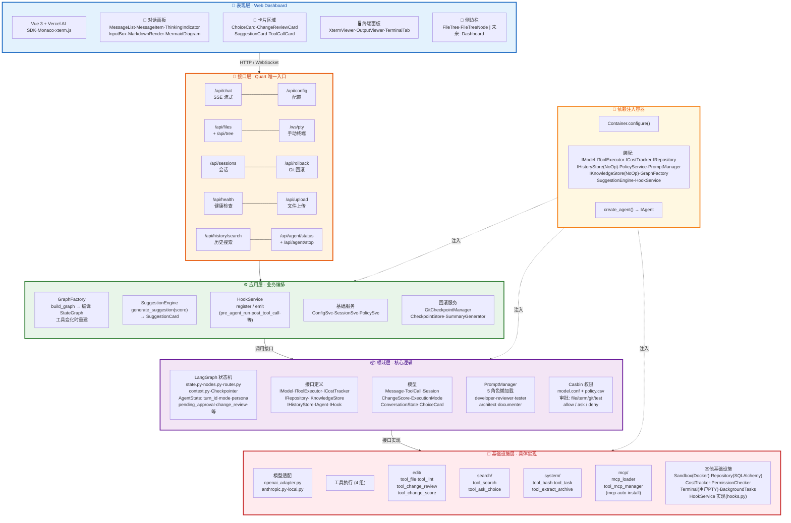

## Mermaid 架构图



> **读图方式**：从上到下 5 层 + DI 容器。箭头 = 依赖方向（Interface→Application→Domain→Infrastructure）。虚线 = DI 注入。每层独立色系便于快速定位。

> **来源**: `architecture-refactor.md` §2
> **关联文档**: `folder-tree.md`（文件结构）、`architecture-guide.md`（总览）
> 此图与主文档 §2 同步更新。

```
┌─────────────────────────────────────────────────────────────────────────┐
│                       PRESENTATION LAYER (Web Dashboard)                  │
│                                                                          │
│  ┌──────────────────────────────────────────────────────────────────┐   │
│  │     Vue 3 + Vercel AI SDK (useChat) + Monaco Editor + xterm.js    │   │
│  │                                                                   │   │
│  │  ┌──────────────────────┐  ┌──────────────────┐  ┌──────────────┐ │   │
│  │  │  对话面板              │  │  交互卡片区域     │  │  终端面板     │ │   │
│  │  │  MessageList          │  │  ChoiceCard      │  │  XtermViewer  │ │   │
│  │  │  MessageItem          │  │  ChangeReview    │  │  OutputViewer │ │   │
│  │  │  ThinkingIndicator   │  │  SuggestionCard  │  │  TerminalTab  │ │   │
│  │  │  InputBox            │  │  ToolCallCard    │  │               │ │   │
│  │  │  Markdown/Mermaid    │  │  (工具调用/审批)   │  │               │ │   │
│  │  │  LivePreview         │  │                  │  │               │ │   │
│  │  └──────────────────────┘  └──────────────────┘  └──────────────┘ │   │
│  │  ┌──────────────────────────────────────────────────────────┐    │   │
│  │  │  侧边栏: 文件树(FileTree)  |  未来Dashboard(监控/成本)   │    │   │
│  │  └──────────────────────────────────────────────────────────┘    │   │
│  └──────────────────────────────────────────────────────────────────┘   │
│                                    │ SSE (chat) + WebSocket (pty)       │
├────────────────────────────────────┼─────────────────────────────────────┤
│                   INTERFACE LAYER (Quart — 唯一入口)                      │
│                                                                          │
│  ┌──────────┐ ┌───────────┐ ┌───────────┐ ┌─────────┐ ┌──────────────┐ │
│  │ /api/chat │ │/api/config│ │ /api/files │ │ /ws/pty │ │/api/sessions │ │
│  │ (SSE流式) │ │           │ │+ /api/tree │ │(手动终端)│ │(历史会话)    │ │
│  └────┬─────┘ └───────────┘ └───────────┘ └─────────┘ └──────────────┘ │
│  ┌──────────┐ ┌───────────┐ ┌───────────┐ ┌────────────┐ ┌──────────┐  │
│  │/api/roll │ │/api/health│ │/api/upload│ │/api/history│ │/api/agent│  │
│  │  back    │ │(健康检查)  │ │(文件上传) │ │  /search   │ │ /status  │  │
│  │(Git回滚) │ │           │ │(+解压)    │ │(历史搜索)  │ │+ /stop   │  │
│  └──────────┘ └───────────┘ └───────────┘ └────────────┘ └──────────┘  │
│       │                                                                 │
├───────┼─────────────────────────────────────────────────────────────────┤
│       ▼                                                                 │
│              APPLICATION LAYER (业务编排)                                  │
│                                                                          │
│  ┌──────────────────────────────────────────────────────────────────┐   │
│  │  GraphFactory                                                     │   │
│  │  ├─ build_graph() → 导入 domain/agent/ 下 nodes + router         │   │
│  │  │  + context → 编译 StateGraph（路由注册在应用层完成）            │   │
│  │  └─ 工具变化时重建图（DynamicGraphFactory）                        │   │
│  └──────────────────────────────────────────────────────────────────┘   │
│                                                                          │
│  ┌──────────────────────────────┐ ┌──────────────────┐ ┌─────────────┐  │
│  │  SuggestionEngine            │ │  HookService     │ │ ConfigSvc   │  │
│  │  generate_suggestion(score)  │ │  register/emit   │ │ SessionSvc  │  │
│  │  → SuggestionCard            │ │  (通用事件钩子)   │ │ PolicySvc   │  │
│  └──────────────────────────────┘ └──────────────────┘ └─────────────┘  │
│  ┌─────────────────┐ ┌──────────────────┐ ┌─────────────────────────┐  │
│  │ GitCheckpoint   │ │ CheckpointStore  │ │ SummaryGenerator        │  │
│  │ Manager         │ │ SQLite 映射表    │ │ 自动生成 ≤50 字摘要    │  │
│  │ (Agent Git)     │ │ turn_id→hash    │ │                         │  │
│  └─────────────────┘ └──────────────────┘ └─────────────────────────┘  │
│                                                                          │
├─────────────────────────────────────────────────────────────────────────┤
│                     DOMAIN LAYER (领域层)                                  │
│                                                                          │
│  ┌──────────────────────────────────────────────────────────────────┐   │
│  │  LangGraph: state.py(AgentState) + nodes.py + router.py +       │   │
│  │  context.py + ToolNode + Checkpointer(SqliteSaver)              │   │
│  │  AgentState: messages, turn_id, mode, persona,                  │   │
│  │    pending_approval, change_review, rejected_changes,           │   │
│  │    change_score, adversarial_suggestion, test_results           │   │
│  └──────────────────────────────────────────────────────────────────┘   │
│  ┌───────────────────┐ ┌────────────────────┐ ┌────────────────────────┐│
│  │  Interfaces       │ │  Models            │ │  PromptManager         ││
│  │  IModel(context驱动)│ │  Message, ToolCall │ │  多角色按需懒加载      ││
│  │  IToolExecutor    │ │  Session, ModeConfig│ │  developer(核心)       ││
│  │  ICostTracker     │ │  ChoiceCard        │ │  reviewer(对抗)        ││
│  │  IRepository      │ │  ChangeScore       │ │  tester                ││
│  │  IKnowledgeStore  │ │  ExecutionMode     │ │  architect             ││
│  │  IHistoryStore    │ │  ConversationState │ │  documenter            ││
│  │  IAgent / IHook   │ │  exceptions.py     │ │                        ││
│  │  + HookContext    │ │                    │ │                        ││
│  └───────────────────┘ └────────────────────┘ └────────────────────────┘│
│  ┌──────────────────────────────────────────────────────────────────┐   │
│  │  Policies & Casbin: model.conf + policy.csv                      │   │
│  │  审批分类: file(带diff)/terminal/git/test/change(审查)           │   │
│  └──────────────────────────────────────────────────────────────────┘   │
│                                                                          │
├─────────────────────────────────────────────────────────────────────────┤
│                  INFRASTRUCTURE LAYER (基础设施层)                          │
│                                                                          │
│  ┌────────┐ ┌──────────────────────────┐ ┌─────────┐ ┌──────────────┐  │
│  │ Model  │ │  Tools（按功能分组）       │ │ Sandbox │ │ Repository   │  │
│  │ Adapter│ │  edit/  : 文件编辑+审查    │ │ (Docker)│ │ SQLAlchemy   │  │
│  │(多种)  │ │  search/: 搜索+选择题      │ │         │ │ + IHistory   │  │
│  │        │ │  system/: bash+任务+解压   │ │         │ │   Store(预留)│  │
│  │        │ │  mcp/   : MCP 加载器+管理  │ │         │ │              │  │
│  └────────┘ └──────────────────────────┘ └─────────┘ └──────────────┘  │
│  ┌────────┐ ┌─────────────────────┐ ┌──────────┐ ┌──────────────────┐  │
│  │ Cost   │ │ PermissionChecker   │ │ Terminal │ │ Background +    │  │
│  │ Tracker│ │ file/term/git/test  │ │ (用户PTY)│ │ HookService      │  │
│  │        │ │ allow/ask/deny      │ │          │ │ 实现(hooks.py)   │  │
│  └────────┘ └─────────────────────┘ └──────────┘ └──────────────────┘  │
│                                                                          │
├─────────────────────────────────────────────────────────────────────────┤
│                     DI CONTAINER (依赖注入容器)                            │
│  Container.configure() → 装配:                                          │
│    IModel / IToolExecutor / ICostTracker / IRepository                  │
│    IHistoryStore(NoOp) / PolicyService / PromptManager                 │
│    IKnowledgeStore(NoOp) / GraphFactory / SuggestionEngine / HookService │
│  create_agent() → 返回 IAgent (一张图统一 Graph，context 约束内 LLM 决定路径)
└─────────────────────────────────────────────────────────────────────────┘
```
