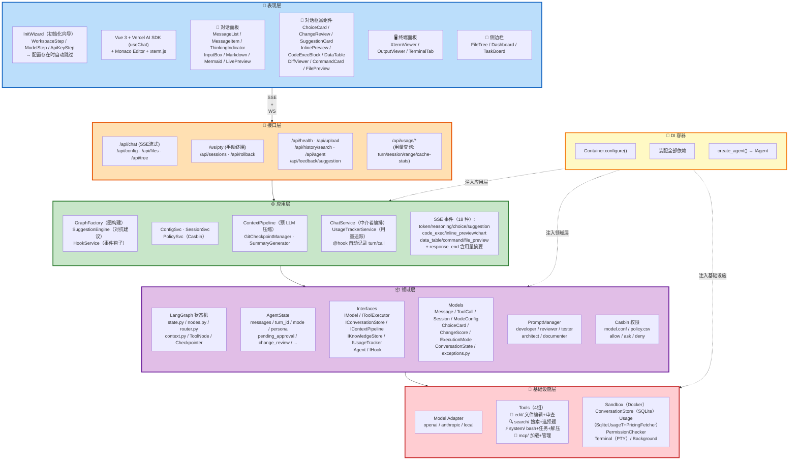

# 架构图

> **来源**: `architecture-refactor.md` §2
> **关联文档**: `folder-tree.md`（文件结构）、`architecture-guide.md`（总览）、`usage-tracking.md`（用量追踪）
> 此图与主文档 §2 同步更新。

```
┌─────────────────────────────────────────────────────────────────────────────────────────────────────────────────────┐
│                                              PRESENTATION LAYER (Web Dashboard)                                        │
│                                                                                                                       │
│  ┌─────────────────────────────────────────────────────────────────────────────────────┐  首次启动/未配置时显示       │
│  │  InitWizard（初始化向导）                                                             │                              │
│  │  ├─ Step 1: WorkspaceStep  ← 选择已有工作区 or 新建                                   │                              │
│  │  ├─ Step 2: ModelStep     ← 选择模型（DeepSeek / Qwen / Claude ...）                 │                              │
│  │  └─ Step 3: ApiKeyStep    ← 录入 API Key（持久化到本地配置）                          │                              │
│  └─────────────────────────────────────────────────────────────────────────────────────┘                              │
│                                                                                                                       │
│  ┌────────────────────────────────────────────────────────────────────────────────────────────────────────────────┐   │
│  │                          Vue 3 + Vercel AI SDK (useChat) + Monaco Editor + xterm.js                              │   │
│  │                                                                                                                 │   │
│  │  ┌──────────────────────────┐  ┌──────────────────────────────┐  ┌──────────────────────────┐                   │   │
│  │  │   对话面板                 │  │   交互卡片区域                 │  │   终端面板                │                   │   │
│  │  │  MessageList             │  │  ChoiceCard                  │  │  XtermViewer             │                   │   │
│  │  │  MessageItem             │  │  ChangeReview                │  │  OutputViewer            │                   │   │
│  │  │  ThinkingIndicator      │  │  SuggestionCard              │  │  TerminalTab             │                   │   │
│  │  │  InputBox               │  │  ToolCallCard                │  │                          │                   │   │
│  │  │  Markdown/Mermaid       │  │  (工具调用/审批)               │  │                          │                   │   │
│  │  │  InlinePreview          │  │                              │  │                          │                   │   │
│  │  └──────────────────────────┘  └──────────────────────────────┘  └──────────────────────────┘                   │   │
│  │  ┌───────────────────────────────────────────────────────────────────────────────────────────────────┐         │   │
│  │  │  侧边栏: 文件树(FileTree) | Dashboard | TaskBoard                                          │         │   │
│  │  └───────────────────────────────────────────────────────────────────────────────────────────────────┘         │   │
│  └────────────────────────────────────────────────────────────────────────────────────────────────────────────────┘   │
│                                                                      │ SSE (chat) + WebSocket (pty)                   │
├──────────────────────────────────────────────────────────────────────┼─────────────────────────────────────────────────┤
│                                   INTERFACE LAYER (Quart — 唯一入口)                                                   │
│                                                                                                                       │
│  ┌─────────────┐ ┌──────────────┐ ┌──────────────┐ ┌────────────┐ ┌─────────────────┐                                │
│  │  /api/chat   │ │ /api/config  │ │  /api/files   │ │  /ws/pty   │ │  /api/sessions   │                                │
│  │  (SSE流式)   │ │              │ │  + /api/tree  │ │  (手动终端) │ │  (历史会话)       │                                │
│  └──────┬──────┘ └──────────────┘ └──────────────┘ └────────────┘ └─────────────────┘                                │
│  ┌─────────────┐ ┌──────────────┐ ┌──────────────┐ ┌────────────────┐ ┌───────────────┐                             │
│  │ /api/roll    │ │ /api/health  │ │ /api/upload  │ │  /api/history   │ │  /api/agent    │                             │
│  │   back       │ │  (健康检查)   │ │  (文件上传)   │ │   /search      │ │  /status       │                             │
│  │  (Git回滚)   │ │              │ │  (+解压)      │ │  (历史搜索)     │ │  + /stop       │                             │
│  └─────────────┘ └──────────────┘ └──────────────┘ └────────────────┘ └───────────────┘                             │
│  ┌─────────────┐ ┌──────────────────┐                                                                                │
│  │ /api/usage   │ │ /api/feedback    │ ← 建议反馈                                                                       │
│  │  /turn       │ │  /suggestion     │                                                                                │
│  │  /session    │ │                  │                                                                                │
│  │  /range      │ │                  │                                                                                │
│  │  /cache-stats│ │                  │                                                                                │
│  └─────────────┘ └──────────────────┘                                                                                │
│       │                                                                                                               │
├───────┼───────────────────────────────────────────────────────────────────────────────────────────────────────────────┤
│       ▼                                                                                                               │
│                                      APPLICATION LAYER (业务编排)                                                       │
│                                                                                                                       │
│  ┌────────────────────────────────────────────────────────────────────────────────────────────────────────────────┐   │
│  │  GraphFactory                                                                                                   │   │
│  │  ├─ build_graph() → 导入 domain/agent/ 下 nodes + router                                                       │   │
│  │  │  + context → 编译 StateGraph（路由注册在应用层完成）                                                          │   │
│  │  │  流程: chat → change_plan(改前预览) → exec → review → suggest                                                 │   │
│  │  └─ 工具变化时重建图（DynamicGraphFactory）                                                                      │   │
│  └────────────────────────────────────────────────────────────────────────────────────────────────────────────────┘   │
│                                                                                                                       │
│  ┌──────────────────────────────────────────────┐ ┌──────────────────────────────┐ ┌────────────────────────────┐    │
│  │  SuggestionEngine                            │ │  HookService                 │ │  ConfigSvc                 │    │
│  │  generate_suggestion(score) → SuggestionCard  │ │  register / emit             │ │  SessionSvc                │    │
│  │                                              │ │  (通用事件钩子)               │ │  PolicySvc                 │    │
│  └──────────────────────────────────────────────┘ └──────────────────────────────┘ └────────────────────────────┘    │
│  ┌──────────────────────────────┐ ┌──────────────────────────────┐ ┌──────────────────────────────────────┐          │
│  │  ChatService                 │ │  ContextPipeline              │ │  ConversationStore                    │          │
│  │  (中介者: graph + hook +     │ │  Truncate + Trim + Fold       │ │  IConversationStore 的 SQLite 实现      │          │
│  │   suggestion + policy 编排)  │ │  (预 LLM 上下文压缩)          │ │                                        │          │
│  │  UsageTrackerService         │ │                              │ │                                        │          │
│  │  TaskService                 │ │                              │ │                                        │          │
│  │  ☆ ExportService             │ │                              │ │                                        │          │
│  │  ☆ ModelFallbackService      │ │                              │ │                                        │          │
│  └──────────────────────────────┘ └──────────────────────────────┘ └──────────────────────────────────────┘          │
│  ┌─────────────────────────┐ ┌──────────────────────────────────┐                                                    │
│  │ GitCheckpoint Manager   │ │ SummaryGenerator                 │                                                    │
│  │ (Agent Git)             │ │ 自动生成 ≤50 字摘要              │                                                    │
│  └─────────────────────────┘ └──────────────────────────────────┘                                                    │
│                                                                                                                       │
├─────────────────────────────────────────────────────────────────────────────────────────────────────────────────────┤
│                                                 DOMAIN LAYER (领域层)                                                  │
│                                                                                                                       │
│  ┌────────────────────────────────────────────────────────────────────────────────────────────────────────────────┐   │
│  │  LangGraph: state.py(AgentState) + nodes.py + router.py +                                                     │   │
│  │  context.py + ToolNode + Checkpointer(SqliteSaver)                                                            │   │
│  │  AgentState: messages, turn_id, mode, persona,                                                                │   │
│  │    pending_approval, change_review, rejected_changes,                                                         │   │
│  │    change_score, adversarial_suggestion, test_results                                                         │   │
│  └────────────────────────────────────────────────────────────────────────────────────────────────────────────────┘   │
│  ┌───────────────────────┐ ┌──────────────────────────────┐ ┌──────────────────────────────┐                        │
│  │  Interfaces           │ │  Models                      │ │  PromptManager               │                        │
│  │  IModel(context驱动)   │ │  Message, ToolCall          │ │  developer(核心)             │                        │
│  │  IToolExecutor        │ │  Session, ModeConfig         │ │  reviewer(对抗)              │                        │
│  │  IConversationStore   │ │  ChoiceCard                  │ │  tester                      │                        │
│  │  IContextPipeline     │ │  ChangeScore                 │ │  architect                   │                        │
│  │  IKnowledgeStore      │ │  ExecutionMode               │ │  documenter                  │                        │
│  │  IUsageTracker        │ │  ConversationState           │ │                              │                        │
│  │  IAgent / IHook       │ │                              │ │                              │                        │
│  │  + HookContext       │ │                              │ │                              │                        │
│  └───────────────────────┘ └──────────────────────────────┘ └──────────────────────────────┘                        │
│  ┌────────────────────────────────────────────────────────────────────────────────────────────────────────────────┐   │
│  │  Policies & Casbin: model.conf + policy.csv                                                                    │   │
│  │  审批分类: file(带diff) / terminal / git / test / change(审查)                                                 │   │
│  └────────────────────────────────────────────────────────────────────────────────────────────────────────────────┘   │
│                                                                                                                       │
├─────────────────────────────────────────────────────────────────────────────────────────────────────────────────────┤
│                                            INFRASTRUCTURE LAYER (基础设施层)                                            │
│                                                                                                                       │
│  ┌──────────────────────────┐ ┌──────────────────────────────────────────────┐ ┌────────────┐ ┌──────────────────────────┐  │
│  │ Model                    │ │  Tools（按功能分组）                           │ │ Sandbox    │ │ ConversationStore       │  │
│  │ Adapter                  │ │  edit   : 文件编辑+审查                      │ │ (Docker)   │ │ IConversationStore      │  │
│  │ openai/anthropic/local  │ │  search : 搜索+选择题                        │ │ config.py  │ │ SQLite 实现              │  │
│  │                          │ │  system : bash+任务+解压                     │ │ path_valid  │ │ 存储对话记录             │  │
│  │                          │ │  mcp    : MCP 加载器+管理                    │ │ manager    │ │                          │  │
│  │                          │ │  PermissionChecker (allow/ask/deny)         │ │ builder    │ │                          │  │
│  ├──────────────────────────┤ ├──────────────────────────────────────────────┤ ├────────────┤ ├──────────────────────────┤  │
│  │  Usage                    │ │ Terminal (PTY)                               │ │ Background │ │ Policies + Hooks         │  │
│  │  SqliteUsageTracker       │ │ 用户手动 xterm.js 终端                        │ │ 后台任务    │ │ Casbin + 事件钩子实现     │  │
│  │  ☆ LicenseService(NoOp)  │ │                                              │ │            │ │                          │  │
│  │  ☆ UpdateService(NoOp)   │ │                                              │ │            │ │                          │  │
│  │  PricingFetcher           │ │ 独立于 AI，AI 不注入命令                     │ │ 空闲自动清理│ │                          │  │
│  ├──────────────────────────┤ ├──────────────────────────────────────────────┤ ├────────────┤ ├──────────────────────────┤  │
│  │ Tasks                     │ │ Tasks Hosting                               │ │            │ │                          │  │
│  │ tool_add_task             │ │ 任务 CRUD 端点 (routes/tasks.py)              │ │            │ │                          │  │
│  │ tool_update_task          │ │ TaskListCard / TaskBoard (前端组件)           │ │            │ │                          │  │
│  └──────────────────────────┘ └──────────────────────────────────────────────┘ └────────────┘ └──────────────────────────┘  │
│                                                                                                                       │
├─────────────────────────────────────────────────────────────────────────────────────────────────────────────────────┤
│                                             DI CONTAINER (依赖注入容器)                                                │
│  Container.configure() → 装配:                                                                                      │
│    IModel / IToolExecutor / IConversationStore / IContextPipeline / IUsageTracker / PolicyService / PromptManager    │
│    IKnowledgeStore(NoOp) / GraphFactory / SuggestionEngine / HookService                                             │
│  create_agent() → 返回 IAgent (一张图统一 Graph，context 约束内 LLM 自行决定)                                            │
└─────────────────────────────────────────────────────────────────────────────────────────────────────────────────────┘
```

## Mermaid 架构图


