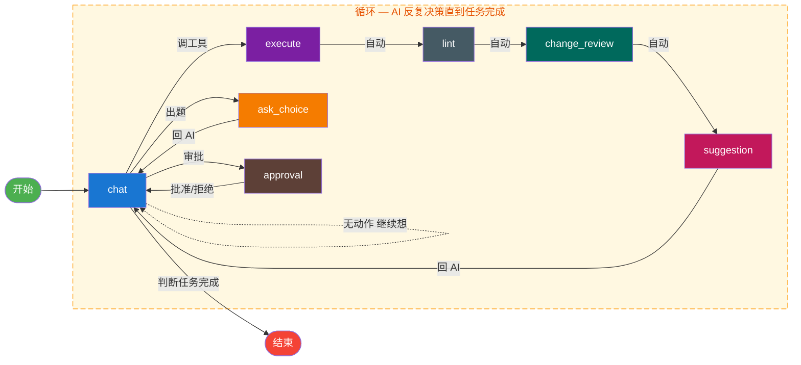

# LangGraph 状态图

> **来源**: `architecture-refactor.md` §3.2, §3.3, §3.6.2-3.6.6, §3.8.1, §3.11
> **关联文档**: `mode-matrix.md`（模式权限）、`adversarial-system.md`（对抗节点）
> 修改 router 或节点定义时，需同步检查 mode-matrix.md 中的权限矩阵。

## 一张图，统一 Graph

不是三张独立图，是所有节点在同一个 StateGraph 内。LLM 通过条件边自行决定路径。

模式不是三种不同的图，只是三种不同的 **context 约束**（工具列表、温度、身份提示词）。



> **橙色虚线框 = 循环区域**。chat 是中枢：所有路径（调工具/出题/审批/继续想）最终都回到 chat。AI 在循环内反复决策，**只有判断任务完成后才跳出循环走向结束**。

## 节点定义

| 节点 | 职责 | 边类型 | 所属层 | 文件 |
|------|------|--------|--------|------|
| `chat` | LLM 对话（所有路径起点） | **条件边**（router 路由） | Domain | `domain/agent/nodes.py` |
| `ask_choice` | Explore：出选择题 | **条件边**（router 检测 tool_call） | Domain | `domain/agent/nodes.py` |
| `execute` | 调工具（ToolNode） | **条件边**（router 检测 tool_call） | Domain | `domain/agent/nodes.py` |
| `lint` | 自动格式化 | **固定边**（execute → lint 自动触发） | Domain | `domain/agent/nodes.py` |
| `change_review` | 变更审查 | **固定边**（lint → change_review 自动触发） | Domain | `domain/agent/nodes.py` |
| `suggestion` | 对抗建议 | **固定边**（change_review → suggestion 自动触发） | Domain | `domain/agent/nodes.py` |
| `approval` | 审批（伪装成 tool_call） | **条件边**（router 检测 pending_approval） | Domain | `domain/agent/nodes.py` |
| **图构建** | 编译 StateGraph（导入 nodes + router） | — | **Application** | `application/services/graph_factory.py` |

> **回滚（ROLLBACK）不是独立节点**：回滚由 AI 在 execute 节点内通过 `tool_bash` 调用 git 命令实现，或用户通过 `/api/rollback` API 触发 GitCheckpointManager。不需要专门的 LangGraph 节点。

## Router（路由）

```python
def router(state: AgentState) -> str:
    """基于 LLM 工具调用的条件路由。
    
    AI 决定下一步走向——不是系统硬编码的判断：
    - 有 tool_call 且名为 ask_choice → 走选择题节点（Explore 模式）
    - 有其他 tool_call → 走 execute 节点执行工具
    - 有待审批请求 → 走 approval 节点
    - 无任何条件匹配 → 默认留在 chat 节点（AI 继续思考/输出文本）
    """
    last_msg = state["messages"][-1]
    if last_msg.get("tool_calls") and last_msg["tool_calls"][0]["name"] == "ask_choice":
        return "ask_choice"
    if last_msg.get("tool_calls"):
        return "execute"
    if state.get("pending_approval"):
        return "approval"
    return "chat"  # 无 tool_calls + 无审批 = AI 继续对话或总结
```

## AgentState（domain/agent/state.py）

```python
class AgentState(TypedDict):
    messages: list                # 对话消息列表
    turn_id: int                  # 当前对话轮次
    persona: str                  # developer/reviewer/tester/...
    mode: str                     # explore / plan / execute
    pending_approval: dict | None # 待审批请求
    change_review: dict | None    # 变更审查数据
    rejected_changes: list | None # 被用户驳回的变更
    change_score: dict | None     # 变更评分结果
    adversarial_suggestion: dict | None  # 对抗建议卡片
    test_results: str | None      # 测试结果
    git_snapshot: str | None      # Git 快照（用于回滚）
```

### 字段生命周期

| 字段 | 写入节点 | 读取节点 | 说明 |
|------|---------|---------|------|
| `messages` | chat, execute, approval | router, chat | AI 对话历史，所有节点可追加 |
| `turn_id` | chat_node（每轮+1） | 全局 | 每轮对话自增，用于 checkpoint 和回滚 |
| `persona` | PromptManager.switch | chat, suggestion | developer/reviewer/tester/architect/documenter |
| `mode` | chat_node（AI 或用户选择） | 全局 | explore / plan / execute，决定 context 约束 |
| `pending_approval` | approval_node | router, approval | 待审批请求，非空时 router 自动导向 approval |
| `change_review` | change_review_node | 前端渲染 | 变更审查数据，输出后由用户逐项确认 |
| `rejected_changes` | 前端驳回回调 | chat_node | 用户驳回的变更列表，AI 分析后提替代方案 |
| `change_score` | change_review_node | suggestion_node | 变更评分，决定对抗建议的级别和内容 |
| `adversarial_suggestion` | suggestion_node | 前端渲染 | 对抗建议卡片，用户勾选后执行 |
| `test_results` | execute（AI 跑测试后） | chat_node | 测试输出，用于判断是否需要修复 |
| `git_snapshot` | chat_node（每轮开始） | rollback | 当前工作区 Git 概览，用于回滚参考 |

## DynamicToolNode（MCP 热插拔）

MCP 工具热加载需要动态工具列表。推荐方案 A，MCP 工具不会每轮对话变化。

### 方案 A（推荐——编译时已知工具集 + 出错时重建）

```python
class DynamicGraphFactory:
    """工具变化时重建 LangGraph，不追求每轮动态"""

    def __init__(self, executor: IToolExecutor):
        self.executor = executor
        self._graph = None
        self._last_tool_hash = None

    def get_graph(self) -> CompiledStateGraph:
        current_hash = hash(tuple(self.executor.get_tools_schema()))
        if self._graph is None or current_hash != self._last_tool_hash:
            self._graph = self._build_graph()
            self._last_tool_hash = current_hash
        return self._graph

    def _build_graph(self) -> CompiledStateGraph:
        tools = self.executor.get_available_tools()  # 含 MCP 动态注册的工具
        tool_node = ToolNode(tools)
        workflow = StateGraph(AgentState)
        # ... 注册所有节点和条件边 ...
        workflow.add_node("execute", tool_node)
        return workflow.compile()
```

### 方案 B（v2 可选——自定义 ToolNode 每轮动态获取）

```python
class DynamicToolNode:
    def __init__(self, executor: IToolExecutor):
        self.executor = executor

    def __call__(self, state: AgentState) -> dict:
        from langgraph.prebuilt.tool_executor import ToolExecutor as LangGraphToolExecutor
        tools = self.executor.get_available_tools()  # 每次都动态获取
        executor = LangGraphToolExecutor(tools)
        last_message = state["messages"][-1]
        if not hasattr(last_message, "tool_calls") or not last_message.tool_calls:
            return {"messages": state["messages"]}
        results = []
        for tc in last_message.tool_calls:
            try:
                result = executor.execute(tc)
                results.append(result)
            except Exception as e:
                results.append(ToolMessage(
                    content=f"工具执行失败: {str(e)}",
                    tool_call_id=tc["id"],
                ))
        return {"messages": results}
```

## 三种模式的 context 对比

| 维度 | Explore Context | Plan Context | Execute Context |
|------|:--------------:|:-----------:|:--------------:|
| **温度** | 0.1-0.2（严谨引导） | 0.2（结构化输出） | 0.3-0.5（自由发挥） |
| **可用工具** | `ask_choice`, `search`, `read`, `write_file`(仅文档/配置) | `ask_choice`, `search`, `read`, `write_file`(仅文档/配置) | 全部工具 |
| **Prompt 身份** | 需求分析师 | 规划师 | 执行者 |
| **LangGraph 节点** | 全部条件边，AI 自行跳转 | 全部条件边，AI 自行跳转 | 全部条件边，AI 自行跳转 |
| **Human-in-loop** | 选项点击/自定义输入 | 审批卡片 | 审批卡片（按需） |
| **终止条件** | 需求足够清晰 | 用户确认方案 | 任务完成或切回 Explore |

## Plan Mode 工作流

AI 先调研输出结构化方案，通过审批卡片让用户确认/修改，确认后切换 Execute 执行。

```
Plan Mode Context:
  temperature=0.2  |  tools=只读(search/grep/read)  |  prompt=规划师

     ┌───── ─ ─ ─ ─ ─ ─ ─ ─ ─ ─ ─ ─ ─ ─ ─ ─ ─ ─ ┐
     │    所有子链由 AI 自行选择跳转                   │
     │  ┌──────────┐   ┌────────────────┐            │
     │  │ 调研阶段  │   │  方案输出       │            │
     │  │ (search, │←─→│ (结构化文本)    │            │
     │  │  read)   │   └───────┬────────┘            │
     │  └──────────┘           │                     │
     │                    ┌────▼────────┐            │
     │                    │ 审批卡片      │            │
     │                    │ (human-in-   │            │
     │                    │  the-loop)   │            │
     │                    └──┬────┬─────┘            │
     │              ┌─────────┘    │                  │
     │              ▼              ▼                  │
     │          修订方案     等待用户指令               │
     │          (回到调研)    (手动确认执行)            │
     └───── ─ ─ ─ ─ ─ ─ ─ ─ ─ ─ ─ ─ ─ ─ ─ ─ ─ ─ ┘
```

**关键限制**：Plan 阶段 AI 可使用只读工具 + ask_choice + write_file（限文档/配置如 .md、.yaml、.json），不可修改源代码（.py、.js、.ts、.vue 等）。bash 命令仅限查询。

## Execute Mode 工作流

AI 收到指令直接干活，全部工具可用。

```
Execute Mode Context:
  temperature=0.3-0.5  |  tools=全部  |  prompt=执行者

     ┌───── ─ ─ ─ ─ ─ ─ ─ ─ ─ ─ ─ ─ ─ ─ ─ ─ ─ ─ ─ ─ ─ ─ ─┐
     │    AI 自行选择子链，不是顺序执行                        │
     │  ┌──────────┐    ┌──────────┐    ┌──────────┐         │
     │  │ CLARIFY  │←───│ EXECUTE  │←───│ REVIEW   │         │
     │  │ (快速澄清)│    │ (ToolNode)│    │ (自检)   │         │
     │  └──────────┘    └──────────┘    └────┬─────┘         │
     │        │               │              │               │
     │        ▼               ▼              ▼               │
     │  ┌──────────┐    ┌──────────┐    ┌──────────┐         │
     │  │ ASK_CHOICE│   │ ROLLBACK │    │ ARCHITECT│         │
     │  │ (出选择题)│    │ (git回滚)│    │ (重构评估)│         │
     │  └──────────┘    └──────────┘    └──────────┘         │
     │                                                         │
     │  AI 可以：                                               │
     │  1. 简单快速 → 直接 EXECUTE → DONE                       │
     │  2. 需要调研 → CLARIFY → 调研 → EXECUTE → REVIEW        │
     │  3. 发现问题 → REVIEW → ROLLBACK → 重新 EXECUTE         │
     │  4. 需求模糊 → 主动切回 Explore Mode 出选择题             │
     │  5. 改得太多 → REVIEW → ARCHITECT → 重构 → 再 REVIEW     │
     └───── ─ ─ ─ ─ ─ ─ ─ ─ ─ ─ ─ ─ ─ ─ ─ ─ ─ ─ ─ ─ ─ ─ ─┘
```

执行模式下，AI 如果发现需求不明确，可以主动切入 Explore Mode。

## 审批卡片内容

```json
{
    "type": "approval_card",
    "context": "plan_approval",
    "plan_summary": "创建个人博客系统",
    "steps": [
        "1. 初始化 Vue 3 + Vite 项目",
        "2. 安装 Element Plus + 路由依赖",
        "3. 创建博客路由与基础组件"
    ],
    "estimated_cost": {"tokens": "~8000", "files": "~15个"}
}
```

## PromptManager

多角色 prompt 按需懒加载，不一股脑塞给 LLM。有五个 prompt 角色文件在 `domain/prompts/` 下。

```python
# domain/prompt_manager.py
class PromptManager:
    """按需加载 prompt，不一股脑塞给 LLM"""

    _cache = {}

    def load(self, persona: str) -> str:
        """懒加载，仅首次读取文件"""
        if persona not in self._cache:
            path = Path(__file__).parent / "prompts" / f"{persona}.md"
            self._cache[persona] = path.read_text(encoding="utf-8")
        return self._cache[persona]

    def switch(self, state: AgentState, persona: str, context: dict) -> AgentState:
        """
        切换 Agent 身份。向 LangGraph AgentState 追加一条 system message，
        不覆盖已有消息。保留历史让 LLM 知道上下文。
        """
        prompt = self.load(persona)
        switch_msg = (
            f"[角色切换] 你现在是 {persona}。\n"
            f"当前上下文: {json.dumps(context)}\n"
            f"{prompt}"
        )
        # 追加 system message（不覆盖历史）
        state["messages"].append({"role": "system", "content": switch_msg})
        state["persona"] = persona
        return state

# 5 个 prompt 角色：
# developer.md — 核心开发者身份
# reviewer.md  — 代码审查员（对抗性）
# tester.md    — 测试员
# architect.md — 重构/架构评估
# documenter.md— 文档撰写
```
